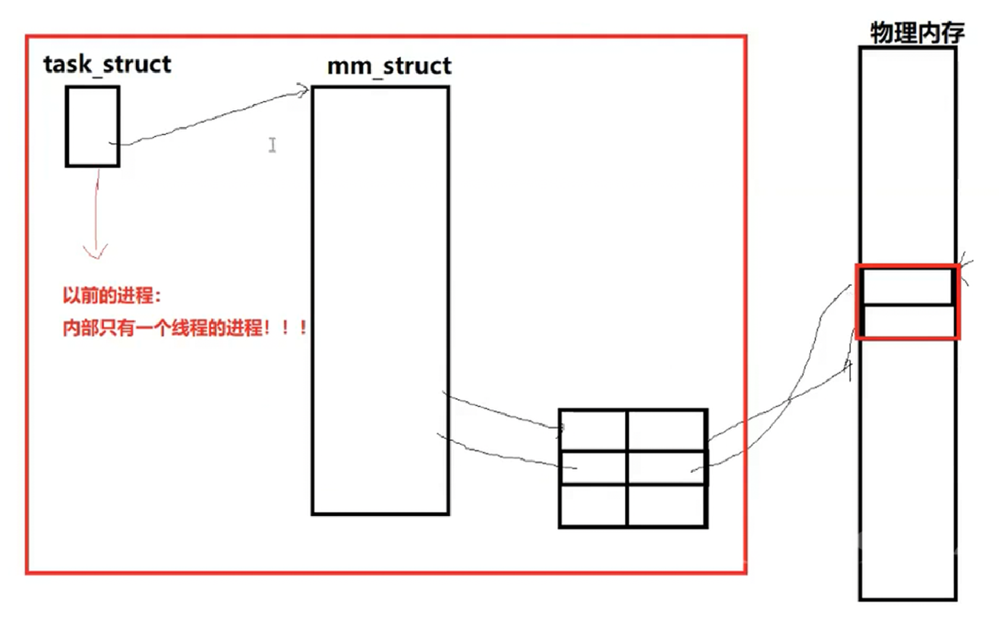
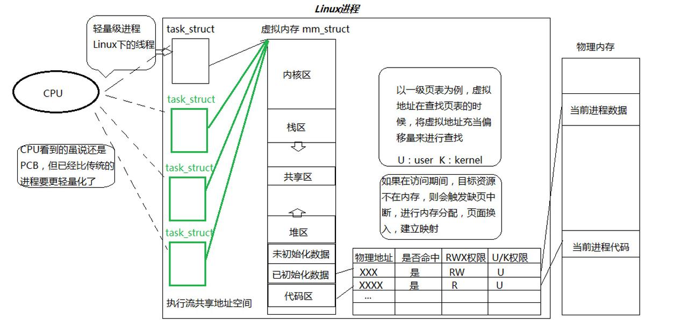
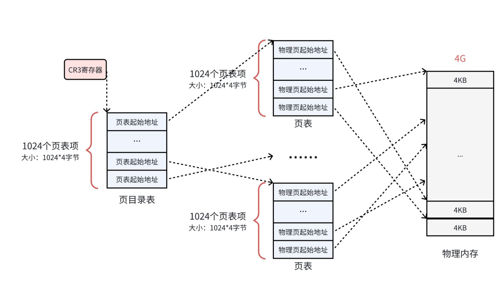
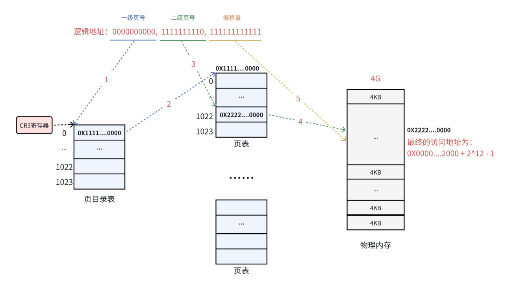

# Linux 线程概念

## 概念角度，感性理解线程

**进程 = 内核数据结构（PCB）+代码和数据（执行流）**

**线程：是进程内部的一个执行分支（执行流）**

在内核与资源角度，**进程是承担分配系统资源的基本实体；线程是 CPU 调度的基本单位。**

进程访问的大部分资源，都是通过地址空间访问的，地址空间是窗口。如果创建多个进程，共享一块地址空间，将资源再分配给不同的`task_struct`，就用进程模拟出线程了。

- Linux“线程”可以采用进程来模拟。
- 对资源的划分，本质是对地址空间虚拟地址范围的划分。**虚拟地址就是资源的代表 。**
- 代码区怎么划分？函数本身是代码块，函数是虚拟地址（逻辑地址）空间的集合。就是让线程未来执行 ELF 程序的不同函数即可。
- 既然上面讲了让进程去执行代码是线程，那进程呢？



**进程 = 内核数据结构（PCB、mm_struct、页表）+自己的代码和数据。**

而以前我们想的进程是内部只有一个线程的进程的。

在Windows中，线程既然线程有创建、挂起、等待、调度和销毁等生命周期，操作系统内核就必须为其设计专门的数据结构进行描述。这个结构体被称为**TCB（Thread Control Block，线程控制块）**。

Linux 开发者认为“没有必要专门设计 TCB”。既然线程的调度与进程高度相似，不如直接复用成熟的 `task_struct` 结构体和调度算法。这样确保了代码的健壮性以及降低了维护成本。

**因此Linux线程的调度结构及算法均与进程相同。**

关于线程，在Linux操作系统视角，是**执行流**；在CPU视角，它就是**轻量级进程**，或**用轻量级进程模拟实现的**。

操作系统、具体操作系统的概念（如：Linux）的概念：**操作系统提供思想，而各个具体的操作系统提供实现思想的方案。**

## 理性角度，理解资源划分（虚拟到物理、页表及其相关概念、部分内存管理）——分页式管理

   物理内存和磁盘以 4KB 为单位进行 I / O 交换的，这个 4KB 的空间叫做**页框或者页帧**。

OS 使用page来管理4KB的数据：

```c
/* include/linux/mm_types.h */
struct page {
    /* 原子标志，有些情况下会异步更新 */
    unsigned long flags;
    union {
        struct {
            /* 换出页列表，例如由zone->lru_lock保护的active_list */
            struct list_head lru;
            /* 如果最低位为0，则指向inode
             * address_space，或为NULL
             * 如果页映射为匿名内存，最低位置位
             * 而且该指针指向anon_vma对象
             */
            struct address_space* mapping;
            /* 在映射内的偏移量 */
            pgoff_t index;
            /*
             * 由映射私有，不透明数据
             * 如果设置了PagePrivate，通常用于buffer_heads
             * 如果设置了PageSwapCache，则用于swp_entry_t
             * 如果设置了PG_buddy，则用于表示伙伴系统中的阶
             */
            unsigned long private;
        };
        struct {    /* slab, slob and slub */
            union {
                struct list_head slab_list; /* uses lru */
                struct {    /* Partial pages */
                    struct page* next;
#ifdef CONFIG_64BIT
                    int pages;  /* Nr of pages left */
                    int pobjects; /* Approximate count */
#else
                    short int pages;
                    short int pobjects;
#endif
                };
            };
            struct kmem_cache* slab_cache; /* not slob */
            /* Double-word boundary */
            void* freelist;     /* first free object */
            union {
                void* s_mem;    /* slab: first object */
                unsigned long counters;    /* SLUB */
                struct {         /* SLUB */
                    unsigned inuse : 16;   /* 用于SLUB分配器：对象的数目 */
                    unsigned objects : 15;
                    unsigned frozen : 1;
                };
            };
        };
        ...
    };
    union {
        /* 内存管理子系统中映射的页表项计数，用于表示页是否已经映射，还用于限制逆向映射
        搜索*/
        atomic_t _mapcount;
        unsigned int page_type;
        unsigned int active;      /* SLAB */
        int units;                /* SLOB */
    };
    ...
#if defined(WANT_PAGE_VIRTUAL)
    /* 内核虚拟地址（如果没有映射则为NULL，即高端内存） */
    void* virtual;
#endif /* WANT_PAGE_VIRTUAL */
    ...
}
```

内核将所有物理页的管理转化为对 **struct page mem[…] 数组**的操作，每个 struct page 在数组中**都有固定的下标**，通过 下标 * 4KB 即可天然计算出**对应的起始物理地址**，再结合页内偏移就能得到具体的物理地址，因此无需在结构体中额外保存物理页地址。

**部分参数介绍：**

1. `flags`：**用来存放页的状态**。这些状态包括页是不是脏的，是不是被锁定在内存中等。`flags` 的每一位单独表示一种状态，所以它至少可以同时表示出32种不同的状态。这些标志定义在`<linux/page-flags.h>`中。

```c
#define PG_locked          0  /* Page is locked. Don't touch. */
#define PG_error           1
#define PG_referenced      2
#define PG_uptodate        3

#define PG_dirty           4
#define PG_lru             5
#define PG_active          6
#define PG_slab            7  /* slab debug (Suparna wants this) */

#define PG_checked         8  /* kill me in 2.5.<early>. */
#define PG_arch_1          9
#define PG_reserved       10
#define PG_private        11  /* Has something at ->private */

#define PG_writeback      12  /* Page is under writeback */
#define PG_nosave         13  /* Used for system suspend/resume */
#define PG_compound       14  /* Part of a compound page */
#define PG_swapcache      15  /* Swap page: swp_entry_t in private */

#define PG_mappedtodisk   16  /* Has blocks allocated on-disk */
#define PG_reclaim        17  /* To be reclaimed asap */
#define PG_nosave_free    18  /* Free, should not be written */
#define PG_buddy          19  /* Page is free, on buddy lists */
```

2. `_mapcount`：**表示在页表中有多少项指向该页，也就是这一页被引用了多少次**。当计数值变为-1时，就说明当前内核并没有引用这一页，于是新的分配中就可以使用它。

3. `virtual`：**表示页的虚拟地址，通常情况下，它就是页在虚拟内存中的地址**。有些内存（即所谓的高端内存）并不永久地映射到内核地址空间上。在这种情况下，这个域的值为NULL，需要的时候，必须动态地映射这些页。

我们申请物理内存，是在做什么？**查数组，改page！建立内核数据结构的对应关系。**



### 页表

一个虚拟地址有32位，它会被分为3组，前10位一组，中间10位一组，后12位一组。这样就能建立起两级页表。



页目录的物理地址被 `CR3 寄存器` 指向（教材里严谨得说叫做：“**指向当前硬件上下文**”，因为页目录跟着进程走，进程切换，CR3指向的页目录页跟着切换。），这个寄存器中，保存了当前正在执行任务的页目录地址。

查找过程可分为两阶段：

1. 先查找到虚拟地址对应的页框。
2. 根据虚拟地址的低12位，作为页内偏移，访问具体字节。



一级页号与二级页号分别作为索引，页目录表与页表中分别存有页表和物理内存的物理地址，三级页号则作为物偏移量。

CPU内还集成了 MMU（内存管理单元），用于将虚拟地址转化为物理地址，CPU将虚拟地址给 MMU ，**MMU根据CR3地址去执行上述查找操作**。

进程切换时，切换 CR3 ，随后 MMU 就会根据CR3去寻找页表，接下来就完成切换了。

- 当发现虚拟地址无法与物理地址映射时：**申请内存——>查找数组——>找到没有被使用的 page ——>得到page index——>物理页框地址。**

- **写时拷贝、缺页中断、内存申请等等，背后都可能要重新建立新页表和建立新映射关系的操作。**
- 对于进程，是一张页目录 + n 张页表构建的映射体系，虚拟地址是索引，物理地址页框是目标，虚拟地址（低12位）+页框地址=物理地址。
- 为什么一定是后12位充当偏移量呢？
    - 2^12^=4096，后12位刚好可以覆盖整个页框4KB。
    - 使用后12位，能保证数据的聚集性。
- 页表一定远远小于1024，页表是在运行中不断变化的。

各个页框分布是随机的，但是页框内部是连续的，因为虚拟地址低12位是连续的。

执行流看到的资源，本质是：**在合法的情况下，你拥有多少虚拟地址，虚拟地址是资源的代表。**

**虚拟地址空间 mm_struct + vm_area_struct 本质：进程资源的统计数据和整体数据，页表则是一张虚拟到物理的地图。**

**所谓的资源划分：本质是地址空间划分；资源共享：本质是虚拟地址共享！**

## 线程的理解

**线程进行资源划分：本质是划分地址空间，获得一定范围的合法虚拟地址，再深入本质，其实就是在划分页表。**

线程进行资源共享：本质是对地址空间的共享，再深入本质：就是对页表条目的共享。
