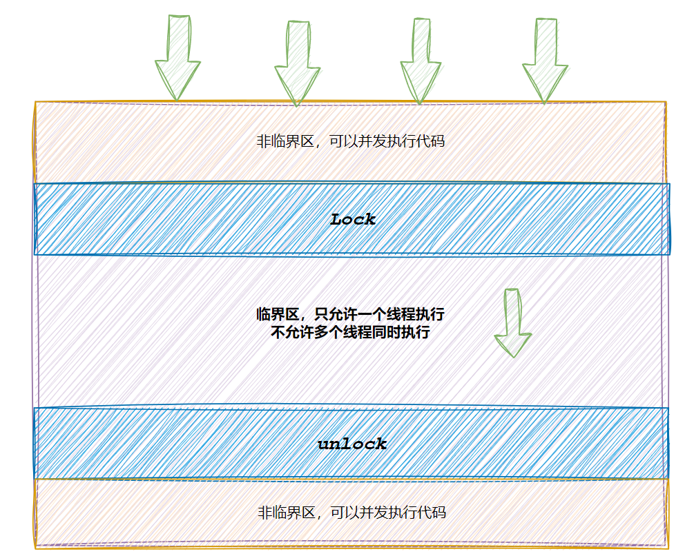
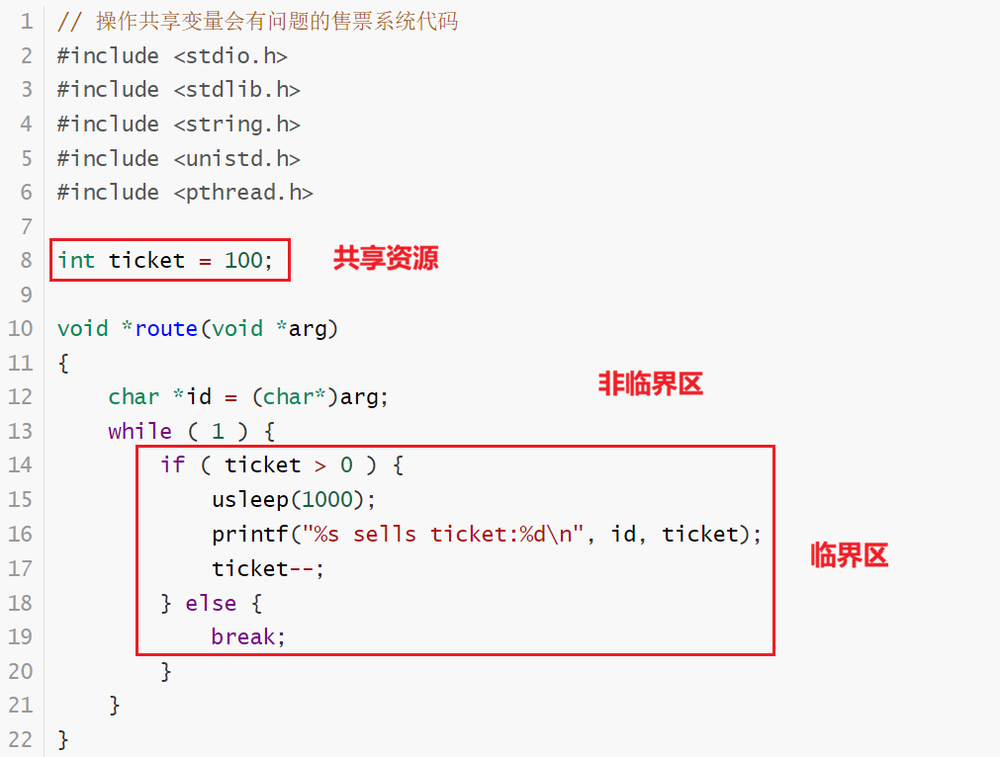
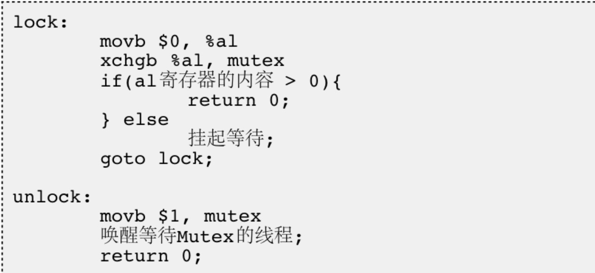
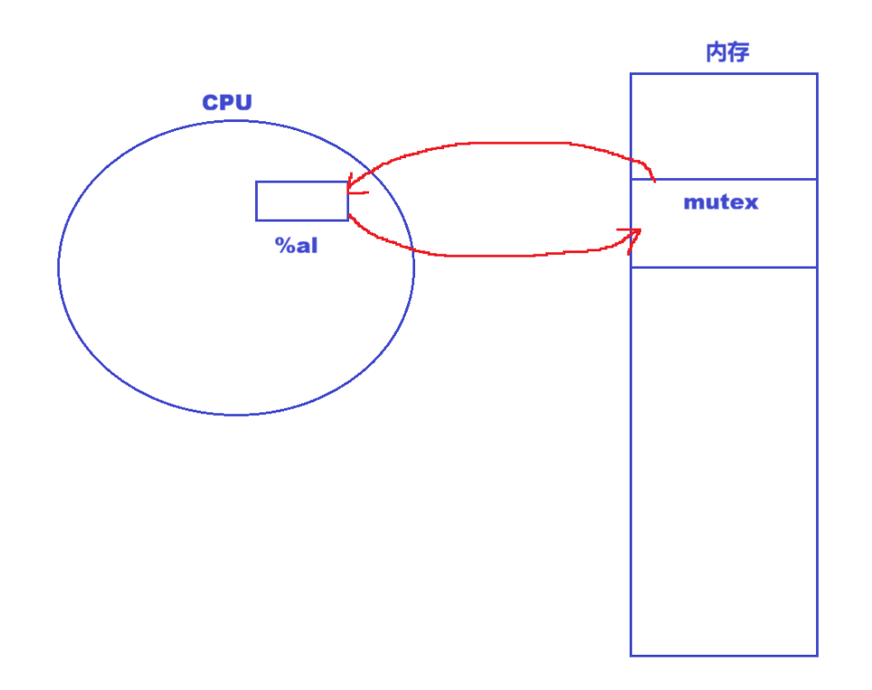
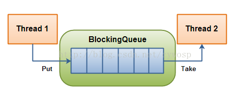

# 一、线程互斥

## 1. 互斥量 mutex

### 1.1 多线程并发引起的问题

- 大部分情况，线程使用的数据都是局部变量，变量的地址空间在线程栈空间内，这种情况，**变量归属单个线程，其他线程无法获得这种变量。**
- 但有时候，很多变量都需要在线程间共享，这样的变量称为共享变量，可以通过数据的共享，完成线程之间的交互。
- **多个线程并发的操作共享变量，会带来一些问题**。

**场景模拟——抢票：**

```c
// 操作共享变量会有问题的售票系统代码
#include <stdio.h>
#include <stdlib.h>
#include <string.h>
#include <unistd.h>
#include <pthread.h>

int ticket = 100;

void *route(void *arg)
{
    char *id = (char*)arg;
    while ( 1 ) {
        if ( ticket > 0 ) {
            usleep(1000);
            printf("%s sells ticket:%d\n", id, ticket);
            ticket--;
        } else {
            break;
        }
    }
} 
int main( void )
{
    pthread_t t1, t2, t3, t4;
    pthread_create(&t1, NULL, route, (void*)"thread 1");
    pthread_create(&t2, NULL, route, (void*)"thread 2");
    pthread_create(&t3, NULL, route, (void*)"thread 3");
    pthread_create(&t4, NULL, route, (void*)"thread 4");
    pthread_join(t1, NULL);
    pthread_join(t2, NULL);
    pthread_join(t3, NULL);
    pthread_join(t4, NULL);
}
```

运行结果：

```
thread 4 sells ticket:100
...
thread 4 sells ticket:1
thread 2 sells ticket:0
thread 1 sells ticket:-1
thread 3 sells ticket:-2
```

### 1.2 出错原因及解决方案

**为什么会减到负数？**

- 一个线程完成判断时，ticket还没发生改变时，另一个线程又来判断。
- ticket-- 不是原子的。

#### 1.2.1 引入锁的机制

使用互斥锁来保护临界区。





#### 1.2.2 接口

##### 1.2.2.1 初始化与销毁

**互斥锁类型为`pthread_mutex_t`。**

- **静态分配**：使用宏 **PTHREAD_MUTEX_INITIALIZER** 静态初始化全局或静态互斥量。例如 **`pthread_mutex_t mutex = PTHREAD_MUTEX_INITIALIZER;`**。**这种静态初始化的互斥量不需要手动释放，当程序运行结束时会自动释放。**
- **动态分配**：**`int pthread_mutex_init(pthread_mutex_t *restrict mutex, const pthread_mutexattr_t *restrict attr);`**
    - 参数 **mutex**：指向需要被初始化的互斥量对象的指针。
    - 参数 **attr**：互斥量的属性设置，通常传入 NULL 使用默认属性。
- **销毁**：**`int pthread_mutex_destroy(pthread_mutex_t *mutex);`**
    - 使用 **PTHREAD_MUTEX_INITIALIZER** 静态初始化的互斥量不需要进行销毁。
    - 切勿销毁一个处于已加锁状态的互斥量。
    - 已经被销毁的互斥量，必须确保后续不会有任何线程再次尝试对其加锁。

##### 1.2.2.2 加锁与解锁

加锁的粒度尽量要细，尽可能不要包含非临界区代码。

- 阻塞加锁：`int pthread_mutex_lock(pthread_mutex_t *mutex);`
- 非阻塞加锁：`int pthread_mutex_trylock(pthread_mutex_t *mutex);`
- 解锁操作：`int pthread_mutex_unlock(pthread_mutex_t *mutex);`
- 返回值：函数执行成功时返回 0，失败时返回错误号。

##### 1.2.2.3 加锁的情况

 在调用 pthread_mutex_lock 申请锁时，执行流可能面临以下情况： 

- **若互斥量当前处于未锁状态，该函数会将互斥量锁定并返回成功。**持锁成功的线程可以继续向后运行，访问临界区代码和临界资源。
- **发起函数调用时，若其他线程已经锁定该互斥量，或者有多个线程同时申请互斥量且当前线程未竞争到锁，pthread_mutex_lock 调用会导致当前线程陷入阻塞（执行流被挂起），直到互斥量被释放解锁。**

##### 1.2.2.4 互斥锁的特性

- 锁本身是临界资源：竞争申请锁时，所有多线程都必须能够先看到锁，**因此锁本身就是一种临界资源。**
- 加解锁的**原子性**：申请锁的过程必须是原子的。
- 锁提供的能力的本质，**是把执行临界区代码由并行转换为串行。**在持锁线程执行期间，其操作不会被打扰，这也是一种变相的原子性表现。

```cpp
#include <stdio.h>
#include <stdlib.h>
#include <string.h>
#include <unistd.h>
#include <pthread.h>
#include <string>

class ThreadData
{
public:
    ThreadData(const std::string &name, pthread_mutex_t &plock)
        : _plock(&plock), _name(name)
    {
    }
    pthread_mutex_t *_plock;
    std::string _name;
};

int ticket = 100;

void *route(void *arg)
{
    ThreadData *t = static_cast<ThreadData *>(arg);
    while (1)
    {
        pthread_mutex_lock(t->_plock);
        if (ticket > 0)
        {
            usleep(1000);
            printf("%s sells ticket:%d\n", t->_name.c_str(), ticket);
            ticket--;
            pthread_mutex_unlock(t->_plock);
        }
        else
        {
            pthread_mutex_unlock(t->_plock);
            break;
        }
    }
    return nullptr;
}
int main(void)
{
    pthread_t t1, t2, t3, t4;
    pthread_mutex_t mutex;
    pthread_mutex_init(&mutex, NULL);

    ThreadData *td1 = new ThreadData("thread 1", mutex);
    pthread_create(&t1, NULL, route, td1);
    ThreadData *td2 = new ThreadData("thread 2", mutex);
    pthread_create(&t2, NULL, route, td2);
    ThreadData *td3 = new ThreadData("thread 3", mutex);
    pthread_create(&t3, NULL, route, td3);
    ThreadData *td4 = new ThreadData("thread 4", mutex);
    pthread_create(&t4, NULL, route, td4);
    pthread_join(t1, NULL);
    pthread_join(t2, NULL);
    pthread_join(t3, NULL);
    pthread_join(t4, NULL);

    pthread_mutex_destroy(&mutex);
    return 0;
}
```

#### 1.2.3 问题

加锁之后，在临界区内部允许线程切换吗？切换了会怎样？

- 完全允许切换。即便持锁线程在临界区内被切走，也不会带来安全问题。因为该线程只是暂时失去了 CPU 执行权，但**它并未释放锁**（属于持有锁被切换）。**在此期间，其他线程被调度运行并尝试申请锁时，均会因锁被占用而陷入阻塞。**所有线程都必须等待该持锁线程重新被调度、执行完代码并释放锁后，才能重新展开锁的竞争。

## 2. 互斥锁的原理

### 2.1 软硬件实现概述

**硬件级实现：关闭时钟中断**

**软件级实现：为了实现互斥锁操作，大多数体系结构都提供了==swap或exchange指令==，该指令的作用是把寄存器和内存单元的数据相交换，由于只有一条指令，保证了原子性,即使是多处理器平台，访问内存的总线周期也有先后，一个处理器上的交换指令执行时另一个处理器的交换指令只能等待总线周期。**

### 2.2 CPU 寄存器与硬件上下文

==**理解锁的前提：**==

**理解进程/线程切换：** CPU 内的寄存器硬件只有一套，但 CPU 寄存器内的数据可以有多份，进程/线程会各自持有一份 ，为当前执行流的上下文。

换句话说，如果把一个变量的内容，交换到 CPU 寄存器内部，本质是：==**把该变量的内容，放入当前执行流硬件的上下文中。而 CPU 寄存器的硬件上下文（即各个寄存器的内容）属于进程/线程私有的。**==

==**我们使用swap、exchange将内存中的变量，交换到 CPU 寄存器中，本质是当前进程/线程在获取锁，因为所有操作都是交换并非拷贝，所以“锁”只有一份，谁交换到锁，锁就是谁的。**==



### 2.3 锁的申请流程

我们用“1”来表示锁。

**步骤一：初始化线程上下文。**线程在尝试加锁时，首先执行 `movb $0, %al`。这一步作用是清理线程自身的硬件上下文，**将自己 CPU 寄存器 `%al` 中的值清零**。

**步骤二：交换数据。**



随后执行 `xchgb %al, mutex`，将线程私有寄存器 `%al`（值为 0）与公共内存中的 `mutex`（初始值为 1）进行原子交换。

**步骤三：判断%al。**

- **如果 %al为 1 ，加锁成功**，线程交换到锁。随后return，去执行临界区代码。
- **如果 %al为 0 ，加锁失败**，说明锁已经被其他线程交换到了 ，挂起等待。

加锁失败的线程会执行goto lock循环申请锁，直到锁被释放。

**步骤四：申请到锁，执行完成，释放锁。**当持锁线程离开临界区时，执行释放锁操作：

1. **恢复共享状态**：执行 `movb $1, mutex`，将内存中 `mutex` 的值重新置为 1。
2. **唤醒等待流**：唤醒阻塞在此锁上的其他线程。
3. **完成解锁**：返回 0，其他线程重新获得竞争锁的机会。

## 3. 互斥锁的封装

Mutex.hpp：

```cpp
#include <pthread.h>
#include <iostream>
#include <string>
#include <unistd.h>

namespace Mutexmodule
{
    class Mutex
    {
    public:
        Mutex()
        {
            try
            {
                int n = pthread_mutex_init(&_Mutex, nullptr);
                if (n != 0)
                    throw n;
            }
            catch (const int &n)
            {
                std::cerr << "init error code: " << n << '\n';
            }
        }

        void Lock()
        {
            try
            {
                int n = pthread_mutex_lock(&_Mutex);
                if (n != 0)
                    throw n;
            }
            catch (const int &n)
            {
                std::cerr << "lock error code: " << n << '\n';
            }
        }

        void Unlock()
        {
            try
            {
                int n = pthread_mutex_unlock(&_Mutex);
                if (n != 0)
                    throw n;
            }
            catch (const int &n)
            {
                std::cerr << "unlock error code: " << n << '\n';
            }
        }

        pthread_mutex_t *GetMutexpointer() { return &_Mutex; }

        ~Mutex()
        {
            try
            {
                int n = pthread_mutex_destroy(&_Mutex);
                if (n != 0)
                    throw n;
            }
            catch (const int &n)
            {
                std::cerr << "destroy error code: " << n << '\n';
            }
        }

    private:
        pthread_mutex_t _Mutex;
    };
}

```

**RAII风格的互斥锁：**

再加上LockGuard类：

```cpp
class LockGuard
{
    public:
    LockGuard(Mutex &Mutex) : _Mutex(Mutex)
    {
        _Mutex.Lock();
    }
    ~LockGuard()
    {
        _Mutex.Unlock();
    }

    private:
    Mutex &_Mutex;
};
```

main.cc：

```cpp
#include "Mutex.hpp"

int ticket = 100;
Mutexmodule::Mutex mx;

void *route(void *arg)
{
    (const char *)arg;
    while (1)
    {
        Mutexmodule::LockGuard ld(mx);
        if (ticket > 0)
        {
            usleep(1000);
            printf("%s sells ticket:%d\n", arg, ticket);
            ticket--;
        }
        else
        {
            break;
        }
    }
    return nullptr;
}
int main(void)
{
    pthread_t t1, t2, t3, t4;
    pthread_create(&t1, NULL, route, (void *)"thread 1");
    pthread_create(&t2, NULL, route, (void *)"thread 2");
    pthread_create(&t3, NULL, route, (void *)"thread 3");
    pthread_create(&t4, NULL, route, (void *)"thread 4");
    pthread_join(t1, NULL);
    pthread_join(t2, NULL);
    pthread_join(t3, NULL);
    pthread_join(t4, NULL);
    return 0;
}
```

**此时，LockGuard在while的代码块中，每次循环开始就自动构造并加锁，循环结束就自动析构并解锁。这就是RAII风格的互斥锁。**

# 二、线程同步

> 引入新的技术必然会引入新的问题，为了进一步解决问题，就必须有新的技术被引入。

## 1. 问题展现

仅有互斥锁是不够的，一个线程高频地申请锁，其竞争锁的能力强，导致其他线程长时间得不到锁，引发线程饥饿问题。

互斥锁本身没有问题，但是它并不高效，也不公平。

**因此，要在保证资源安全的前提下，让所有的执行流按照一定的顺序进行访问临界资源，这就是==线程同步==。**

互斥解决有没有错的问题，同步解决高不高效、公不公平的问题。

## 2. 条件变量

 当一个线程互斥地访问某个变量时，它可能发现**在其它线程改变状态之前，它什么也做不了**。
  例如：一个线程访问队列时，发现队列为空，它只能等待，直到其它线程将一个节点添加到队列中。这种情况下就需要用到**条件变量**。

## 3. 同步与竞态条件

- **同步**：在保证数据安全（互斥）的前提下，让线程能够**按照某种特定的顺序访问临界资源**，从而有效避免饥饿问题，叫做同步。
- **竞态条件（Race Condition）**：由于**执行时序的问题**，而导致程序运行出现异常或结果不符合预期，我们称之为竞态条件。

## 4. 条件变量的接口

### 4.1 初始化

- 静态：如果条件变量被定义为全局变量或 **static** 静态变量，可以使用宏进行快速静态初始化，无需手动销毁：

```c
pthread_cond_t cond = PTHREAD_COND_INITIALIZER;
```

- 动态：如果条件变量是局部变量或在堆上动态分配的，则需要调用 **pthread_cond_init** 函数进行动态初始化：

```c
int pthread_cond_init(pthread_cond_t *restrict cond, const pthread_condattr_t *restrict attr);
```

- **cond**：指向需要初始化的条件变量的指针。
- **attr**：条件变量的属性，通常设置为 **NULL** 表示使用默认属性。

### 4.2 等待

当线程访问临界资源前发现条件不满足时，需要调用等待接口使自身挂起休眠，进入该条件变量的等待队列中。

```c
int pthread_cond_wait(pthread_cond_t *restrict cond, pthread_mutex_t *restrict mutex);
```

- **cond**：指定要在哪个条件变量下进行等待。
- **mutex**：互斥锁指针。

### 4.3 唤醒

- 唤醒单个线程：

```c
int pthread_cond_signal(pthread_cond_t *cond);
```

**功能**：唤醒在指定条件变量 **cond** 下等待的**一个**线程（相当于按一下铃铛，唤醒队列头部的线程）。

- 广播唤醒所有线程：

```c
int pthread_cond_broadcast(pthread_cond_t *cond);
```

**功能**：唤醒在指定条件变量 **cond** 下等待的**所有**线程（相当于大喇叭广播，让队列中所有等待的线程同时醒来重新竞争资源）。

### demo1

```cpp
#include <iostream>
#include <pthread.h>
#include <vector>
#include <unistd.h>

int n = 0;
pthread_mutex_t _mutex = PTHREAD_MUTEX_INITIALIZER;
pthread_cond_t _cond = PTHREAD_COND_INITIALIZER;

void *RunThread(void *args)
{
    char *name = static_cast<char *>(args);
    while (true)
    {
        {
            pthread_mutex_lock(&_mutex);
            pthread_cond_wait(&_cond, &_mutex);
            n++;
            std::cout << "线程" << name << "计算: " << n << std::endl;
            pthread_mutex_unlock(&_mutex);
        }
    }
}

int main()
{
    int cnt = 5;
    std::vector<pthread_t> pvr;
    while (cnt)
    {
        pthread_t tid;
        pvr.push_back(tid);
        char *name = new char[64];
        int n = snprintf(name, 64, "thread-%d", cnt);
        if (n < 0)
            perror("snprintf error");
        pthread_create(&tid, nullptr, RunThread, name);
        cnt--;
    }

    while (true)
    {
        std::cout << "唤醒一个线程" << std::endl;
        usleep(1000);
        pthread_cond_signal(&_cond);
    }

    for (auto e : pvr)
    {
        pthread_join(e, nullptr);
    }
    return 0;
}

```

- **这里一定要先加锁，才能去等待**，因为线程要去等待嘛，肯定是某种条件不满足了，此时判断条件，必须要在临界区内执行。
- **带着锁的线程去执行 pthread_cond_wait ，一定要先释放锁**，如果锁没有释放就去休眠，那么所有线程就都不能访问临界区了。
- 这就是为什么 `pthread_cond_wait` 必须传入第二个参数 `&_mutex` 的根本原因：
    - 当线程执行 `pthread_cond_wait` 时，操作系统会在将该线程挂入 `_cond` 等待队列的**同时，自动释放传入的互斥锁 `_mutex`**！
    - **调用 pthread_cond_signal 唤醒线程后，线程会再次原地申请锁。若成功，则在之前睡觉的地方继续执行下去；若失败，则会在锁上面阻塞等待锁。**

## 5. 生产者消费者模型

### 5.1 概述

在多线程编程中，生产者消费者模型是一种极其经典的数据共享与线程协作模式。如果把多线程通信比作一个生活中的故事，那么生产者就像是生产商品的**工厂**，消费者就像是购买商品的**顾客**，而两者之间并非直接进行一手交钱一手交货的面对面交易，而是通过**超市**这个中间交易场所来进行数据交互。
  生产者消费者模型的本质，**就是通过一块特定数据结构构成的内存空间作为缓冲区，将负责产生数据的线程（生产者）与负责处理数据的线程（消费者）进行解耦，实现高效的数据传输与任务调度。**

### 5.2 321原则

- 3种关系：
    - 生产者之间：竞争互斥关系。
    - 消费者之间：互斥关系。
    - 生产者与消费者之间：互斥和同步。
- 2种角色：生产者与消费者（线程承担）。
- 1个交易场所：以特定结构构成的“内存”空间。

### 5.3 优势

- **解耦**：生产者不需要关心数据被谁消费、何时消费，只需将数据扔进缓冲区；消费者也不需要找生产者要数据，只需从缓冲区读取。双方不直接通信，降低了代码模块间的耦合度。

- **支持忙闲不均**：缓冲区起到了蓄水池和缓冲垫的作用。当工厂临时停产时，超市里依然有库存供消费者采购；当消费者较少时，生产者可以持续生产将仓库填满，平衡了两端的处理能力差异。

- **极大地提高整体并发效率**：

    很多初学者会产生疑问：既然向交易场所（缓冲区）存取数据需要加锁互斥，导致入队列和出队列的过程是串行的，那为什么还能说该模型能提高效率？
    **模型的效率提升并不体现于临界区数据的加锁存取过程，而是体现于临界区之外的并发处理**：

    - 生产者与消费者之间的并发性：生产者在获取外部数据或构建任务（如网络IO接收、数据解析等）的过程，可以与消费者的处理过程并发进行。
    - 消费者与消费者之间的并发性：当多个消费者线程从缓冲区拿到任务后，它们可以同时并发地去执行具体的耗时业务逻辑（如复杂的数学计算、磁盘写入等），而不需要互相等待。
    - **简单来说，就是生产者在处理任务时，生产者可以获取任务，此过程是并发的。**

## 6. 基于阻塞队列的生产者消费者模型

### 6.1 阻塞队列



 在多线程编程中阻塞队列(Blocking Queue)是一种常用于实现生产者和消费者模型的数据结构。其与普通的队列区别在于，**当队列为空时，从队列获取元素的操作将会被阻塞，直到队列中被放入了元素；当队列满时，往队列里存放元素的操作也会被阻塞，直到有元素被从队列中取出**（以上的操作都是基于不同的线程来说的，线程在对阻塞队列进程操作时会被阻塞）。


