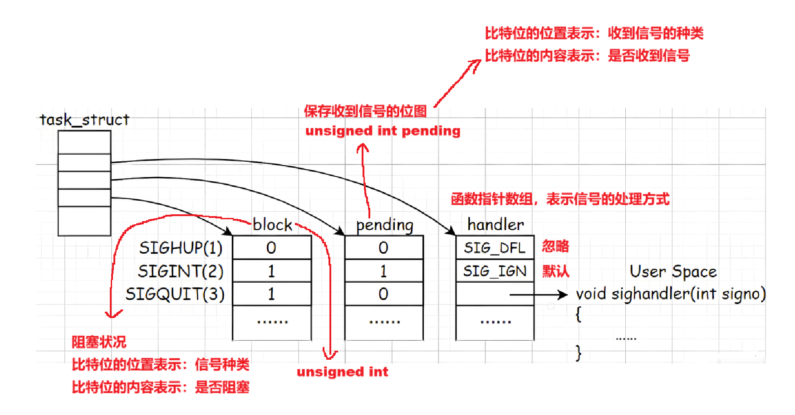
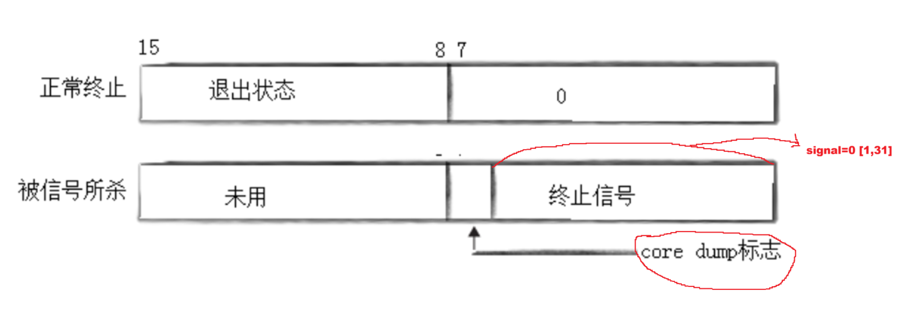
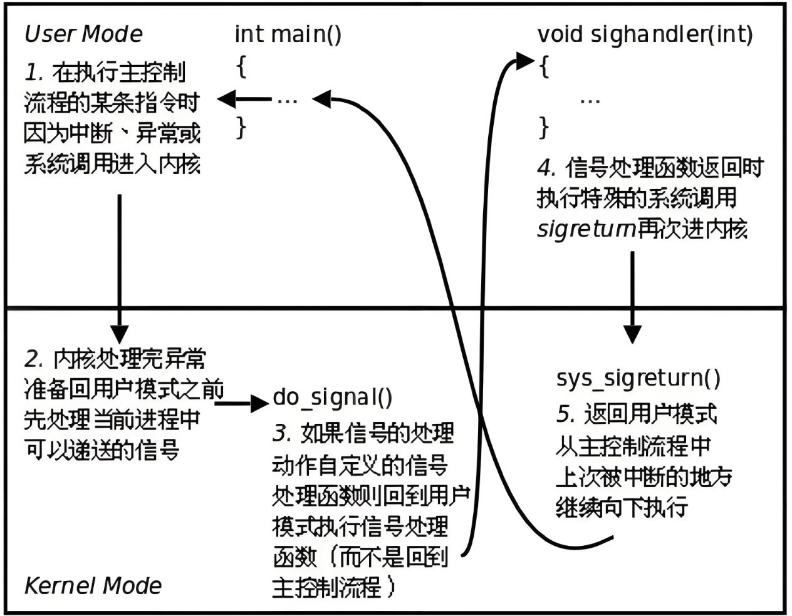
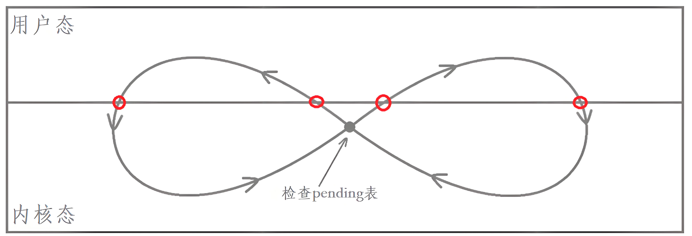
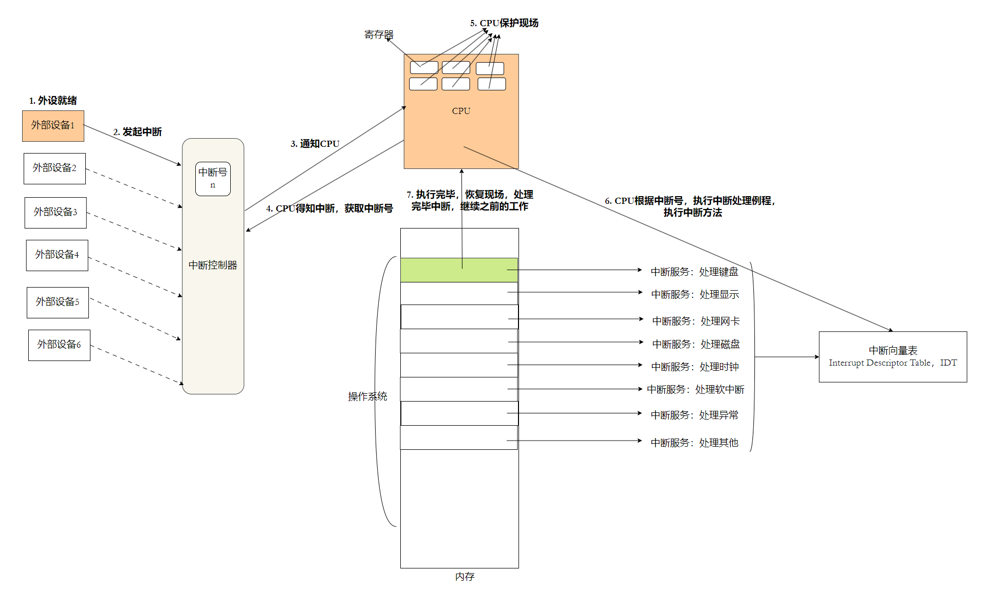
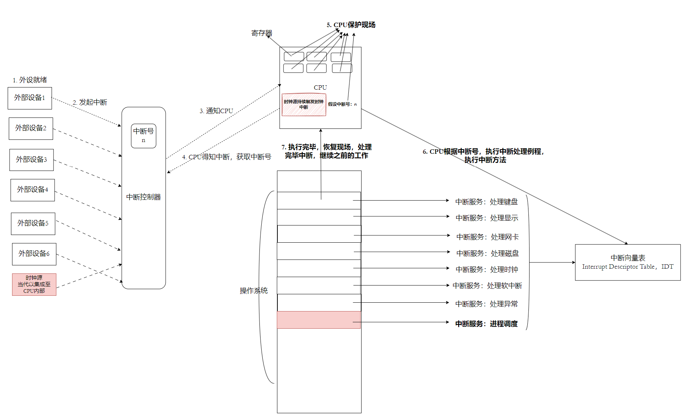
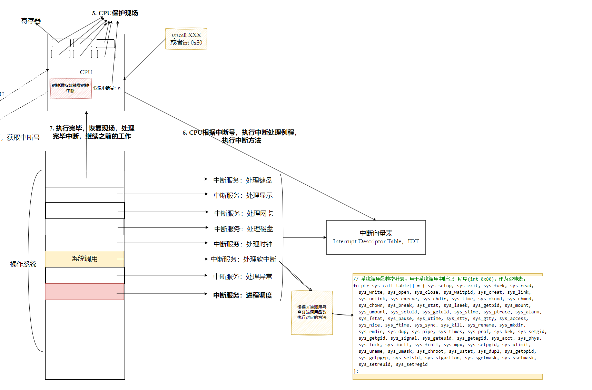
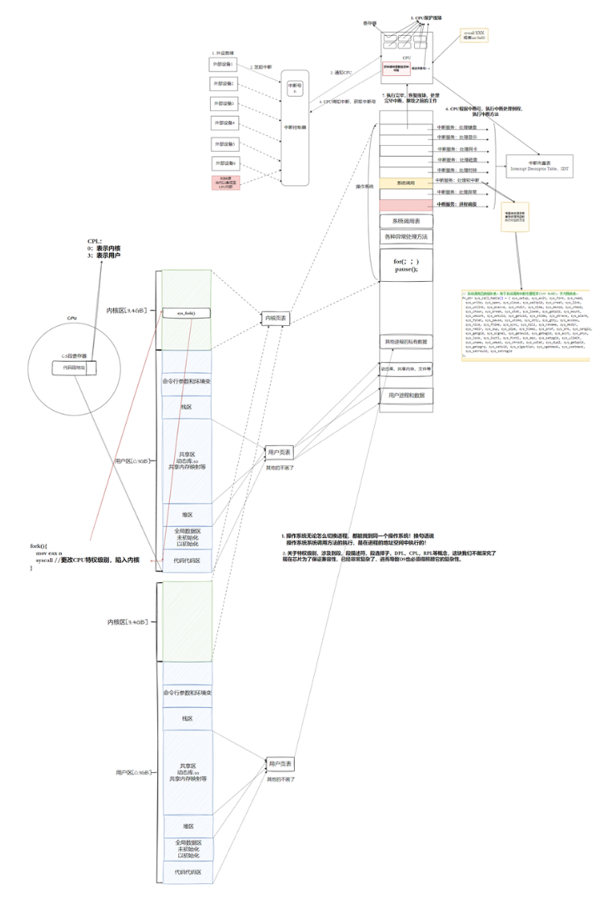
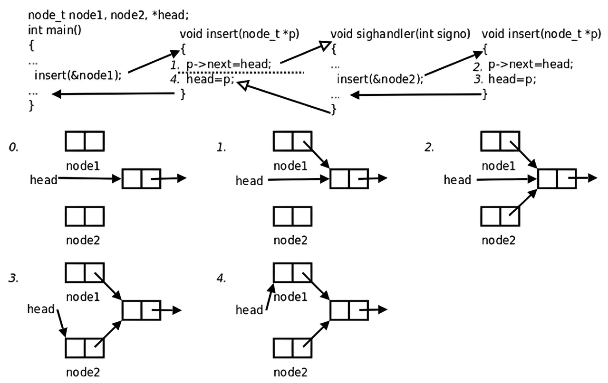

# 信号

## 前置

> 注意：信号与信号量毫无关系。

什么叫做信号：可能中断当前正在做的事情，**是==给进程发送的==一种事件的==异步==通知机制**。

同步是指事件不同时进行；异步是指事件在同时进行。

**信号的产生，相对于进程的运行，是异步的。**

### 结论

- 信号处理，进程在信号没有产生的时候，早就知道信号该如何处理了。
- 信号的处理，不是立即处理，而是可以等一会再处理，**合适的时候**，进行信号的处理。
- OS 程序员设计的进程，进程早已经内置了对于信号的识别与处理方法。
- 给进程产生信号的信号源非常多。

## 信号的产生

### 键盘产生

`Ctrl + C`是给目标进程发送信号的，相当一部分信号的处理，就是让自己终止！

- 信号都有哪些——`Ctrl + C`给进程发送信号，发哪一个信号呢？

使用`kill -l`查看所有信号：

```bash
 $ kill -l
 1) SIGHUP	 2) SIGINT	 3) SIGQUIT	 4) SIGILL	 5) SIGTRAP
 6) SIGABRT	 7) SIGBUS	 8) SIGFPE	 9) SIGKILL	10) SIGUSR1
11) SIGSEGV	12) SIGUSR2	13) SIGPIPE	14) SIGALRM	15) SIGTERM
16) SIGSTKFLT	17) SIGCHLD	18) SIGCONT	19) SIGSTOP	20) SIGTSTP
21) SIGTTIN	22) SIGTTOU	23) SIGURG	24) SIGXCPU	25) SIGXFSZ
26) SIGVTALRM	27) SIGPROF	28) SIGWINCH	29) SIGIO	30) SIGPWR
31) SIGSYS	34) SIGRTMIN	35) SIGRTMIN+1	36) SIGRTMIN+2	37) SIGRTMIN+3
38) SIGRTMIN+4	39) SIGRTMIN+5	40) SIGRTMIN+6	41) SIGRTMIN+7	42) SIGRTMIN+8
43) SIGRTMIN+9	44) SIGRTMIN+10	45) SIGRTMIN+11	46) SIGRTMIN+12	47) SIGRTMIN+13
48) SIGRTMIN+14	49) SIGRTMIN+15	50) SIGRTMAX-14	51) SIGRTMAX-13	52) SIGRTMAX-12
53) SIGRTMAX-11	54) SIGRTMAX-10	55) SIGRTMAX-9	56) SIGRTMAX-8	57) SIGRTMAX-7
58) SIGRTMAX-6	59) SIGRTMAX-5	60) SIGRTMAX-4	61) SIGRTMAX-3	62) SIGRTMAX-2
63) SIGRTMAX-1	64) SIGRTMAX
```

信号就是其序号的宏。

其中 [ 1 , 31 ] 为普通信号，可以不被立即处理；[ 34 , 64] 为实时信号，一般都需要立即处理。我们暂时只研究普通信号。 

**`Ctrl + C`就是给目标进程发送 2 号信号**。

`Ctrl + Z`——3	`Ctrl + \`——20

处理信号的方式可以有：默认处理、自定义处理和忽略处理。大部分进程收到信号的默认处理方式就是终止。

```c
typedef void (*sighandler_t)(int);
sighandler_t signal(int signum, sighandler_t handler);
```

`sighandler_t`是一个返回值为`void`，参数为`int`的函数指针类型。

`signal`可以自定义信号处理方式，当收到`signum`信号时，会去调用`handler`函数。

`man 7 signal`查看所有信号的详细信息：

```
Signal      Standard   Action   Comment
────────────────────────────────────────────────────────────────────────
SIGABRT      P1990      Core    Abort signal from abort(3)
SIGALRM      P1990      Term    Timer signal from alarm(2)
SIGBUS       P2001      Core    Bus error (bad memory access)
SIGCHLD      P1990      Ign     Child stopped or terminated
SIGCLD         -        Ign     A synonym for SIGCHLD
SIGCONT      P1990      Cont    Continue if stopped
SIGEMT         -        Term    Emulator trap
SIGFPE       P1990      Core    Floating-point exception
SIGHUP       P1990      Term    Hangup detected on controlling terminal
								or death of controlling process
SIGILL       P1990      Core    Illegal Instruction
SIGINFO        -                A synonym for SIGPWR
SIGINT       P1990      Term    Interrupt from keyboard
SIGIO          -        Term    I/O now possible (4.2BSD)
SIGIOT         -        Core    IOT trap. A synonym for SIGABRT
SIGKILL      P1990      Term    Kill signal
SIGLOST        -        Term    File lock lost (unused)
SIGPIPE      P1990      Term    Broken pipe: write to pipe with no
readers; see pipe(7)
SIGPOLL      P2001      Term    Pollable event (Sys V).
Synonym for SIGIO
SIGPROF      P2001      Term    Profiling timer expired
SIGPWR         -        Term    Power failure (System V)
SIGQUIT      P1990      Core    Quit from keyboard
SIGSEGV      P1990      Core    Invalid memory reference
SIGSTKFLT      -        Term    Stack fault on coprocessor (unused)
SIGSTOP      P1990      Stop    Stop process
SIGTSTP      P1990      Stop    Stop typed at terminal
SIGSYS       P2001      Core    Bad system call (SVr4);
								see also seccomp(2)
SIGTERM      P1990      Term    Termination signal
SIGTRAP      P2001      Core    Trace/breakpoint trap
SIGTTIN      P1990      Stop    Terminal input for background process
SIGTTOU      P1990      Stop    Terminal output for background process
SIGUNUSED      -        Core    Synonymous with SIGSYS
SIGURG       P2001      Ign     Urgent condition on socket (4.2BSD)
SIGUSR1      P1990      Term    User-defined signal 1
SIGUSR2      P1990      Term    User-defined signal 2
SIGVTALRM    P2001      Term    Virtual alarm clock (4.2BSD)
SIGXCPU      P2001      Core    CPU time limit exceeded (4.2BSD);
see setrlimit(2)
SIGXFSZ      P2001      Core    File size limit exceeded (4.2BSD);
see setrlimit(2)
SIGWINCH       -        Ign     Window resize signal (4.3BSD, Sun)

The signals SIGKILL and SIGSTOP cannot be caught, blocked, or ignored.
```

#### 前台进程与后台进程

输入：

- ./XXX ——前台进程
- ./XXX & ——后台进程
- 命令行shell进程——前台

键盘产生的信号只能给前台进程。

**后台进程无法从标准输入（键盘）中获取内容。前台进程可以。但是两者都能向标准输出上打印。**

**因为键盘只有一个——输入数据一定是给确定的进程的——前台进程只能有一个，后台可以有多个。**

**前台进程的本质，就是要从键盘中获取数据的。键盘输入只能给前台进程。**

`jobs`——查看后台任务。	`fg [任务号]`——将特定后台任务变成前台。

`Ctrl + Z`——将进程暂停，并自动提到后台。	`bg [任务号]`——将后台暂停进程，运行起来。

#### 理解“给进程发送信号”

信号产生之后，并不是立即处理，所以要求，进程必须把信号记录下来，在合适的时候处理。

**在进程 PCB 中，会有一个位图结构表示收到了哪个信号。因此发送信号，本质是向目标进程写信号，即修改位图。**

**PCB 是内核数据结构对象，修改位图本质就是修改内核的数据，能修改内核的只有==操作系统==自己！不管信号怎么产生，发送信号，在底层，必须让 OS 发送。**

因此 OS 必须提供发送信号的系统调用——`kill`！——`int kill(pid_t pid, int sig);`

### 系统调用产生信号

`int kill(pid_t pid, int sig);`——给`[pid]`进程发送`sig`信号。

**为了防止你将所有信号都自定义捕捉从而引发进程无法终止的问题，所以，==9和19号信号无法被自定义捕捉。==**

`int raise(int sig);`——自己给自己发送信号。

`void abort(void);`——强制终止进程。实际发送6号信号终止。如果自定义捕捉了6号信号，它会先执行自定义捕捉内容，再终止进程。

### 产生信号——硬件异常

当我们在程序中将一个数除以0，会崩溃。实际上它发送了一个8号信号，使进程退出。

当产生野指针时，程序也会出错误。它发送了一个11号信号。

信号全部都是 OS 发送的，当程序出错， OS 会识别错误，然后再发送信号。

那 OS 怎么知道出什么错了呢。

CPU（硬件）中有很多寄存器，包括状态寄存器EFLAGS，寄存器包含当前进程的上下文，出了什么错误，它会知道；而 OS 可以管理软硬件资源，那么就能从 CPU 中获取错误信息。

### 产生信号——软件条件

`unsigned int alarm(unsigned int seconds);`设置闹钟，结束时发送信号。

`int pause(void);`暂停进程直到有信号。

内核中定时器的数据结构：

```c
struct timer_list {
	struct list_head entry;
	unsigned long expires;
	void (*function)(unsigned long);
	unsigned long data;
	struct tvec_t_base_s *base;
}
```

可以使用一个最小堆来管理定时器，保证堆顶始终为最小值。但是内核中其实不是用对来管理的。

定时器发送信号的方式即为软件条件。

## 信号的保存

### 相关概念：

- 实际执行信号的处理动作称为**信号递达**。
- 信号从产生到递达之间的状态，称为**信号未决。**
- 进程可以选择阻塞某个信号。
- **被阻塞的信号产生时将保持在未决状态，直到进程解除对此信号的阻塞，才执行递达的动作。**
- 注意，阻塞和忽略是不同的，**只要信号被阻塞就不会递达，而忽略是在递达之后可选的一种处理动作**。

### 内核中的表示



内核中的任意一个信号都可以用这三个结构来表示。当信号递达时，pending 表由1变0.

### `sigset_t`

实际上是一个位图结构，未决和阻塞标志都可以用它来表示，sigset_t 称为信号集。阻塞信号也叫做当前进程的信号屏蔽字。

***

Linux 提供的信号操作一定是围绕着三张表展开的。

位图：

```c
struct bits
{
	int bitmap[10]	//每个数都有32位，共有10个数，总共有32*10=320个比特位。
}
```

### 信号集操作函数

```c
#include <signal.h>
int sigemptyset(sigset_t *set);
int sigfillset(sigset_t *set);
int sigaddset(sigset_t *set, int signo);
int sigdelset(sigset_t *set, int signo);
int sigismember(const sigset_t *set, int signo);
```

#### `sigprocmask`

`int sigprocmask(int how, const sigset_t *set, sigset_t *oldset);`——可以读取或更改进程的**信号屏蔽字（阻塞信号集）**。

对于 how 参数：


oldset 输出型参数，调用后得到老的block。

#### `sigpending`

`int sigpending(sigset_t *set);`——读取当前进程的**未决信号集**，通过**set参数**传出。  

**注意：9号信号不可被捕捉、不可被屏蔽。**

**当准备抵达时，要首先清空 pending 信号集中对应的信号位图 1 -> 0 。**

### Core / Term

各个进程的 Action 有 Term 和 Core 。两者核心区别是，对于 Core ，**当进程异常退出时，会在当前路径下形成一个文件，存储进程在内存中的核心数据**，从内存拷贝到磁盘形成文件，这种形式是==**核心转储**==——目的就是为了**支持 debug** 。而对于 Term ，进程异常退出时则是**直接退出**。但是在云服务器上，core dump功能是被禁止的。

`ulimit -c XXX`——启用core dump，文件大小为XXX。

核心转储的目的是为了支持 debug ——开启core dump ，直接运行崩溃，使用gdb，`core-file core`，直接帮助我们定位到出错行——事后调试。



## 信号的捕捉

### 信号捕捉流程



- 之前所说的合适的时候处理信号，此时刻就是进程从内核态返回到用户态的时候。

- 如果信号是默认或者忽略呢？如果是忽略，OS 会将pending 比特位由 1 改为 0 ，然后直接返回。如果是默认，那么 OS 会将进程直接杀掉，再返回；如果要暂停进程， OS 则会修改进程 PCB 中进程状态。
- 重谈自定义捕捉：
  - 我们在指向自定义方法时，OS也需要从内核态切换至用户态，去执行自定义捕捉，防止用户做出非法操作。
  - `sighandler` 函数返回后自动执行特殊的系统调用 `sigreturn` 再次进入内核态。



### 用户态和内核态

#### 操作系统是怎么运行的

##### ==硬件中断==



这与我们之前的自定义捕捉非常相似，但是信号是纯软件，本质是用软件来模拟中断。

##### ==时钟中断==

**当没有中断到来时，OS 保持暂停。**



时钟源以固定频率向 CPU 发送信号， OS 就在硬件时钟中断的驱使下进行调度了， **OS 就是基于中断进行工作软件。**

后来，设计者将时钟源集成进 CPU内部，因此， CPU 就有了主频的概念。

OS 就是一个死循环，时钟源给 CPU发送中断，使 OS 工作。

进程内部存在一个时间片，每次调度，时间片就会- -，当时间片减到0时，完成调度。

一台新的计算机，得到当前准确的时间戳后，就能得到历史总频率，每次调度将计数器+ +，进而可以使计算机在离线的情况下得到当前时间。

##### 软中断

当程序执行出错时，如产生除以0、野指针、指针重复释放等错误时，会使 CPU 中 EFLAGS 标志位溢出，产生中断号，去执行**异常中断**。


**当页表映射时发现虚拟地址存在，但物理地址不存在时，会触发缺页中断，去调用方法重新申请空间。**

没有硬件参与，只是由软件触发的中断称为软中断。

***

CPU内部自己也可以让软件去触发中断，使用`int(x86)`、`syscall(x86_64)`可主动执行中断。

当我们调用系统调用时，具体是怎么进入 OS 的呢？

这里有一张系统调用表（函数指针数组），里面存放了所有的系统调用。从此往后，每个系统调用都有一个唯一的下标，此下标叫做**系统调用号**。



==**校正概念：OS 不提供任何系统调用接口，OS只提供系统调用号，而我们所使用的open/fork等等都是glibc所封装的。**==系统调用号与系统调用通过 eax 寄存器来传递。

- 无论是什么问题，都会去执行软中断， OS 就是躺在中断历程上的代码块。
- CPU内部的软中断，比如int 0x80或syscall，叫做陷阱。
- 除以0，野指针叫做异常。

#### 理解用户态与内核态



操作系统也是软件，一定也存在内存。

**用户页表会存在多份，但是内核页表只有一份，所有进程共享。**这就意味着，无论如何调度进程，我们都能找到 OS 。 **系统调用的过程也是在进程地址空间上进行的，所有的系统调用都是地址空间之间的跳转。**

问题来了，如果用户拿到虚拟地址 [3 , 4GB]，用户不就可以随便访问内核的代码和数据了吗？

此时就引入用户态和内核态：

- 用户态：以用户身份，只能访问自己的[0 , 3GB]。
- 内核态，以内和身份，运行你通过系统调用的方式访问 OS 的[3 , 4GB]。

在 OS 中，怎么判断当前是用户态还是内核态呢？

- CPU 内有一个 cs 寄存器，如果低两位比特位为01表示内核态；为11表示用户态。

**用户态 CPU 权限级别为 3 ，只能访问[0 , 3GB]；内核态 CPU 权限级别为 0 ，允许用户使用系统调用，通过 eax 寄存器将系统调用号传到 CPU ，根据系统调用表使用系统调用。其中此权限标志位称为 CPL 。**

***

自定义处理的另一种方法：

`int sigaction(int signum, const struct sigaction *act,struct sigaction *oldact);`

```c
struct sigaction {
               void     (*sa_handler)(int);
               void     (*sa_sigaction)(int, siginfo_t *, void *);
               sigset_t   sa_mask;
               int        sa_flags;
               void     (*sa_restorer)(void);
           };
```

这个结构体中有一个信号集的参数，当某个信号正在处理时，会先将其阻塞再处理，处理完了再解除阻塞，这样就能保证，如果在处理时又来一个这个信号，那么它就会先阻塞直到上一个信号处理完了了，它再进行处理。因此，当信号递达时，pending 表由 1 变 0 ，block 表由 0 变 1 。

==**正在处理的信号，会被自动屏蔽。**==

如果在处理信号时，还想屏蔽其他信号，可以在 sa_mask 信号集中添加信号。

## 可重入函数



main执行流与handler执行流重复执行 insert 方法，此方法被两个以上执行流重复进入了，此函数被重入了。

函数分为可重入函数与不可重入函数，这是函数的特点之一。大部分的函数都是不可重入的。

如果一个函数符合以下条件之一则是不可重入的: 

- 调用了 malloc 或 free ，因为 malloc 也是用全局链表来管理堆的。 
- 调用了标准 I/O 库函数。标准 I/O 库的很多实现都以不可重入的方式使用全局数据结构。

只有自己临时变量的函数是可重入的。

## volatile

volatile 修饰的变量，保证内存空间可见性，每次检测变量都从内存空间里查看变量。

## sigchld信号

17号信号，子进程在退出时会给父进程发送 sigchld 信号。父进程默认处理动作是 Ign 忽略。

```c
void WaitAll(int num){
    waitpid(-1, nullptr, 0);
    std::cout << "father get a signal: " << num << std::endl;
}

int main(){
    signal(SIGCHLD, WaitAll); 
    pid_t id = fork();
    if (id == 0){
        std::cout << "I am child, exit" << std::endl;
        sleep(3);
        exit(3);
    }
    while (true){
        std::cout << "I am fater, exit" << std::endl;
        sleep(1);
    }
    return 0;
}
```

这是只有一个子进程的情形。但如果是几乎在同一时间内创建的大量子进程呢，每个子进程退出都会发送sigchld信号，可能前一个信号还没递达，pending 表还是 1 ，后一个信号就来了，这样就会导致信号丢失，无法回收子进程。

***

可以通过自定义捕捉使用 waitpid 非阻塞轮询来回收子进程。

```c
void WaitAll(int num)
{
    while (true)
    {
        pid_t n = waitpid(-1, nullptr, WNOHANG);
        if(n == 0)
        {
            break;
        }
        else if(n < 0)
        {
            std::cout << "waitpid error " << std::endl;
            break;
        }
    }

    std::cout << "father get a signal: " << num << std::endl;
}
int main()
{
    signal(SIGCHLD, WaitAll);
    int pid = fork();
    if (pid == 0)
    {
        std::cout<<"I am a child new I will exit"<<std::endl;
        sleep(3);
        exit(300);
    }
    std::cout<<"I am Futher I will exit"<<std::endl;
    return 0;
}
```

***

事实上,由于UNIX的历史原因,要想不产生僵尸进程还有另外一种办法：父进程调用 sigaction 将 SIGCHLD 的处理动作置为 SIG_IGN ，这样 fork 出来的子进程在终止时会自动清理掉,不会产生僵尸进程, 也不会通知父进程。此方法对于Linux可用，但不保证在其它UNIX系统上都可用。请编写程序验证这样做不会产生僵尸进程。

上述方法的确定就是拿不到子进程的返回状态。

问题来了：它的默认处理动作不是忽略吗，那为什么自定义捕捉还要捕捉成SIG_IGN，这不多此一举吗？更关键的是，为什么一改就不会产生僵尸了呢？

sigchld的默认处理动作是SIG_DFL，而SIG_DFL具体是Ign，我们是把SIG_DFL设为SIG_IGN。
