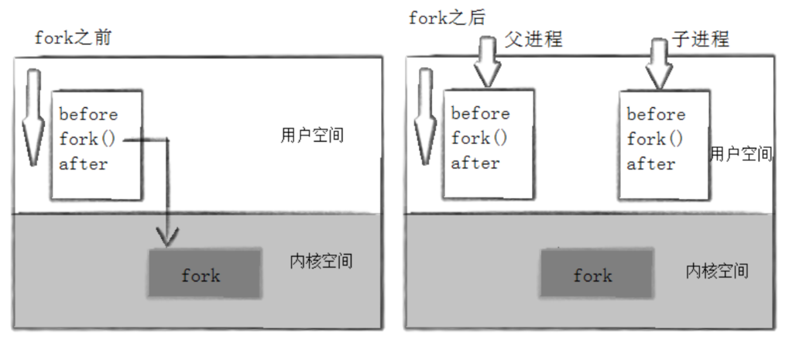
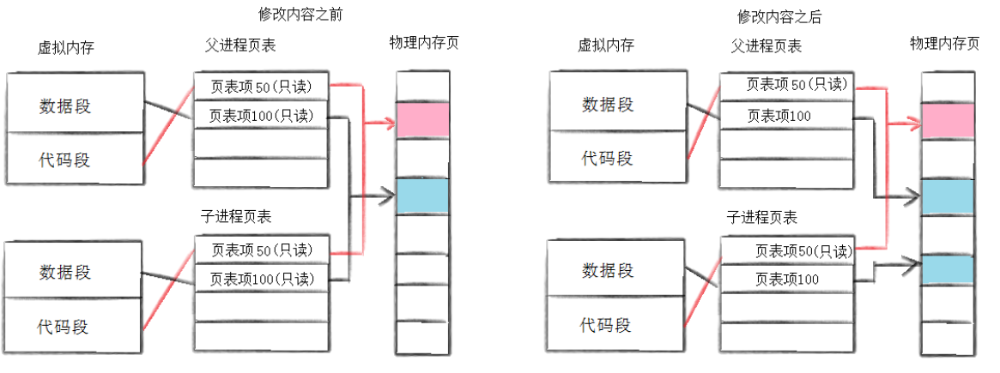
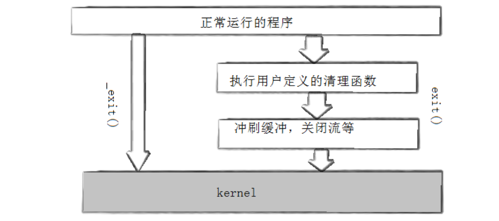
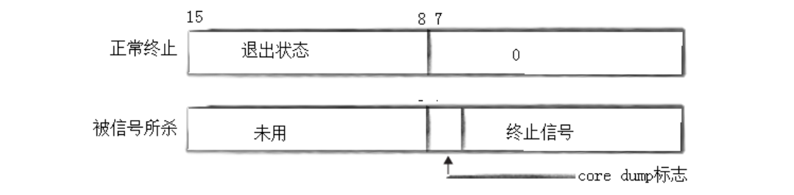
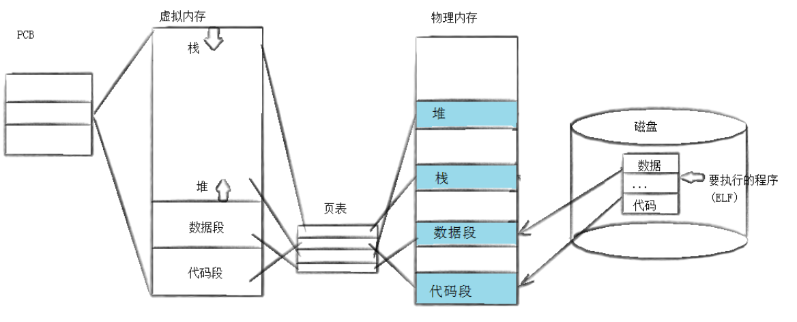
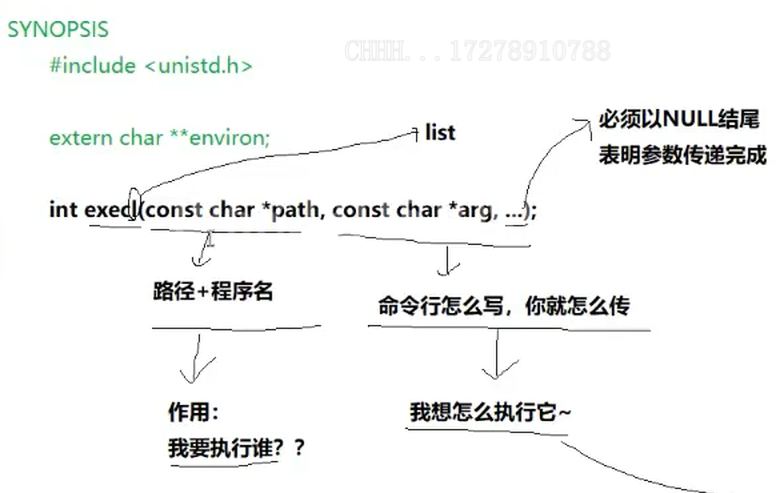
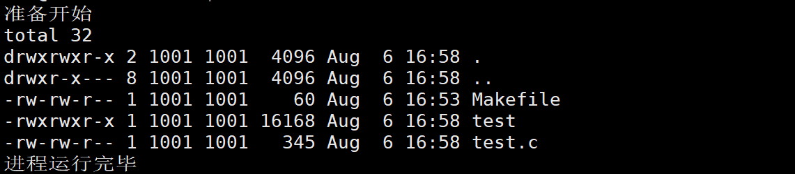
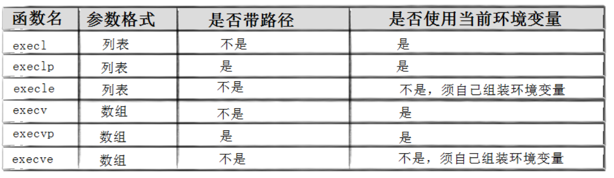

# 一、创建进程

## 1. fork

具体的使用之前已经讲过。

调用`fork`，内核：

- 分配新的内存块和内核数据结构给子进程 
-  将父进程部分数据结构内容拷贝⾄子进程
- 添加子进程到系统进程列表当中
- fork 返回，开始调度器调度



**如果进程执行的代码是其他操作系统的代码和数据，那么这就是内核级虚拟机。**

## 2. 写时拷贝



## 3. fork常规用法

- 希望父子进程执行不同代码段。
- 一个进程要执行一个不同的程序。

## 4. fork失败原因

- 系统有太多进程。
- 实际用户进程超过了限制。

# 二、进程终止

**程序退出场景：**

- 代码运行完毕，结果正确。
- 代码运行完毕，结果错误。
- 代码异常终止。

父进程需要得到这些场景信息。

`main`函数的返回值，通常表明程序的执行情况，结果正确`return 0`，结果不正确`return !0`。我们可以用不同的值表明不同的错误原因。`return`的值一般会返回给父进程。

`echo $?`可以打印最近一个程序（进程）退出时的退出码。**进程退出码会写到当前进程的`task_struct`里。**

当代码异常时，退出码无意义。进程一旦出现异常，一般是进程收到了信号。

可以使用`exit(int x)`（C语言提供）直接退出进程，退出码为`x`。任何地方调用`exit`表示进程结束，并返回给父进程`bash`，子进程的退出码。

`_exit`（系统提供）可以直接终止调用它的进程。

区别：`exit`退出时，会刷新缓冲区；`_exit`退出时，不会刷新缓冲区。`exit`底层是调用了`_exit`，但是在调用之前还做了其他事情：

1. 先执行用户通过`atexit`或`on_exit`定义的清理函数。
2. 关闭所有打开的流，所有的缓存数据均被写入。
3. 调用`_exit`。



要了解，我们之前谈的缓冲区，一定不是操作系统内部的缓冲区，而是C语言提供的缓冲区。

# 三、进程等待

## 1. 原因

父进程通过等待的方式，回收子进程资源，获取子进程退出信息，解决僵尸进程，防止内存泄漏。

## 2. 方法

父进程通过`wait`方法来等待。

`wait`是等待任意一个退出的子进程。成功返回目标Z进程的`pid`，失败返回-1。子进程没有退出时，父进程会等待在`wait`位置。

`pid_t waitpid(pid_t pid,int *status,int options);`可以等待指定进程，当`pid==-1`时，它可以用于接收任意进程，当父进程没有子进程时，会等待失败。

`status`是输出型参数，由系统填充。`status`有32位比特位，高16位不使用，使用低16位，而低16位的高8位表示退出码。



绝对不能使用全局变量来获取子进程退出码，进程之间具有独立性，子进程修改全局变量会发生写时拷贝。

如果进程异常退出，`status`第7位保存对应信号编号，没有异常则是0。这说明，一旦第7位不为0，异常退出，退出状态无意义。

`status`是怎么拿到退出码的？

- 子进程的退出码会存在子进程的`task_struct`里，父进程调用`waitpid()`，通过系统调用去子进程的`task_struct`找到退出码。之前调用的`getpid()`/`getppid()`也是类似的原理。
- **因此，子进程僵尸状态，就是为了`task_struct`里有相应的数据供父进程读取。**
- 宏`WIFEXITED(status)`可查看进程是否正常退出，正常退出为真。宏`WEXITSTATUS(status)`可以直接获取退出码。

`option`选项用于阻塞控制。`waitpid`默认为阻塞调用，当`option`为`WNOHANG`时为非阻塞调用。**多次调用等待结果称为非阻塞轮询，一次调用等待结果称为阻塞调用。**

`waitpid`返回值>0：等待已结束；

返回值=0：一次调用结束，但子进程没有退出；

返回值<0：等待失败。

# 四、进程程序替换

## 原理



执行`execl`时，进程会将新路径下的代码和数据替换到原来的代码段和数据段。

在程序替换过程中，并没有创建新的进程，只是：把当前进程的代码和数据用新的程序的代码和数据覆盖式的进行替换。

1. 一旦替换执行成功，就去执行新代码了，原始代码的后半部分就已经不存在了。

2. `exec`系列函数，只有失败会返回值，成功不会返回值。因此，它有返回值，必定是失败。

## 认识所有接口

```c
#include <unistd.h>

extern char **environ;

int execl(const char *pathname, const char *arg, ...
                /* (char  *) NULL */);
int execlp(const char *file, const char *arg, ...
                /* (char  *) NULL */);
int execle(const char *pathname, const char *arg, ...
                       /*, (char *) NULL, char *const envp[] */);
int execv(const char *pathname, char *const argv[]);
int execvp(const char *file, char *const argv[]);
int execvpe(const char *file, char *const argv[],
                char *const envp[]);
```



看代码：

```c
#include <stdio.h>
#include <sys/wait.h>
#include <unistd.h>
#include <stdlib.h>
int main()
{
    printf("准备开始\n");
    if(fork()==0)
    {
        sleep(1);
        //子进程
        execl("/usr/bin/ls","/usr/bin/ls","-ln","-a",NULL);
        exit(1);
    }
    waitpid(-1,NULL,0);
    printf("进程运行完毕\n");
    return 0;
}
```



为什么进行程序替换后，父进程没有受到影响？

1. 进程具有独立性。
2. 子进程发生替换，数据和代码发生写时拷贝。

它也可以调用我们自己写的程序。

所有程序都是`bash`的子进程，那么程序`main`函数命令行参数都是其父进程`bash`通过`exec`来传的。

- l(list) :表示参数采用列表。

- v(vector) :参数用数组。
- p(path) :有p自动搜索环境变量PATH。
- e(env) :表示自己维护环境变量。



`int putenv(char *string);` 新增环境变量。
