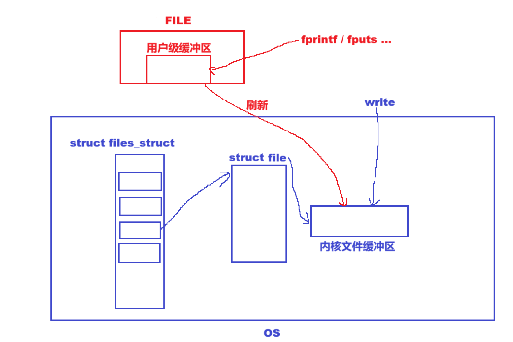

# 基础IO

> 主题：理解文件 · C 语言的文件 · 系统 IO · 一切皆文件 · 缓冲区
> 上一篇：[进程控制](./进程控制（优化整理版）.md)

## 目录

- [一、理解文件](#一理解文件)
- [二、C 语言的文件](#二c-语言的文件)
- [三、系统 IO](#三系统-io)
- [四、一切皆文件](#四一切皆文件)
- [五、缓冲区](#五缓冲区)

---

## 一、理解文件

0KB 的文件是占据空间的。**文件 = 内容 + 属性**，我们对文件的操作都是围绕着内容和属性展开的。

**狭义理解：**

- 文件在磁盘里。
- 磁盘是永久性存储介质，因此文件在磁盘上的存储是**永久性**的。
- 磁盘是外设（既是输出设备也是输入设备）。
- 磁盘上的文件本质：对文件的所有操作，都是对外设的输入和输出，简称 **IO**。

**广义理解：Linux 一切皆文件。**

**系统角度：**

- 对文件的操作本质是**进程对文件的操作**。
- 磁盘的管理者是操作系统。
- 文件的读写本质不是通过 C/C++ 的库函数来操作的（这些库函数只是为用户提供方便），而是通过文件相关的**系统调用接口**来实现的。
- 操作系统一定会提供系统调用，使用户能够操作磁盘硬件。`fopen`、`fclose` 等等都是封装了底层 OS 的系统调用。

访问文件，需要先打开文件。打开文件的是进程。

>  核心结论：**对文件的操作，本质是进程对文件的操作。**

---

## 二、C 语言的文件

C 会默认打开三个输入输出流：`stdin`、`stdout`、`stderr`。

| 流 | 含义 |
|---|---|
| `stdin` | 标准输入，键盘文件 |
| `stdout` | 标准输出，显示器文件 |
| `stderr` | 标准错误，显示器文件 |

```c
#include <stdio.h>

extern FILE *stdin;
extern FILE *stdout;
extern FILE *stderr;
```

### 文件打开方式

| 模式 | 说明 |
|---|---|
| `r` | 以只读方式打开文本文件，流定位在文件开头 |
| `r+` | 打开用于读写，流定位在文件开头 |
| `w` | 将文件截断为零长度，或创建文本文件用于写入，流定位在文件开头 |
| `w+` | 打开用于读写；文件不存在则创建，存在则截断，流定位在文件开头 |
| `a` | 打开用于追加（在文件末尾写入）；文件不存在则创建，流定位在文件末尾 |
| `a+` | 打开用于读取和追加；文件不存在则创建，读的初始位置在文件开头，但输出总是追加到文件末尾 |

---

## 三、系统 IO

### 1. 接口

```c
int open(const char *pathname, int flags);
int open(const char *pathname, int flags, mode_t mode);
```

打开或创建一个文件。

**flags 常用宏：**

| 宏 | 含义 |
|---|---|
| `O_RDONLY` | 只读 |
| `O_WRONLY` | 只写 |
| `O_RDWR` | 读写 |
| `O_CREAT` | 不存在就新建 |
| `O_TRUNC` | 打开时清空文件内容 |
| `O_APPEND` | 追加内容 |

>  如果不带第三个参数（权限位），创建文件时的权限是**乱码**。

**`mode_t umask(mode_t mask);`** 设置权限掩码；如果不设置，就是系统默认。

| 函数 | 说明 |
|---|---|
| `close(fd)` | 关闭文件，`fd` 为 `open` 的返回值 |
| `ssize_t write(int fd, const void *buf, size_t count);` | 写入内容 |

>  写入内容为字符串时，`count` 为 `strlen`，**不能 `+1`**。
> 对于 `write`，系统不关心写入的类型；写入其他类型时，需要先格式化为字符串，此格式化由语言提供或自己实现。

**`ssize_t read(int fd, void *buf, size_t count);`** 读数据：读取成功返回文件大小，失败返回小于 0。

### 2. 文件描述符

- 打开成功时，`open` 的返回值 `fd` 一定**大于等于 0**。
- **`fd` 0、1、2 三者分别为标准输入、标准输出、标准错误。**

再看 `FILE *fopen(const char *pathname, const char *mode);`——`FILE` 指什么呢？

- `FILE` 是 C 语言中定义的一个**结构体**，由 `typedef` 而来。
- 无论是什么语言，在 OS 接口中，OS 只认 `fd`（文件描述符）。
- 因此 `FILE` 中一定封装了 `fd`，它就是 **`fileno`**。

**为什么这样设计 `FILE`？**

>  `FILE` 中封装了各个系统的文件标识符，根据平台条件编译，使代码具备**可移植性**。


### 3. 重定向原理

**文件描述符分配原则：最小的、没有被使用的，作为最新的 `fd` 分配给用户。**

```c
close(1);
int fd = open("log.txt", O_CREAT | O_WRONLY | O_TRUNC, 0666);
printf("fd: %d\n", fd);
```

随后，原本应该打印到显示器上的信息 `fd: 1` 被打印到了 `log.txt` 文件中：


因为 OS 只认 `fd`，`printf` 打印 `fd = 1` 的文件中——该文件原本是标准输出，现在是 `log.txt`。

**`int dup2(int oldfd, int newfd);`** 重定向系统调用：将 `oldfd` 的 `file` 拷贝到 `newfd` 的位置，即 `newfd` 指向 `oldfd`。

>  **重定向 = 打开方式 + `dup2`。**

---

## 四、一切皆文件

- 1、2 文件都是指向显示器的，直接重定向只会使 1 改变。
- 可以利用标准错误的重定向能力，将常规消息与错误信息进行**分离**。


无论文件怎么样，在系统看来，都类似于一个 `char` 类型的数组，因此在 `struct file` 里，有一个 **`f_pos`** 记录文件的起始位置。

- 每个文件都有一个**内核缓冲区**和一个 **`inode`**：缓冲区记录内容，`inode` 记录属性。
- 除了读写外，在 `operation` 中有多种操作。


---

## 五、缓冲区

**缓冲区就是内存中的一段空间。**

- 在 C 语言标准库中，每个打开的文件都会有一个**用户级语言层缓冲区**。
- 打印会先打印到这个缓冲区中，当用户**强制刷新、刷新条件满足或进程退出时**，标准库会将缓冲区内容刷新到**内核缓冲区**中，交给 OS。
- `FILE` 是 C 语言的结构体，里面会有**缓冲区**。

**所谓格式化输出，就是将数据格式化输出到语言缓冲区中；当刷新时，再将缓冲区内容拷贝到内核缓冲区，接下来的任务就交给 OS 了。**

> 频繁使用系统调用会降低效率，向内核缓冲区刷新成本较高。因此，**C 语言的缓冲区就是为了减少系统调用次数**——将多次少量内容的刷新，改为一次大量内容的刷新，提高效率。

- `fprintf`、`fputs` 都是**库函数**，向语言缓冲区里写；
- `write` 是**系统调用**，向内核缓冲区里写。

**刷新方案：**

| 方案 | 说明 | 适用 |
|---|---|---|
| 立即刷新 | 无缓冲（写透模式 `WT`） | — |
| 满了再刷新 | 全缓冲，效率最高 | 普通文件一般使用 |
| 行刷新 | 行缓冲 | 显示器 |

>  OS 的刷新方案由 OS 自主决定。**把数据交给 OS，就相当于交给了硬件，其本质就是拷贝。**



### 经典现象：重定向 + fork

```c
// 库函数
printf("hello printf\n");
fprintf(stdout, "hello fprintf\n");
const char *s = "hello fwrite\n";
fwrite(s, strlen(s), 1, stdout);

// 系统调用
const char *ss = "hello write\n";
write(1, ss, strlen(ss));

// ???
fork();
```

```bash
$ ./a.out
hello printf
hello fprintf
hello fwrite
hello write

$ ./a.out > log.txt
$ cat log.txt
hello write
hello printf
hello fprintf
hello fwrite
hello printf
hello fprintf
hello fwrite
```

**原因分析：**

- 重定向不仅仅改变了文件，同时还改变了文件的**刷新方式**：向显示器打印为**行刷新**，向普通文件打印为**全缓冲**，从而导致库函数的三条信息没有马上刷新。
- 最后 `fork()` 产生子进程，父子进程退出时都要刷新缓冲区，使库函数的内容**刷新了两次**（`write` 是系统调用直接写入，不经过语言缓冲区，故只出现一次）。

