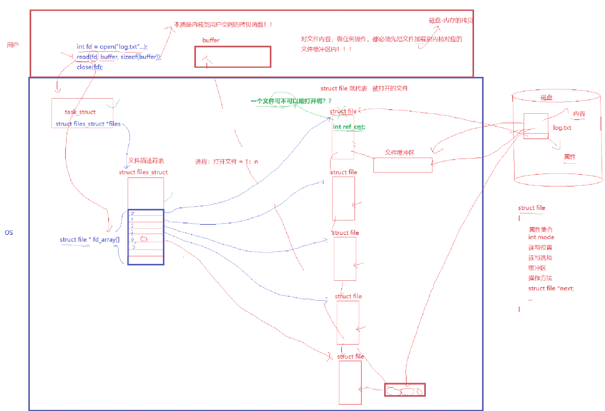
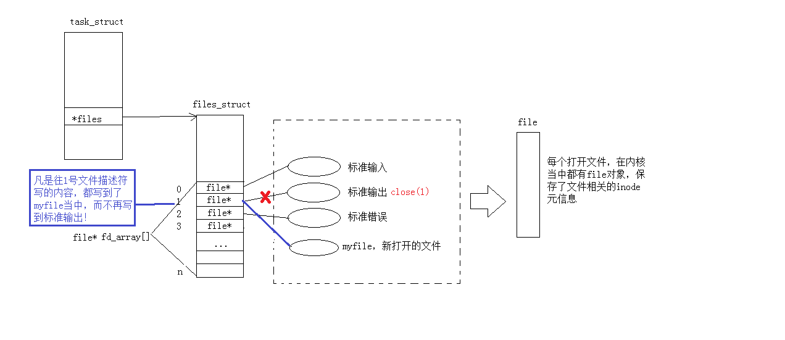
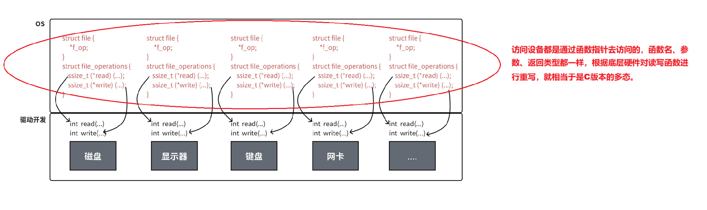
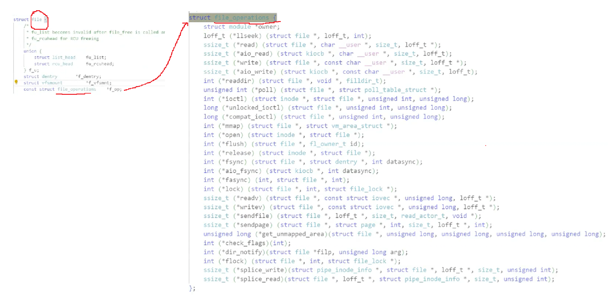
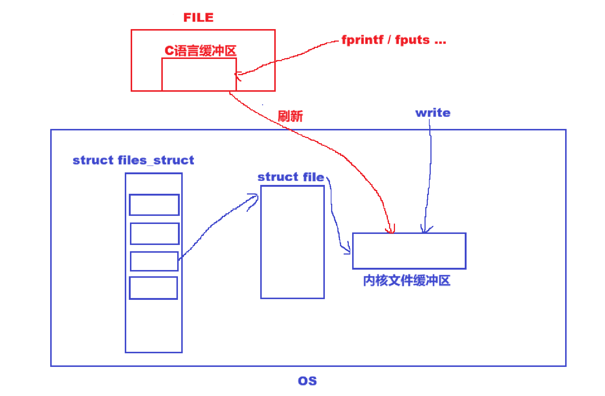

# 一、理解文件

0KB的文件是占据空间的。**文件=内容+属性**，我们对文件的操作都是围绕着内容和属性展开的。

**狭义理解：**

- 文件在磁盘里。

- 磁盘是永久性存储介质，因此文件在磁盘上的存储是永久性的。
- 磁盘是外设（即是输出设备也是输入设备）。
- 磁盘上的文件本质是对文件的所有操作，都是对外设的输入和输出简称IO。

**广义理解：Linux一切皆文件。**

***

**系统角度：**

- 对文件的操作本质是进程对文件的操作。
- 磁盘的管理者是操作系统。
- 文件的读写本质不是通过C语言/C++的库函数来操作的（这些库函数只是为用户提供方便），而是通过文件相关的系统调⽤接口来实现的。
- 操作系统一定会提供系统调用，使用户能够操作磁盘硬件。`fopen`、`fclose`等等都是封装了底层OS的系统调用。

访问文件，需要先打开文件。打开文件的是进程。==**对文件的操作，本质是进程对文件的操作。**==

# 二、C语言的文件

C会默认打开三个输入输出流，分别是`stdin`、`stdout`、`stderr`。

- `stdin`：标准输入，键盘文件。
- `stdout`：标准输出，显示器文件。
- `stderr`：标准错误，显示器文件。

```c
#include <stdio.h>

extern FILE *stdin;
extern FILE *stdout;
extern FILE *stderr;
```

***

**文件打开方式：**

```
r Open text file for reading.
The stream is positioned at the beginning of the file.
    
r+ Open for reading and writing.
The stream is positioned at the beginning of the file.
    
w Truncate(缩短) file to zero length or create text file for writing.
The stream is positioned at the beginning of the file.

w+ Open for reading and writing.
The file is created if it does not exist, otherwise it is truncated.
The stream is positioned at the beginning of the file.

a Open for appending (writing at end of file).
The file is created if it does not exist.
The stream is positioned at the end of the file.

a+ Open for reading and appending (writing at end of file).
The file is created if it does not exist. The initial file position
for reading is at the beginning of the file,
but output is always appended to the end of the file.
```

# 三、系统IO

## 1.接口

```c
int open(const char *pathname, int flags);
int open(const char *pathname, int flags, mode_t mode);
```

打开可能或创建一个文件。

`flags`可以为宏：`O_RDONLY`（读）、`O_WRONLY`（写）、`O_RDWR`（读写）、`O_CREAT`（不存在就新建）等等。

当`flag`带上`O_TRUNC`（清空）时，打开文件内容会清空，不带它时就不会清空。`O_APPEND`为追加内容。

如果不带第三个参数权限位，创建文件时的权限是乱码。

**`mode_t umask(mode_t mask);`**设置权限掩码。如果不设置，就是系统默认。

**`close(fd)`**关闭文件，`fd`为`open`的返回值。

**`ssize_t write(int fd, const void *buf, size_t count);`**写入内容。

注意，写入内容为字符串时，`count`为`strlen`，不能`+1`。

对于`write`，系统不关心写入的类型，当写入类型为其他类型时，需要先格式化为字符串才能写入，此格式化由语言提供或自己实现。

**`ssize_t read(int fd, void *buf, size_t count);`**读数据。读取成功返回文件大小，失败返回小于0。

## 2.文件描述符

打开成功时，`open`的返回值`fd`一定大于等于0。**其中`fd`0、1、2三者为标准输入、标准输出、标准错误。**

再看`FILE *fopen(const char *pathname, const char *mode);`，其中，`FILE`指什么呢？

`FILE`是C语言中定义的一个结构体，由`typedef`而来。

无论是什么语言，在OS接口中，OS只认`fd`，即文件描述符。因此，`FILE`中一定封装了`fd`，它就是`fileno`。

为什么这样设计`FILE`呢？

`FILE`中封装了各个系统的文件标识符，根据平台条件编译，使代码具备可移植性。

***



## 3.重定向原理

文件描述符分配原则：最小的，没有被使用的，作为最新的`fd`分配给用户。

```c
close(1);
int fd=open("log.txt",O_CREAT | O_WRONLY | O_TRUNC, 0666);
printf("fd: %d\n",fd);
```

随后，原本应该打印到显示器上的信息`fd: 1`被打印到了`log.txt`文件中



因为OS只认`fd`，`printf`打印`fd=1`的文件中，该文件原本是标准输出，现在是`log.txt`。

`int dup2(int oldfd, int newfd);`重定向系统调用。——将`oldfd`的`file`拷贝到`newfd`的位置，即`newfd`指向`oldfd`。

重定向=打开方式+`dup2`。

# 四、一切皆文件

1、2文件都是指向显示器的，直接重定向只会使1改变。

可以利用标准错误用重定向能力将常规消息与错误信息进行分离。

无论文件怎么样，在系统看来，都类似于一个`char`类型的数组，因此在`struct file`里，有一个`f_pos`记录文件的起始位置。

每个文件都有一个内核缓冲区，一个`innode`，缓冲区记录内容，`inode`记录属性。





除了读写外，在`operation`中有多种操作。

# 五、缓冲区

缓冲区就是内存中的一段空间。

在C语言标准库中，每个打开的文件都会有一个用户级语言层缓冲区，打印会先打印到这个缓冲区中，当用户**强制刷新、刷新条件满足或进程退出时**，标准库会将缓冲区内容刷新到内核缓冲区中，交给OS。

`FILE`是C语言的结构体，里面会有**缓冲区**。

所谓格式化输出就是将数据格式化输出到**语言缓冲区**中，当刷新时，再将缓冲区内容**拷贝到内核缓冲区**，接下来的任务就交给OS了。

***

**频繁使用系统调用会降低效率，向内核缓冲区刷新成本较高。因此，C语言的缓冲区就是为了减少系统调次数，将多次少量内容的刷新改为一次大量内容的刷新，提高效率。**

`fprintf`、`fputs`都是库函数，向语言缓冲区里写，`write`是系统调用，向内核缓冲区里写

刷新方案：

1. 立即刷新——无缓冲——写透模式`WT`
2. 满了——全缓冲——效率最高，普通文件一般使用这种方案
3. 行刷新——行缓冲——显示器用

OS的刷新方案由OS自主决定。把数据交给OS，就相当于交给了硬件，==**其本质就是拷贝**==。

