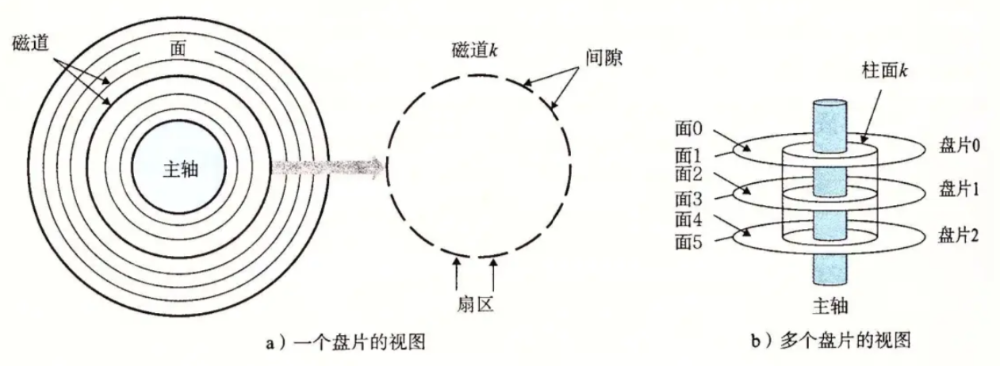
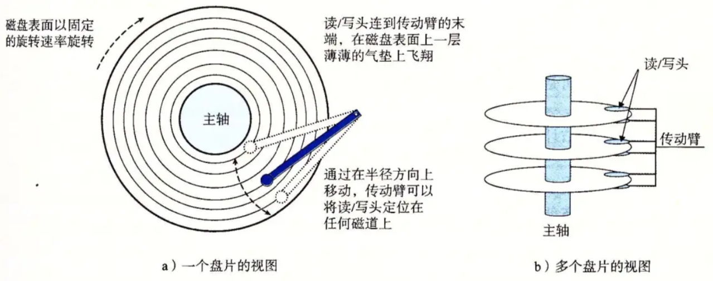
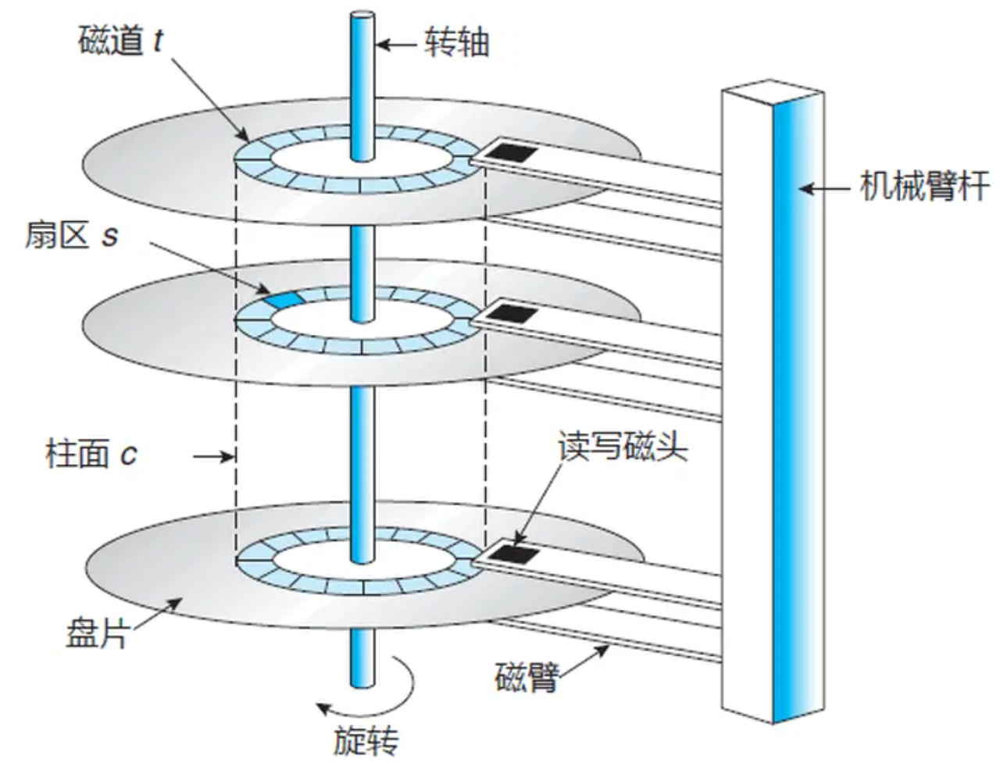
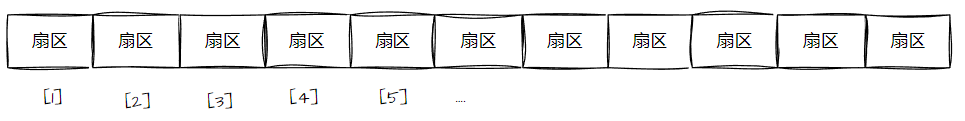
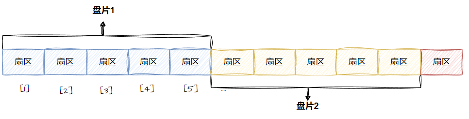
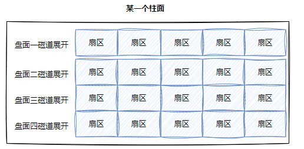
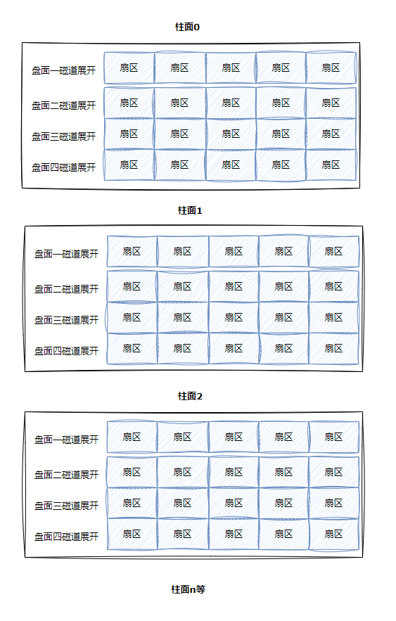
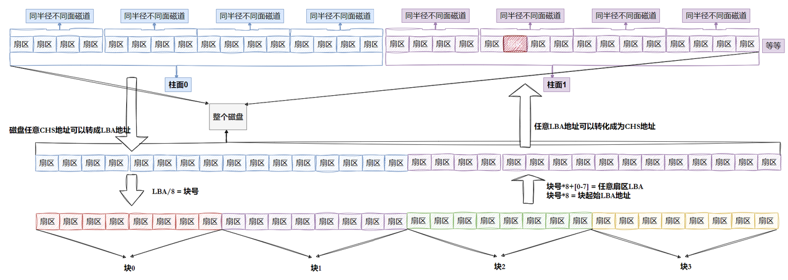
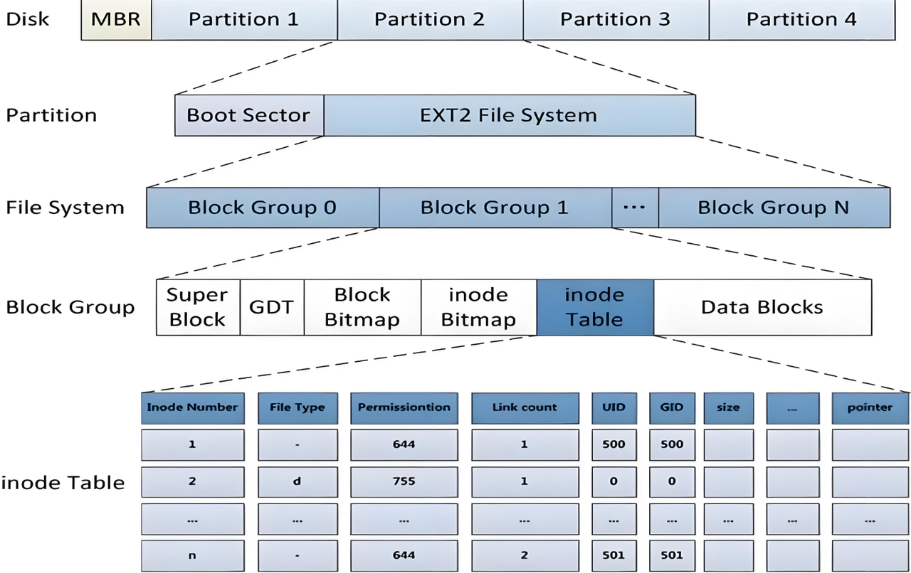

文件如果被打开了——在内存。	没有被打开——在磁盘。

# 一、理解硬件

## 1. 结构

磁盘的存储结构：

扇区：**是磁盘存储数据的基本单位，512字节**，块设备。

磁头在传动臂的作用下共进退。

磁盘读写数据：先确定数据所在柱面，将磁头前后移动定位柱面，再选择扇区对应的磁头，等待磁盘旋转直到扇区转到磁头位置。

**因此，只需要知道柱面（Cylinder）、磁头（Head）、扇区（Sector）的参数，我们就可以进行读写数据，这种方案被称为CHS定址。**

***

磁带也可以存储数据，将磁带拉直，它本质上就是线性结构，其逻辑结构类似于：

**这样每一个扇区，就有了一个线性地址（其实就是数组下标），这种地址叫做 LBA 。**

***

磁盘物理上分了很多面，但是在我们看来，逻辑上，磁盘整体是由“柱面”卷起来的。

磁盘的真实情况是：

**磁道：**

某一盘面的某一磁道展开：

一维数组

**柱面：** 

整个磁盘所有盘面的同一个磁道，即柱面展开：

二维数组

**整盘：**

三维数组

CHS即为数组三个下标。

==**磁盘通常使用LBA地址。**==**OS就能使用一个数字访问磁盘扇区了。**

# 二、文件系统

## 1.“块”的概念

OS文件系统访问磁盘，不以扇区为单位，而是以“块”为单位，**一般是4KB**（连续8个扇区，可以调整）。

文件系统，使用磁盘块，是以4KB为单位的。

## 2.“分区”的概念

为了方便管理，OS将**多个块**合并为一个**分区**。分区依旧很大，因此可以把一个**分区**的多个块合为一个**组**，将一个组的管理方法推广到所有组。这就是典型的**分治**思想。

**文件系统是以分区为单位的。文件的内容是以4KB（块）为单位存入`Data Blocks`中**

## 3.“`inode`”的概念

文件=内容+属性，在Linux下，内容和属性是分开存储的，Linux中，**任何文件都要有自己的属性合集，此合集为`inode`**。**`inode`的大小一般是固定的，为128字节。因此文件的属性大小是一定的**

***

**文件名不会作为属性，保存在`inode`中。**

文件的属性`inode`会保存在`inode Table`中。`inode Table`以4KB的数据块为单位，因此一个数据块会保存32个`inode`。

为了区分`inode Table`中多个`inode`，因此每个文件都要有自己的`inode`编号。`ls`的`-i`选项可以查看文件的`inode`编号。

- `Block Bitmap`：**记录着`Data Block`中哪个数据块已经被占用，哪个数据块没有被占用。**

- `inode Bitmap`：**每个`bit`表示一个`inode`是否空闲可用。**

- `GDT (Group Description Table)`：**块组描述符，描述块组属性信息，整个分区有多少个块组就有多少个块组描述符**，每个块组描述符存储一个块组的描述信息，如在这个块组中从哪⾥开始是`inode Table`，从哪里开始是`Data Blocks`，空闲的`inode`和数据块还有多少个等等。块组描述符在每个块组的开头都有一份拷贝。

- `Super Block`：**超级块，描述整个分区文件系统的情况。**记录的信息主要有：`bolck`和`inode`的总量，未使用的`block`和`inode`的数量，一个`block`和`inode`的大小，最近一次挂载的时间，最近一次写入数据的时间，最近一次检验磁盘的时间等其他文件系统的相关信息。

**格式化的本质就是写入文件系统的管理信息。**

不是每个`Block Group`中都有`Super Block`，但是`Super Block`内容完全一样，就相当于在多个`Block Group`中进行备份。

在同一个分区内，`inode`编号和块号都是唯一的。

**OS将文件系统的所有管理信息全部加载到内存，所有工作都是在内存中完成的。**

***

那`inode`怎么映射到文件内容呢？（之后再讲）

在`inode`中有一个固定大小的数组，数组中保存的是该文件数据块的编号。

***

Linux下如何看待目录？

之前讲到文件名不会作为属性保存在文件`inode`中，那它会保存在哪里呢？

我们之前找文件用的是文件名，不是`inode`怎么解释？