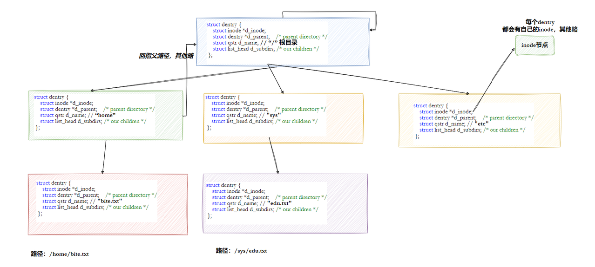
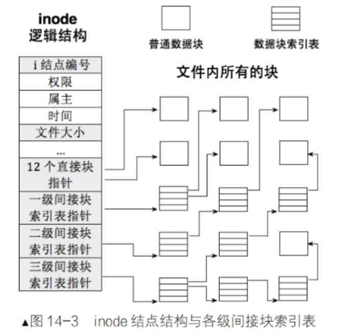
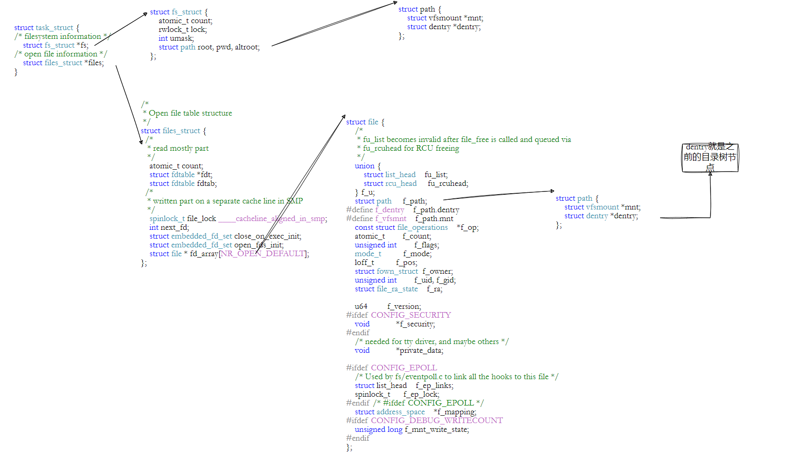
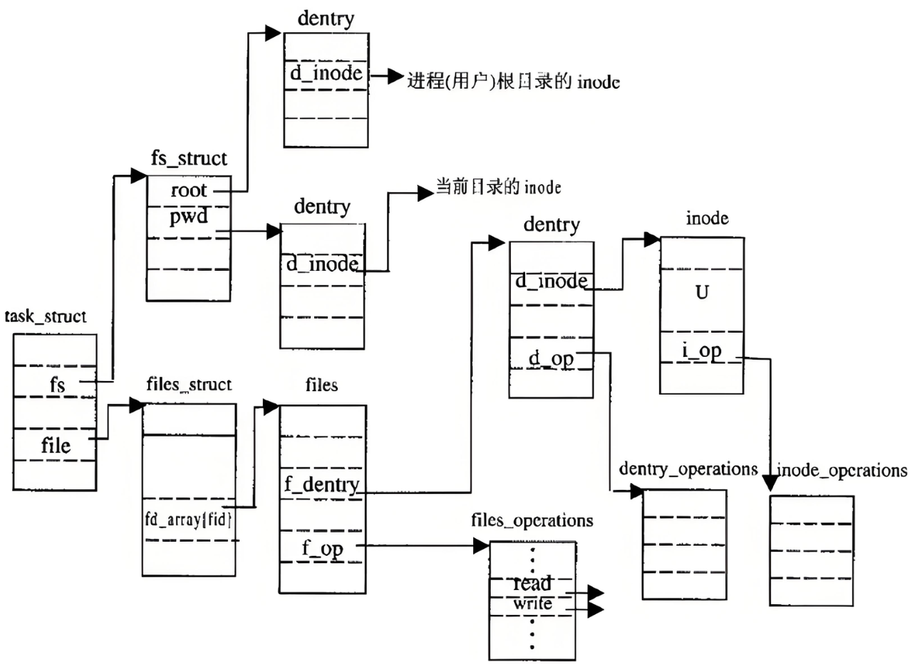
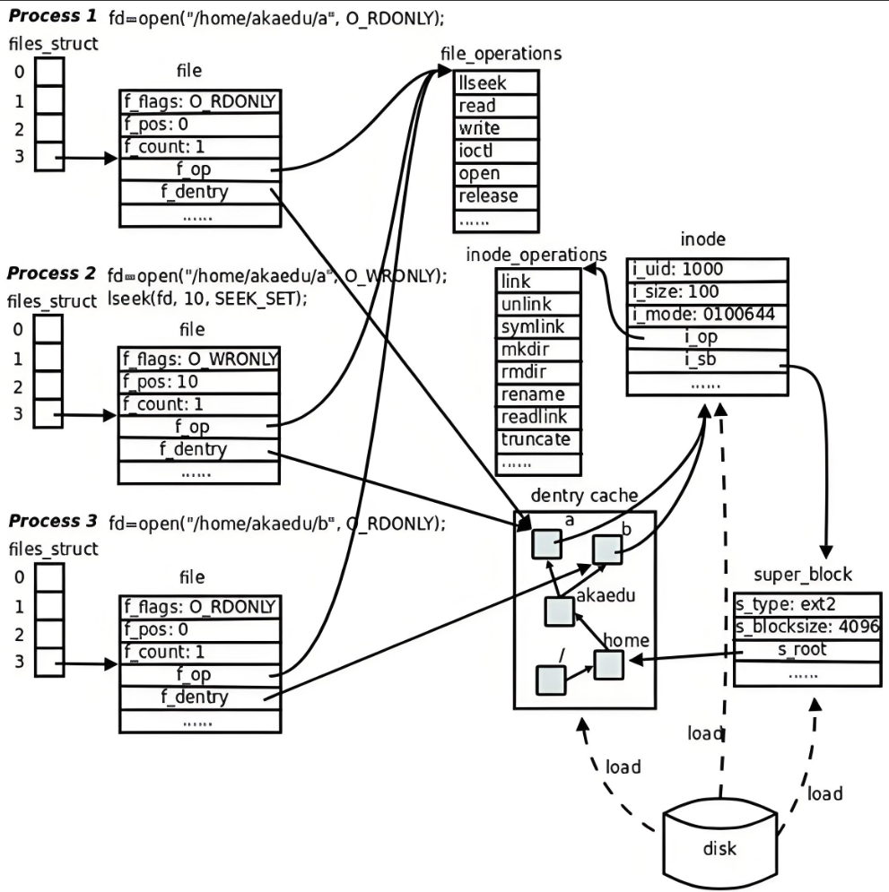
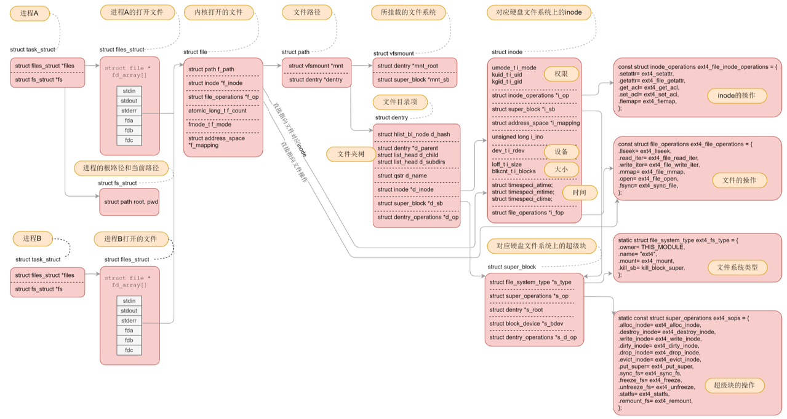
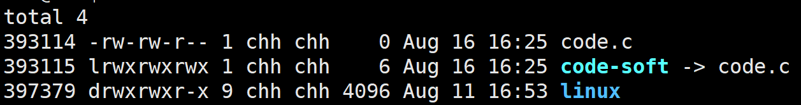
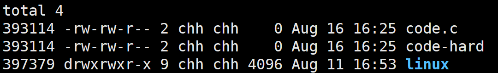
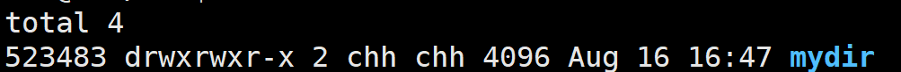
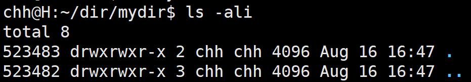

# Ext 系列文件系统

> 核心观点：文件被打开后，相关数据会被加载或缓存到内存；未被访问的数据主要保存在磁盘上。Linux 文件系统负责在两者之间建立统一、可靠且高效的映射。

## 序

本文按照“硬件寻址 -> 文件系统组织 -> 路径解析 -> 数据块映射 -> 软硬链接”的顺序展开。核心问题：

- 磁盘如何定位一个扇区，为什么操作系统更常使用 LBA 地址？
- 文件系统为什么要引入块、分区和块组？
- 文件名、文件属性和文件内容分别保存在哪里？
- Linux 如何从一个路径找到目标文件的 inode？
- 软链接和硬链接在存储结构与使用场景上有什么区别？

## 一、理解存储硬件

### 1. 磁盘的物理结构

磁盘的基本存储结构如下：

传统机械硬盘由盘片、磁道、扇区、磁头和传动臂等部分组成。磁头安装在传动臂上，同一组磁头会共同移动，因此可以同时定位到相同编号的磁道。

**扇区（Sector）**是磁盘读写的基本物理单位，传统大小通常为 **512 字节**（部分新磁盘使用 4 KiB 物理扇区）。磁盘作为能够按块读写的设备，在 Linux 中通常被称为块设备。

磁盘读写一个物理位置时，大致需要经历以下过程：

1. 移动磁头，定位到目标柱面；
2. 选择对应盘面的磁头；
3. 等待盘片旋转，使目标扇区转到磁头下方；
4. 读取或写入该扇区的数据。

### 2. CHS 与 LBA 寻址

早期磁盘使用 **CHS（Cylinder、Head、Sector）** 定址：

- **磁道（Track）**：某个盘面上的一圈轨道，可展开为一维数组；
- **柱面（Cylinder）**：所有盘面上编号相同的磁道集合，可看作二维数组中的一层；
- **整盘**：由多个盘面和柱面组成，可看作三维数组。

CHS 实际上就是数组的三个下标。随着磁盘容量增大，CHS 参数受到表示范围和物理结构的限制，于是现代系统普遍使用 **LBA（Logical Block Addressing，逻辑块地址）**。LBA 将所有扇区按顺序编号，操作系统只需提供一个线性编号即可访问目标扇区。

> 结论：物理上磁盘包含多个盘面、磁道和扇区；逻辑上，操作系统通常把它视为一个连续的 LBA 地址空间。

## 二、文件系统的基本组织方式

### 1. 块（Block）

操作系统的文件系统通常不直接以单个扇区作为管理单位，而是将连续的多个扇区组合成一个**块**。常见块大小为 **4 KiB**，即连续的 8 个 512 字节扇区；具体大小由文件系统创建时的参数决定。

使用块作为分配单位可以减少管理开销，也能提升顺序读写效率。但块越大，存放小文件时产生的内部碎片通常也越多。

### 2. 分区与块组

一块磁盘可以划分为多个**分区（Partition）**，每个分区可以独立创建文件系统。文件系统本身还会将一个分区划分为若干**块组（Block Group）**，在每个块组内集中管理相关的数据和元数据。

这种“将大问题拆成多个相似小问题”的方式体现了**分治思想**。文件内容通常按 4 KiB 块分配，并保存在块组的 Data Blocks 区域中。

### 3. inode：文件的属性集合

在 Linux 中，可以把文件理解为：

> **文件 = 内容（数据） + 属性（元数据）**

文件内容和属性分开存储。每个文件都拥有一个 inode（index node），其中记录**文件类型、权限、所有者、大小、时间戳、硬链接数以及数据块索引等信息**。inode 的大小由文件系统格式决定，传统 Ext 文件系统中常见为 128 字节，现代文件系统也可能使用更大的 inode。

**文件名不保存在 inode 中。** 文件名由目录维护。

### 4. 块组中的管理结构

一个典型块组会包含以下区域（实际布局会因 Ext 版本、特性和磁盘大小而有所不同）：

- **Super Block（超级块）**：描述整个文件系统的总体信息，例如块和 inode 的总量、空闲数量、块大小、挂载与检查时间等；
- **GDT（Group Descriptor Table，块组描述符表）**：记录各块组的布局及资源统计信息，例如 inode 表和数据块从哪里开始、剩余多少空闲 inode 和数据块；
- **Block Bitmap（块位图）**：每一位对应一个数据块，用于标记该块是否已被占用；
- **inode Bitmap（inode 位图）**：每一位对应一个 inode，用于标记 inode 是否空闲；
- **inode Table（inode 表）**：集中保存该块组中的 inode；
- **Data Blocks（数据块）**：保存普通文件、目录等对象的实际内容。

如果 inode 为 128 字节、块大小为 4 KiB，那么一个 inode 块可容纳 4096 / 128 = 32 个 inode。文件系统会使用 inode 编号区分 inode 表中的不同记录；可以使用 ls -i 查看文件的 inode 编号。

超级块和块组描述符通常会在部分块组中保留副本，作为元数据备份，并不意味着每个块组都存放一份。**格式化的本质**就是初始化这些文件系统管理信息，而不是简单地“清空磁盘”。

同一分区内，inode 编号和块号在其各自的地址空间中唯一。系统运行时会把常用的文件系统元数据缓存到内存，以减少反复访问磁盘的开销；修改后的数据则会根据写回策略同步到磁盘。

## 三、目录与路径解析

### 1. 目录也是一种文件

目录同样拥有 inode 和数据内容。目录数据保存的是一组映射关系：

~~~text
文件名  ->  inode 编号
~~~

因此，文件名不是文件 inode 的属性，而是目录内容的一部分。执行 ls -i 时，系统读取目录项，就能同时显示名称和对应的 inode 编号。

查找 /home/user/a.txt 时，内核会从根目录 / 开始，依次解析 home、user 和 a.txt，每一步都通过目录项获得下一级 inode，直到找到目标对象。相对路径则以当前进程记录的工作目录为起点，绝对路径始终以根目录为起点。

### 2. dentry：路径解析缓存

如果每次访问文件都从根目录开始读取磁盘，路径解析会产生大量 I/O。Linux 内核因此使用 struct dentry（directory entry，目录项）在内存中缓存已经访问过的路径关系，并组织成一棵多叉树。

> 需要注意：dentry 主要缓存“路径名称到 inode”的查找结果；inode、页缓存和磁盘上的目录数据仍然各自承担不同职责。缓存命中可以显著减少路径查找的磁盘访问，但数据最终是否落盘还取决于写回和同步机制。

### 3. 挂载分区

磁盘完成分区和格式化后，还需要将文件系统挂载到目录树中的某个目录，这个过程称为**挂载（mount）**。挂载完成后，访问挂载点及其子路径，就相当于访问对应分区的文件系统。

可以使用以下命令观察挂载关系：

~~~bash
findmnt
df -T
~~~

仅凭路径可以判断文件位于哪棵目录树中；需要进一步确认具体分区时，可结合 df、findmnt 或 stat 等命令查看。

## 四、inode 如何定位文件内容

inode 中包含用于定位文件数据块的索引信息。对于小文件，inode 可以直接记录若干数据块编号；文件变大后，则通过间接索引、二级间接索引或更高层级的索引结构继续定位数据块。

从逻辑上看，读取文件需要完成两次映射：

1. 通过路径解析和目录项，得到目标文件的 inode；
2. 读取 inode 中的数据块索引，再访问对应的 Data Blocks。

这解释了为什么文件名、inode 和文件内容可以分别管理，也解释了硬链接为何能够让多个名称共享同一份文件内容。

## 五、整体流程总结

一次典型的文件访问可以概括为：

~~~text
路径
  -> dentry 缓存（未命中时读取目录数据）
  -> inode
  -> 数据块索引
  -> Data Blocks 中的文件内容
~~~

## 六、软链接与硬链接

### 1. 软链接（Symbolic Link）

软链接是一个独立的文件，拥有自己的 inode。它的文件内容通常是目标文件的路径，文件类型显示为 l。创建和删除软链接的示例：

~~~bash
ln -s /path/to/A B
readlink B
unlink B
~~~

上述命令建立 B -> A 的关系。软链接适合为路径较长或经常变化的目标提供一个易记入口，也可以跨文件系统建立链接。目标文件被删除或移动后，软链接可能变成悬空链接。

### 2. 硬链接（Hard Link）

硬链接不是一个新的文件实体，而是在目录中增加一个新的名称，使其指向已有 inode：

~~~bash
ln A B
ls -li A B
~~~

原文件和硬链接会显示相同的 inode 编号，并共享同一份文件内容。inode 中的硬链接计数记录当前有多少个目录项指向它；只有当硬链接计数为 0 且没有进程打开该文件时，文件占用的数据块才可以被回收。

硬链接通常不能跨文件系统创建，也不能由普通用户为目录创建，以避免形成难以遍历的目录环。

### 3. 目录链接数为何会变化

新建目录后，目录的链接数通常从 2 开始。这是因为目录默认包含 . 和 ..：

- . 指向当前目录 inode，相当于当前目录的一个硬链接；
- .. 指向父目录 inode。

每在该目录下新建一个子目录，父目录会多出一个子目录中的 .. 目录项，因此父目录的链接数通常增加 1。

这也是“通过目录链接数估算直接子目录数量”的依据之一，但实际排查时仍应以 find 等命令的结果为准。

### 4. 对比总结

| 特性 | 软链接 | 硬链接 |
| --- | --- | --- |
| 是否拥有独立 inode | 是 | 否，与目标共享 inode |
| 保存的内容 | 目标路径字符串 | 不复制内容，仅新增目录项 |
| 是否可跨文件系统 | 可以 | 不可以 |
| 目标删除后的表现 | 可能变成悬空链接 | 其他链接仍可访问文件 |
| 常见创建命令 | ln -s A B | ln A B |

> 一句话记忆：软链接链接的是“路径”，硬链接链接的是“inode”。

## 七、关键结论

1. 磁盘以扇区为物理读写单位，操作系统通常通过 LBA 线性地址访问它。
2. 文件系统以块为管理单位，并通过块组、位图、inode 表和数据块组织分区。
3. 文件名保存在目录项中；inode 保存文件属性和数据块索引；文件内容保存在 Data Blocks 中。
4. 路径解析从根目录或当前目录开始，dentry 用于缓存路径查找结果。
5. 挂载把一个分区接入统一的 Linux 目录树，挂载点是访问该分区的入口。
6. 软链接拥有独立 inode，保存目标路径；硬链接共享目标 inode，不复制文件内容。

