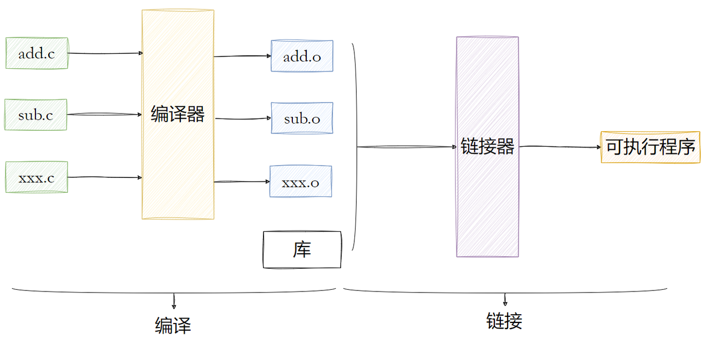
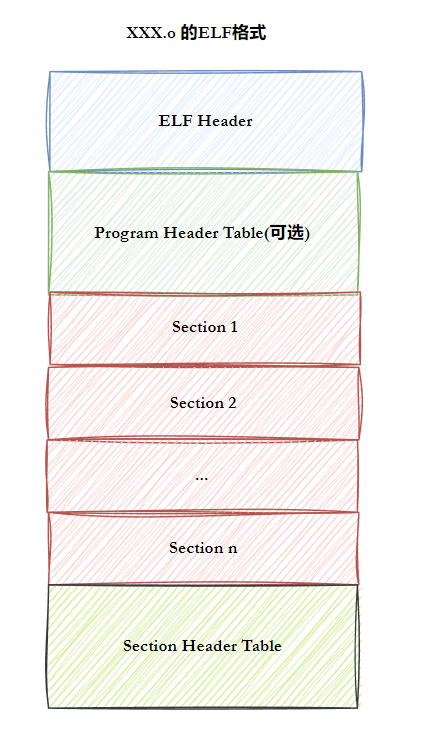
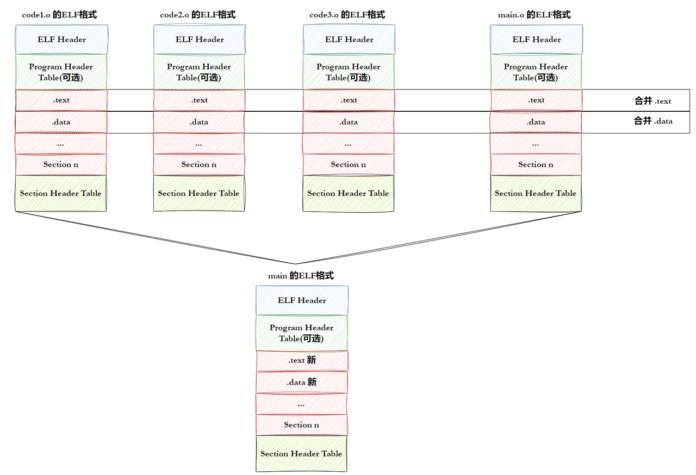
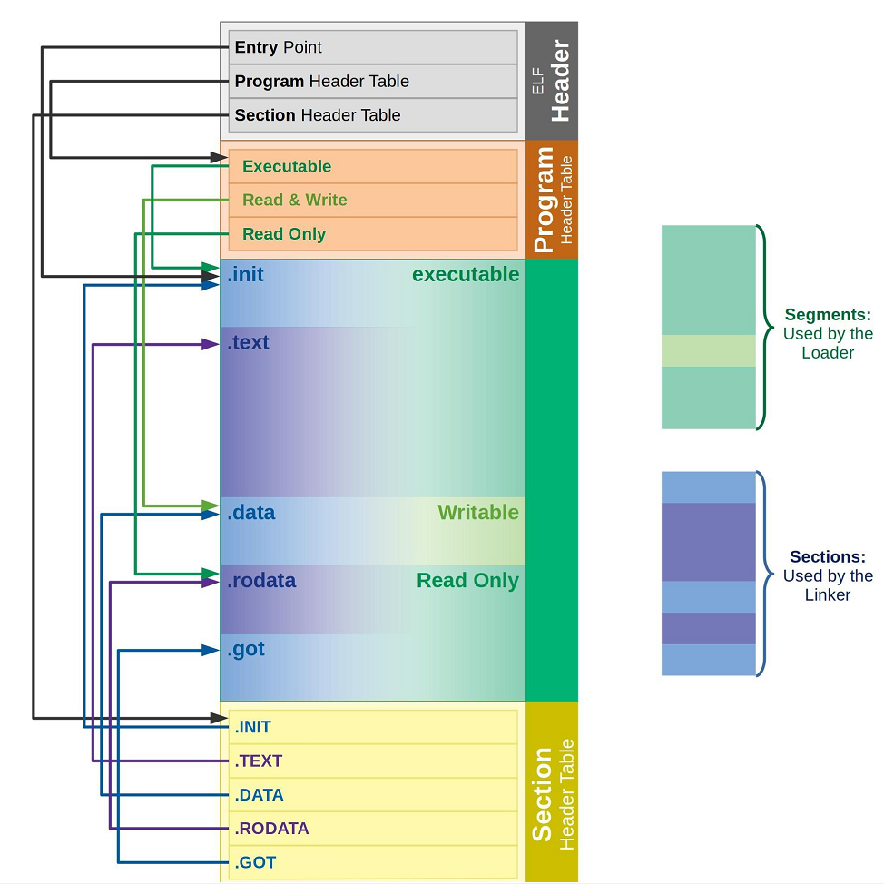
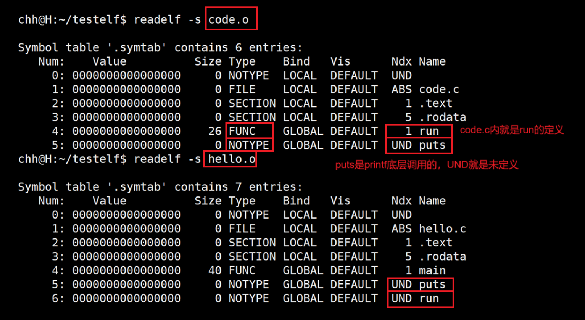
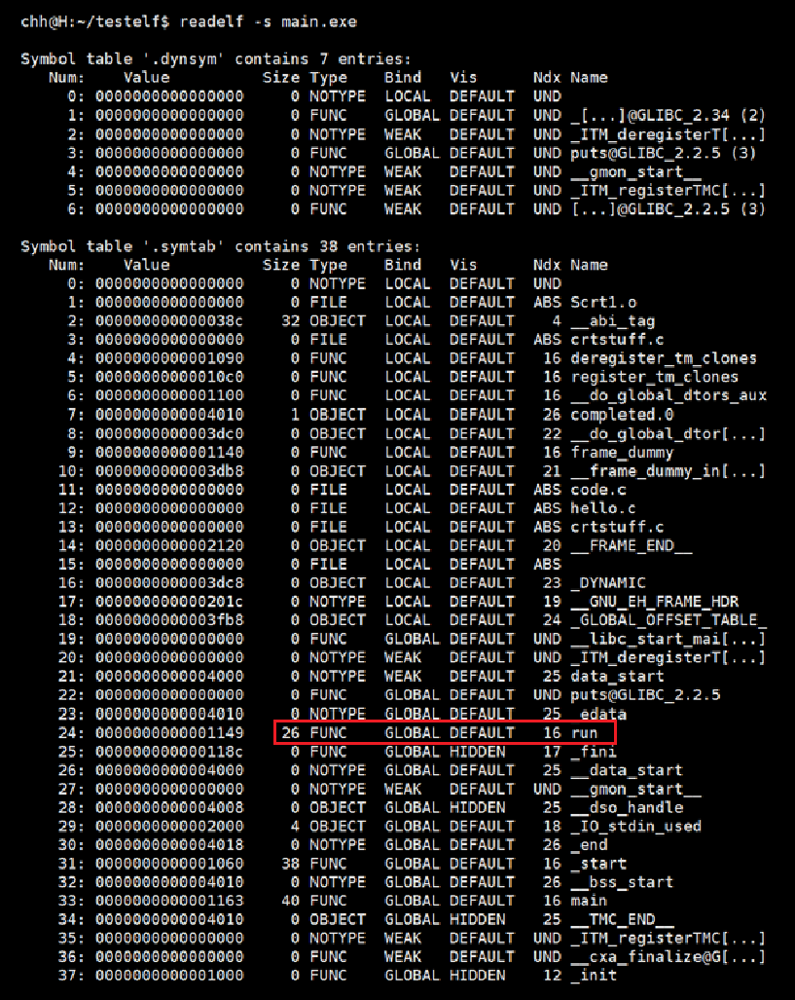
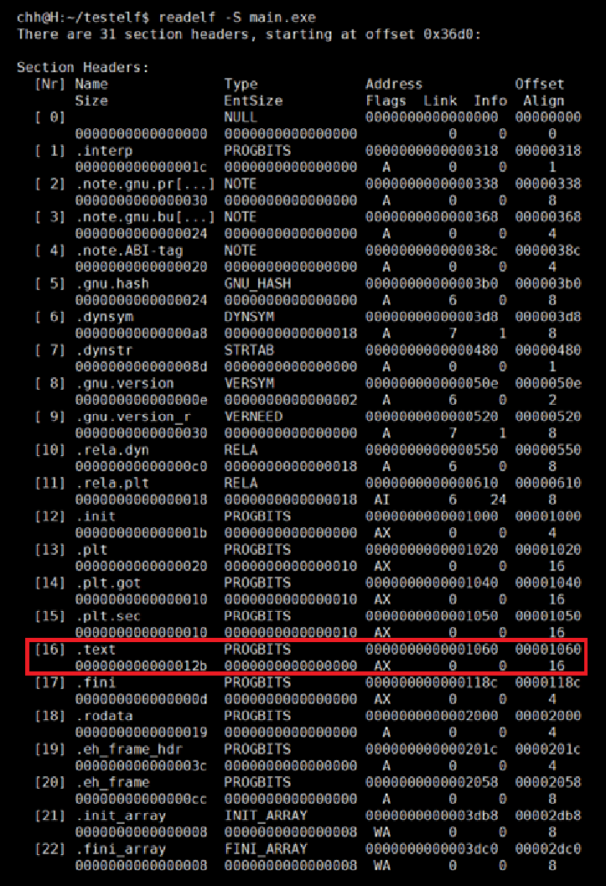
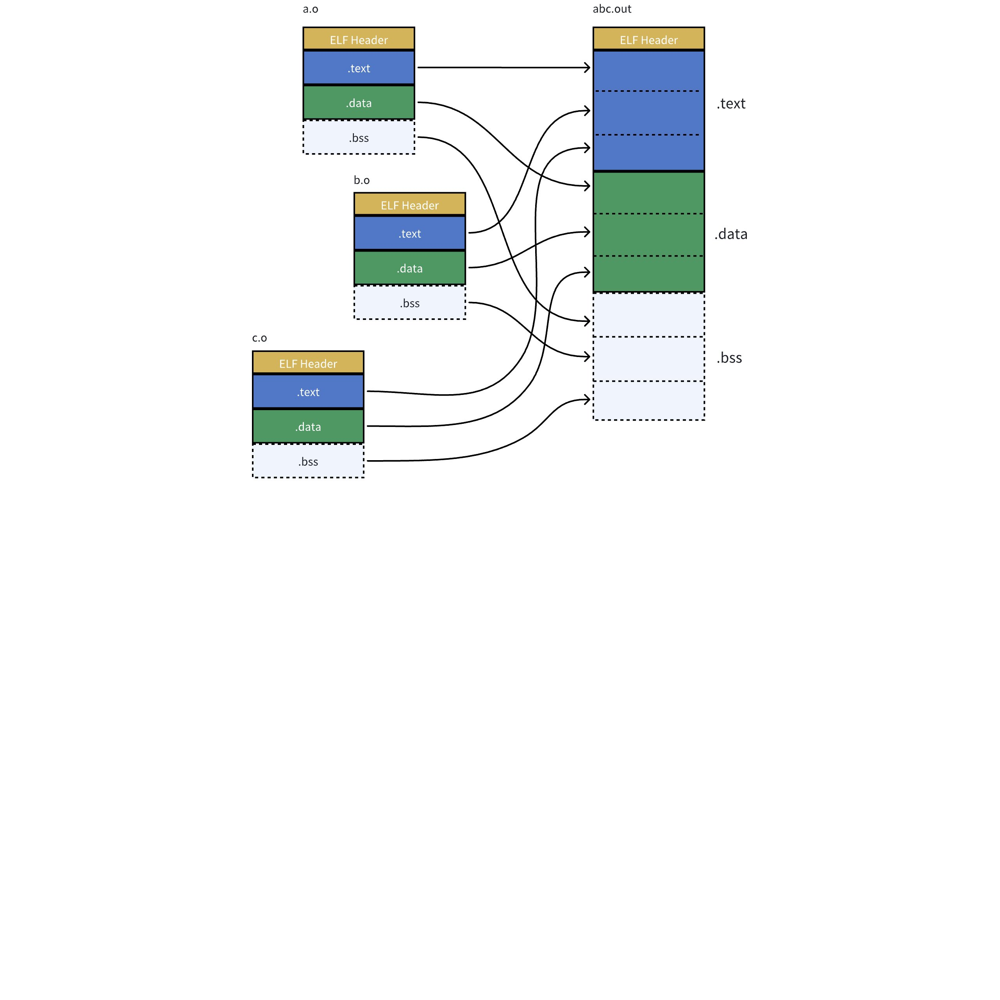

# 一、什么是库

库有两种：

- 静态库`.a[Linux]`、`.lib[windows]`
- 动态库`.so[Linux]`、`.dll[windows]`

***

# 二、静态库

静态库的制作：

静态库中不要包含`main`函数。

原来所有的库（不论是静态还是动态），本质都是原文件对应的`.o`。

静态库本质就是`.o`打包。

`ar -rc libmyc.a *.o`	`.a`静态库本质是一种归档文件，不需要读者捷豹，二用`gcc/g++`直接链接即可。

将程序编译为`.o`后，`gcc -o usercode usercode.o -L. -lmyc`。

`gcc`选项：`-LAAA`：去`AAA`目录里找库；`-lmyc`：找`myc`（去掉前缀`lib`和后缀`.a`）这个库。

如果我们要链接任何非`C/C++`标准库（包括外部的和我们自己写的），都要指明`-L -l`。

如果目标库与头文件不在同一目录，那么`gcc`就要加`-I`选项。`-I`找到头文件。

假设目录结构：

```
.
|--lib
|	|--include
|	|	|--mystdio.h
|	|	|--mystring.h
|	|
|	|--mylib
|		|---libmyc.a
|
|--usercode.c
```

**`gcc -o usercode usercode.c -I ./lib/include -L ./lib/mylib -l myc`**

或者说可以在主程序中直接`include`路径+文件。

***

要注意，库也是要被安装到系统中的。之前做的这些操作都是在找不到库的前提下。OS找库和头文件都是先会在指定路径中找的。头文件在`usr/include`，库在`/lib64`。

所谓安装，就是将文件拷贝到指定路径。之后，我们只需注意我们导入的库为第三方库，只需要加上`-l`选项即可。

`ldd`可以查看可执行程序依赖的库。

# 三、动态库

动态库制作：

原理基本上与静态库差不多，在使用`gcc`时，需要加上`-fPIC`与位置无关码。

```bash
$ gcc -fPIC -c *.c
$ gcc -shared -o libmyc.so *.o
```

通过与静态库一样的操作，用`gcc`编译成可执行程序后，发现程序并不能正常运行，使用`ldd`，发现我们自己做的库找不到，这是为什么呢？

我们使用`gcc`的`-I`、`-L`、`-l`选项只是告诉`gcc`我们的库在哪里，而并非系统，因为对于静态库，编译为可执行程序时，会将库直接拷贝到程序中，因此不会出错；而对于动态库，则不会发生拷贝，因此在运行时就找不到库。

解决方案：

1. 直接将库拷贝到系统中。
2. 建立软连接到系统的默认路径。
3. 利用环境变量`LD_LIBRARY_PATH`，它一般是空的，将库的路径追加给它。
4. 在`/etc/ld.so.conf.d/`目录下新建一个`*.conf`任意名字的配置文件，在文件中写入动态库的路径。再运行`sudo ldconfig`即可。

***

**如果动静态库共存，`gcc`默认使用动态库。加上`-static`强制使用静态库。**

**那问题来了，如果没有静态库，却加`-static`呢？——直接报错，一旦加上`-static`就必须使用静态库。**

**只存在静态库，可执行程序，对于该库，只能静态连接了。**

***

**`Linux`下，默认情况安装的大部分库中，默认优先安装动态库。**

**多个应用程序可以共用一个库。**

**`Visual Studio`不仅仅能形成可执行程序，也能形成库。**

***

# 四、目标文件



编译后生成的`.o`文件为目标文件。

动静态库、可执行程序、`.o`文件都是`ELF`格式的。它们是以`ELF`格式放到二进制文件中的。

# 五、ELF文件

最常见的节：

- 代码节（`.text`）：用于保存机器指令，是程序的主要执行部分。
- 数据节（`.data`）：保存已初始化的全局变量和局部静态变量。

```
$ size code 
 text	data	bss		dec		hex		filename
 3312	636		 4    	3952  	 f70   	 code
```



***

**ELF形成可执行：**

1. 将多份C/C++源代码，翻译成目标`.o`文件+动静态库(ELF)。
2. 将多份`.o`文件`section`进行合并。



***

**ELF可执行文件加载：**

- 一个`ELF`会有多种不同的`Section`，在加载到内层的时候，也会进行`Section`合并，形成`segment`。
- 合并原则：相同属性，如：可读、可写、可执行。
- 具体的合并原则放在`Programm Header Table`中。
- Section合并的主要原因是为了减少页面碎片，提高内存使用效率。如果不进行合并， 假设页面大小为4096字节（内存块基本大小，加载，管理的基本单位），如果.text部分 为4097字节，`.init`部分为512字节，那么它们将占用3个页面，而 合并后，它们只需2个 页面。
- 具有相同属性的`section`合并成一个大的 `segment`，这样就可以实现不同的访问权限，从而优化内存管理和权限访问控制。

`readelf`可以读取文件`ELF`相关信息。

 `ELF`提供了两个视角：

- 链接视角（`Linking view`）——对应节表头`Section header table`
- 执行视角（`execute view`）——对应程序头表`Program header table`
- 说白了就是：一个在链接时作用，一个在运行加载时作用。



`ELF Header`记录了各个管理信息的位置与信息。

# 六、静态连接与加载

`objdump -d AAA.o > BBB.s`：将`AAA.o`反汇编成`BBB.s`。

```c
//code.c
#include <stdio.h>
void run()
{
    printf("running\n");
}

//hello.c
#include <stdio.h>
void run();
int main()
{
    printf("hello world!\n");
    run();
    return 0;
}
```

将它们进行反汇编：

`code.s`

```assembly
                                                                          
code.o:     file format elf64-x86-64


Disassembly of section .text:

0000000000000000 <run>:
   0:   f3 0f 1e fa             endbr64
   4:   55                      push   %rbp
   5:   48 89 e5                mov    %rsp,%rbp
   8:   48 8d 05 00 00 00 00    lea    0x0(%rip),%rax        # f <run+0xf>
   f:   48 89 c7                mov    %rax,%rdi
  12:   e8 00 00 00 00          call   17 <run+0x17>
  17:   90                      nop
  18:   5d                      pop    %rbp
  19:   c3                      ret

```

`hello.s`

```assembly
                                                                      
hello.o:     file format elf64-x86-64

Disassembly of section .text:

0000000000000000 <main>:
   0:   f3 0f 1e fa             endbr64
   4:   55                      push   %rbp
   5:   48 89 e5                mov    %rsp,%rbp
   8:   48 8d 05 00 00 00 00    lea    0x0(%rip),%rax        # f <main+0xf>
   f:   48 89 c7                mov    %rax,%rdi
  12:   e8 00 00 00 00          call   17 <main+0x17>
  17:   b8 00 00 00 00          mov    $0x0,%eax
  1c:   e8 00 00 00 00          call   21 <main+0x21>
  21:   b8 00 00 00 00          mov    $0x0,%eax
  26:   5d                      pop    %rbp
  27:   c3                      ret

```

我们可以看到两个文件`call`的地址均为0，是因为此时两文件都还没有链接，并不知道`printf`和`run`是什么。将它们进行链接，就可以填充。

看看两者的符号表：



可以看到：`code.c`不认识`printf`，`hello.c`不认识`printf`和`run`。

将它们进行链接并生成可执行文件`main.exe`：

```bash
$ gcc *.o -o main.exe
```

看看`main.exe`符号表：



可见，`run()`可以被找到。

读取可执行程序最终的`section`清单（部分）：



`hello.o`和`code.o`的`.text`被合并为`main.exe`的16`section`。

看看`main.exe`转成反汇编：

```assembly

main.exe:     file format elf64-x86-64


Disassembly of section .init:

0000000000001000 <_init>:
    1000:   f3 0f 1e fa             endbr64
    1004:   48 83 ec 08             sub    $0x8,%rsp
    1008:   48 8b 05 d9 2f 00 00    mov    0x2fd9(%rip),%rax        # 3fe8 <__gmon_start__@Base>
    100f:   48 85 c0                test   %rax,%rax
    1012:   74 02                   je     1016 <_init+0x16>
    1014:   ff d0                   call   *%rax
    1016:   48 83 c4 08             add    $0x8,%rsp
    101a:   c3                      ret

Disassembly of section .plt:

0000000000001020 <.plt>:
    1020:   ff 35 9a 2f 00 00       push   0x2f9a(%rip)        # 3fc0 <_GLOBAL_OFFSET_TABLE_+0x8>
    1026:   f2 ff 25 9b 2f 00 00    bnd jmp *0x2f9b(%rip)        # 3fc8 <_GLOBAL_OFFSET_TABLE_+0x10>
    102d:   0f 1f 00                nopl   (%rax)
    1030:   f3 0f 1e fa             endbr64
    1034:   68 00 00 00 00          push   $0x0
    1039:   f2 e9 e1 ff ff ff       bnd jmp 1020 <_init+0x20>
    103f:   90                      nop

Disassembly of section .plt.got:

0000000000001040 <__cxa_finalize@plt>:
    1040:   f3 0f 1e fa             endbr64
    1044:   f2 ff 25 ad 2f 00 00    bnd jmp *0x2fad(%rip)        # 3ff8 <__cxa_finalize@GLIBC_2.2.5>
    104b:   0f 1f 44 00 00          nopl   0x0(%rax,%rax,1)

Disassembly of section .plt.sec:

0000000000001050 <puts@plt>:
    1050:   f3 0f 1e fa             endbr64
    1054:   f2 ff 25 75 2f 00 00    bnd jmp *0x2f75(%rip)        # 3fd0 <puts@GLIBC_2.2.5>
    105b:   0f 1f 44 00 00          nopl   0x0(%rax,%rax,1)                                          

Disassembly of section .text:

0000000000001060 <_start>:
    1060:   f3 0f 1e fa             endbr64
    1064:   31 ed                   xor    %ebp,%ebp
    1066:   49 89 d1                mov    %rdx,%r9
    1069:   5e                      pop    %rsi
    106a:   48 89 e2                mov    %rsp,%rdx
    106d:   48 83 e4 f0             and    $0xfffffffffffffff0,%rsp
    1071:   50                      push   %rax
    1072:   54                      push   %rsp
    1073:   45 31 c0                xor    %r8d,%r8d
    1076:   31 c9                   xor    %ecx,%ecx
    1078:   48 8d 3d e4 00 00 00    lea    0xe4(%rip),%rdi        # 1163 <main>
    107f:   ff 15 53 2f 00 00       call   *0x2f53(%rip)        # 3fd8 <__libc_start_main@GLIBC_2.34>
    1085:   f4                      hlt
    1086:   66 2e 0f 1f 84 00 00    cs nopw 0x0(%rax,%rax,1)
    108d:   00 00 00

0000000000001090 <deregister_tm_clones>:
    1090:   48 8d 3d 79 2f 00 00    lea    0x2f79(%rip),%rdi        # 4010 <__TMC_END__>
    1097:   48 8d 05 72 2f 00 00    lea    0x2f72(%rip),%rax        # 4010 <__TMC_END__>
    109e:   48 39 f8                cmp    %rdi,%rax                                                         
    10a1:   74 15                   je     10b8 <deregister_tm_clones+0x28>
    10a3:   48 8b 05 36 2f 00 00    mov    0x2f36(%rip),%rax        # 3fe0 <_ITM_deregisterTMCloneTable@Base>
    10aa:   48 85 c0                test   %rax,%rax
    10ad:   74 09                   je     10b8 <deregister_tm_clones+0x28>
    10af:   ff e0                   jmp    *%rax
    10b1:   0f 1f 80 00 00 00 00    nopl   0x0(%rax)
    10b8:   c3                      ret
    10b9:   0f 1f 80 00 00 00 00    nopl   0x0(%rax)

00000000000010c0 <register_tm_clones>:
    10c0:   48 8d 3d 49 2f 00 00    lea    0x2f49(%rip),%rdi        # 4010 <__TMC_END__>
    10c7:   48 8d 35 42 2f 00 00    lea    0x2f42(%rip),%rsi        # 4010 <__TMC_END__>
    10ce:   48 29 fe                sub    %rdi,%rsi
    10d1:   48 89 f0                mov    %rsi,%rax
    10d4:   48 c1 ee 3f             shr    $0x3f,%rsi
    10d8:   48 c1 f8 03             sar    $0x3,%rax
    10dc:   48 01 c6                add    %rax,%rsi
    10df:   48 d1 fe                sar    %rsi
    10e2:   74 14                   je     10f8 <register_tm_clones+0x38>
    10e4:   48 8b 05 05 2f 00 00    mov    0x2f05(%rip),%rax        # 3ff0 <_ITM_registerTMCloneTable@Base>
    10eb:   48 85 c0                test   %rax,%rax
    10ee:   74 08                   je     10f8 <register_tm_clones+0x38>
    10f0:   ff e0                   jmp    *%rax
    10f2:   66 0f 1f 44 00 00       nopw   0x0(%rax,%rax,1)
    10f8:   c3                      ret
    10f9:   0f 1f 80 00 00 00 00    nopl   0x0(%rax)

0000000000001100 <__do_global_dtors_aux>:
    1100:   f3 0f 1e fa             endbr64
    1104:   80 3d 05 2f 00 00 00    cmpb   $0x0,0x2f05(%rip)        # 4010 <__TMC_END__>               
    110b:   75 2b                   jne    1138 <__do_global_dtors_aux+0x38>
    110d:   55                      push   %rbp
    110e:   48 83 3d e2 2e 00 00    cmpq   $0x0,0x2ee2(%rip)        # 3ff8 <__cxa_finalize@GLIBC_2.2.5>
    1115:   00
    1116:   48 89 e5                mov    %rsp,%rbp
    1119:   74 0c                   je     1127 <__do_global_dtors_aux+0x27>
    111b:   48 8b 3d e6 2e 00 00    mov    0x2ee6(%rip),%rdi        # 4008 <__dso_handle>
    1122:   e8 19 ff ff ff          call   1040 <__cxa_finalize@plt>
    1127:   e8 64 ff ff ff          call   1090 <deregister_tm_clones>
    112c:   c6 05 dd 2e 00 00 01    movb   $0x1,0x2edd(%rip)        # 4010 <__TMC_END__>
    1133:   5d                      pop    %rbp
    1134:   c3                      ret
    1135:   0f 1f 00                nopl   (%rax)
    1138:   c3                      ret
    1139:   0f 1f 80 00 00 00 00    nopl   0x0(%rax)

0000000000001140 <frame_dummy>:
    1140:   f3 0f 1e fa             endbr64
    1144:   e9 77 ff ff ff          jmp    10c0 <register_tm_clones>

0000000000001149 <run>:
    1149:   f3 0f 1e fa             endbr64
    114d:   55                      push   %rbp
    114e:   48 89 e5                mov    %rsp,%rbp
    1151:   48 8d 05 ac 0e 00 00    lea    0xeac(%rip),%rax        # 2004 <_IO_stdin_used+0x4>
    1158:   48 89 c7                mov    %rax,%rdi
    115b:   e8 f0 fe ff ff          call   1050 <puts@plt>
    1160:   90                      nop
    1161:   5d                      pop    %rbp
    1162:   c3                      ret

0000000000001163 <main>:
    1163:   f3 0f 1e fa             endbr64
    1167:   55                      push   %rbp
    1168:   48 89 e5                mov    %rsp,%rbp
    116b:   48 8d 05 9a 0e 00 00    lea    0xe9a(%rip),%rax        # 200c <_IO_stdin_used+0xc
    1172:   48 89 c7                mov    %rax,%rdi
    1175:   e8 d6 fe ff ff          call   1050 <puts@plt>
    117a:   b8 00 00 00 00          mov    $0x0,%eax
    117f:   e8 c5 ff ff ff          call   1149 <run>
    1184:   b8 00 00 00 00          mov    $0x0,%eax
    1189:   5d                      pop    %rbp
    118a:   c3                      ret

Disassembly of section .fini:

000000000000118c <_fini>:
    118c:   f3 0f 1e fa             endbr64
    1190:   48 83 ec 08             sub    $0x8,%rsp
    1194:   48 83 c4 08             add    $0x8,%rsp
    1198:   c3                      ret

```

在`<main>`中可以看到`call`调用`run`的地址已经找到并填充。

静态连接就是把库中的`.o`进行合并。

所以链接其实就是将编译之后的所有目标文件连同用到的一些静态库运行时库组合，拼装成一个独立的可执行文件。其中就包括我们之前提到的地址修正，当所有模块组合在一起之后，链接器会根据我们的`.o`文件或者静态库中的重定位表找到那些需要被重定位的函数全局变量，从而修正它们的地址。这其实就是**静态链接**的过程。  




所以，连接过程会涉及到对`.o`中外部符号进行地址重定位。