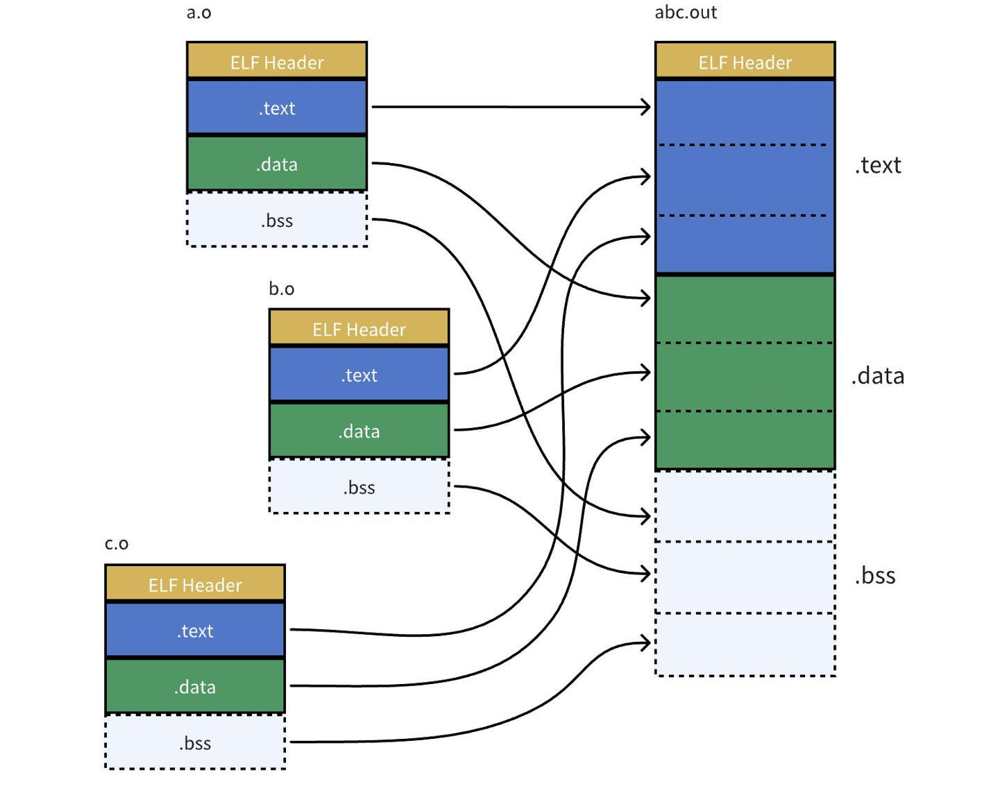
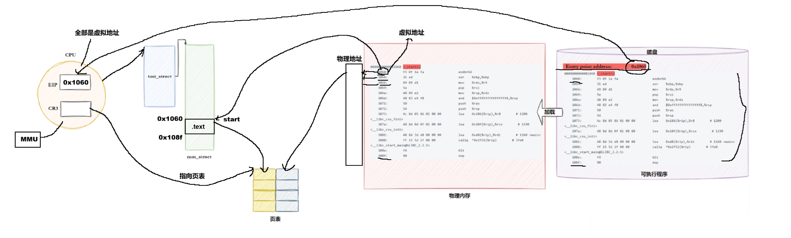
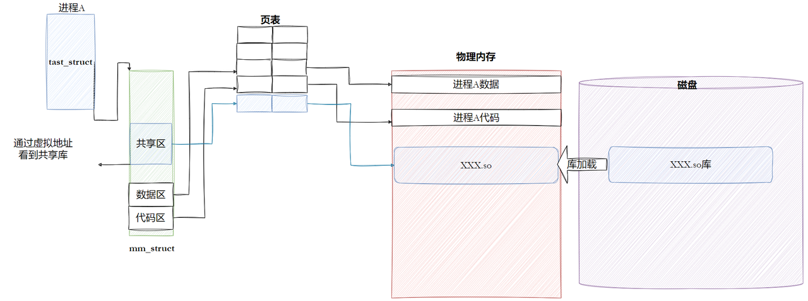
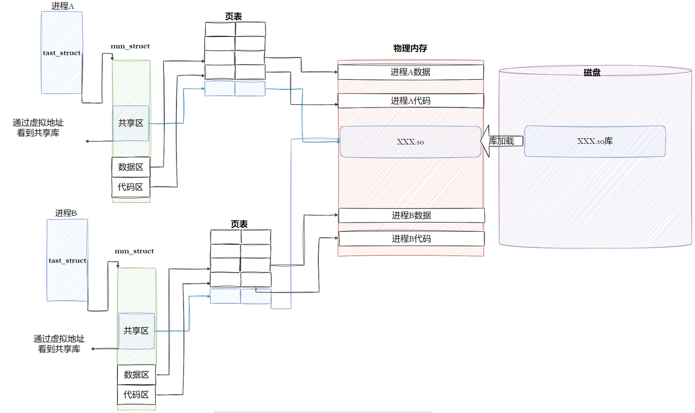
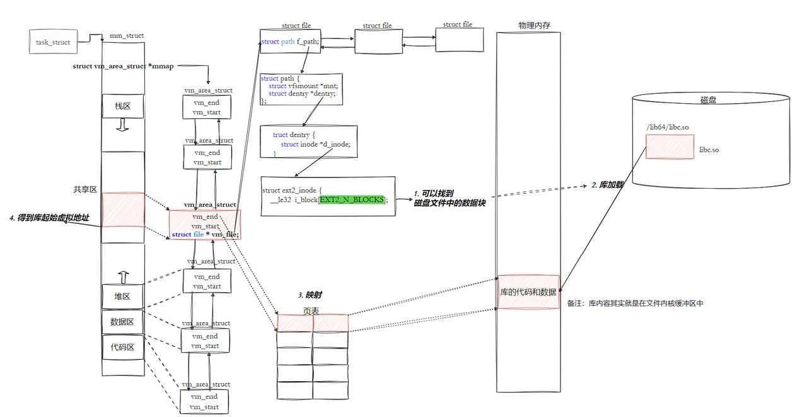
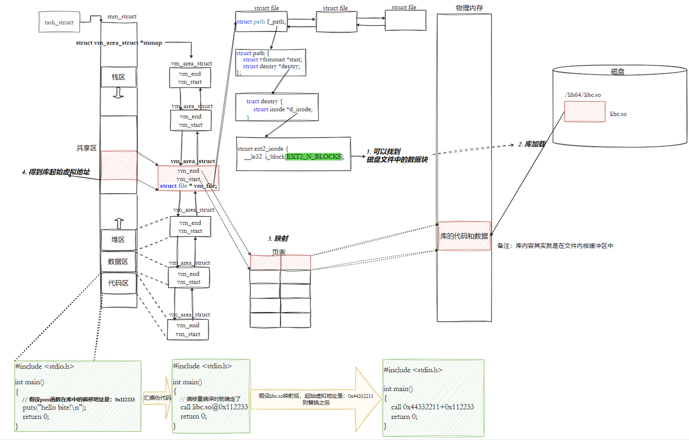
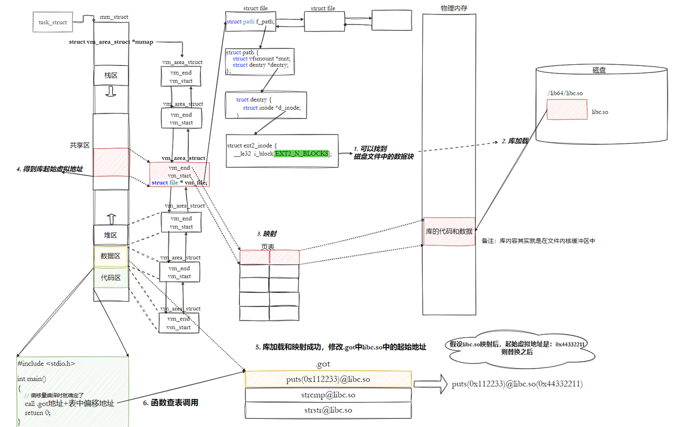
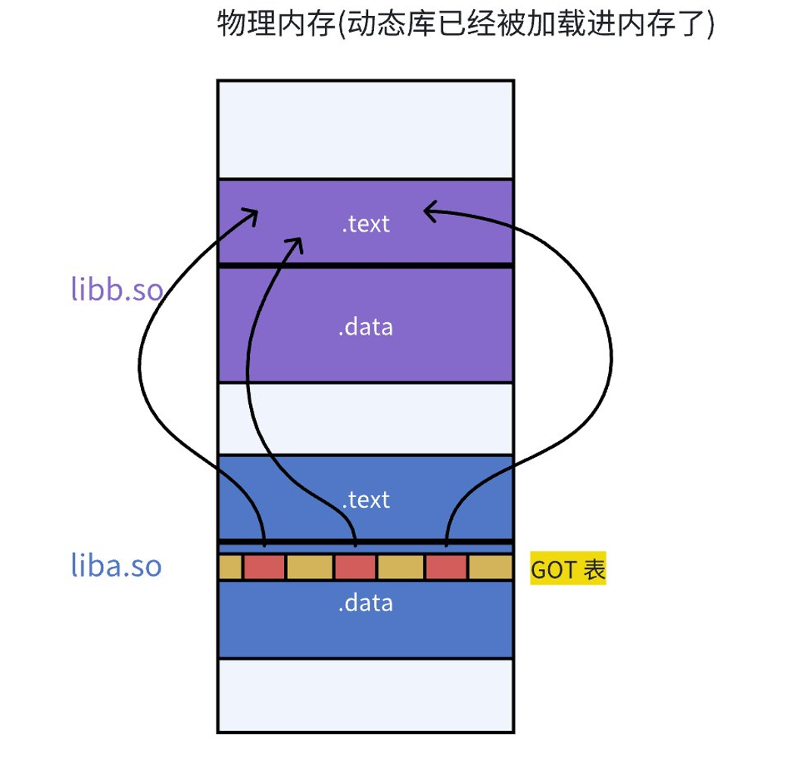
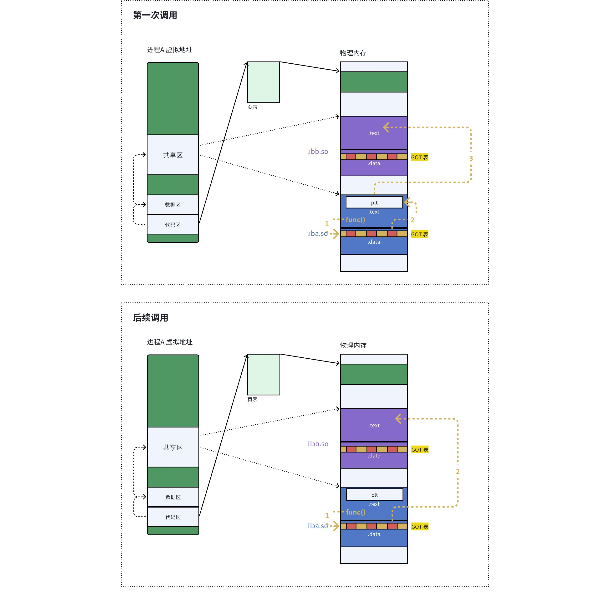

# 一、什么是库

在 Linux 和 Windows 平台上，常见的库主要分为两类：

- 静态库：Linux 使用 `.a`，Windows 使用 `.lib`。
- 动态库：Linux 使用 `.so`，Windows 使用 `.dll`。

***

# 二、静态库

## 静态库的制作

静态库中通常不应包含 `main` 函数，因为 `main` 是可执行程序的入口。

无论静态库还是动态库，底层都由源文件编译得到的目标文件（`.o`）组成。

静态库本质上是多个 `.o` 文件的归档打包。

```bash
ar -rc libmyc.a *.o
```

`.a` 文件本质上是一种归档文件。使用 `gcc` 或 `g++` 链接时，链接器会自动从中提取所需的目标文件。

将程序编译为 `.o` 文件后，可以使用下面的命令进行链接：

```bash
gcc -o usercode usercode.o -L. -lmyc
```

`gcc` 的常用选项如下：

- `-L<目录>`：指定库文件的搜索目录。
- `-lmyc`：链接名为 `libmyc.a`（去掉前缀 `lib` 和后缀 `.a`）的库。

链接任何非 C/C++ 标准库（包括第三方库和自行编写的库）时，通常需要指定 `-L` 和 `-l`。

如果头文件不在系统默认目录中，需要使用 `-I` 指定头文件搜索路径。

假设目录结构：

```
.
|--lib
|	|--include
|	|	|--mystdio.h
|	|	|--mystring.h
|	|
|	|--mylib
|		|---libmyc.a
|
|--usercode.c
```

```bash
gcc -o usercode usercode.c -I ./lib/include -L ./lib/mylib -lmyc
```

也可以在源文件中直接使用带路径的 `#include`，但更推荐通过 `-I` 统一管理头文件搜索路径。

***

需要注意，库通常还要安装到系统中。前面的操作是在库不位于系统默认目录时，通过编译参数显式指定路径。Linux 会优先在指定目录中搜索头文件和库；常见的系统目录包括 `/usr/include`（头文件）和 `/lib64`、`/usr/lib64`（库文件）。

所谓“安装”，就是将头文件和库文件复制到约定的系统目录，并在需要时更新动态链接器的缓存。安装完成后，使用第三方库时通常只需指定 `-l` 选项。

`ldd` 可以查看可执行程序依赖的动态库。

# 三、动态库

## 动态库的制作

动态库的制作流程与静态库类似，但编译时需要生成位置无关代码（PIC），通常使用 `-fPIC` 选项：

```bash
$ gcc -fPIC -c *.c
$ gcc -shared -o libmyc.so *.o
```

如果按照静态库的方式编译可执行程序，程序运行时可能会提示找不到自定义动态库。使用 `ldd` 检查依赖关系，可以看到该库处于 “not found” 状态。

`-I`、`-L` 和 `-l` 只在编译、链接阶段告诉编译器和链接器库的位置，并不会自动修改系统的动态库搜索路径。静态链接会把所需代码复制到可执行文件中；动态链接则只记录库的依赖关系，程序运行时仍需由动态链接器找到对应的 `.so` 文件。

解决方案：

1. 直接将库拷贝到系统中。
2. 在系统默认库目录中建立软链接。
3. 设置环境变量 `LD_LIBRARY_PATH`，将动态库所在目录追加到其中（适合临时测试）。
4. 在 `/etc/ld.so.conf.d/` 目录下新建任意名称的 `.conf` 文件，写入动态库目录，然后执行 `sudo ldconfig` 更新缓存。

***

如果静态库和动态库同时存在，`gcc` 默认优先使用动态库；加上 `-static` 可以强制使用静态链接。

如果没有对应的静态库却指定了 `-static`，链接会直接失败，因为该选项要求使用静态库。

如果系统中只有静态库，那么对于该库，可执行程序只能采用静态链接。

***

在 Linux 中，大多数软件包默认优先提供动态库。

多个应用程序可以共享同一个动态库，从而减少磁盘和内存占用。

`Visual Studio` 不仅可以生成可执行程序，也可以生成静态库和动态库。

***

# 四、目标文件


源文件经过编译后生成的 `.o` 文件称为目标文件。

在 Linux 中，目标文件、动态库以及可执行文件通常采用 ELF 格式；静态库本身是归档文件，其成员才是 ELF 目标文件。

# 五、ELF文件

最常见的节：

- 代码节（`.text`）：用于保存机器指令，是程序的主要执行部分。
- 数据节（`.data`）：保存已初始化的全局变量和局部静态变量。
- 未初始化数据节（`.bss`）：保存未初始化或初始化为零的全局变量和局部静态变量。

```
$ size code 
 text	data	bss		dec		hex		filename
 3312	636		 4    	3952  	 f70   	 code
```


***

**ELF 文件形成可执行程序：**

1. 将多份 C/C++ 源代码编译成目标文件（`.o`），并准备所需的静态库或动态库。
2. 链接器合并多个 `.o` 文件中的相关节（`Section`），解析符号并完成重定位。


***

**ELF 可执行文件的加载：**

- 一个 ELF 文件包含多个属性不同的 `Section`。加载到内存时，操作系统会按访问权限将它们组织成 `Segment`。
- 合并依据主要是访问属性，例如可读、可写、可执行。
- 具体的加载信息记录在 `Program Header Table` 中。
- 按属性组织可以减少页面碎片并提高内存利用率。以 4096 字节为页面大小为例，如果 `.text` 为 4097 字节、`.init` 为 512 字节，分别加载可能需要 3 个页面；合理组织后只需 2 个页面。
- 具有相同属性的 `Section` 组织为一个 `Segment`，可以同时实现访问权限控制和高效的内存管理。

`readelf` 可以读取 ELF 文件的相关信息。

`ELF` 提供了两个视角：

- 链接视角（`Linking view`）：对应节头表（`Section Header Table`）。
- 执行视角（`Execution view`）：对应程序头表（`Program Header Table`）。
- 前者服务于链接过程，后者服务于程序运行时的加载过程。


`ELF Header` 记录了文件类型、目标架构、入口地址以及各类表的位置和大小等管理信息。

# 六、链接与加载

## 静态链接与加载

`objdump -d AAA.o > BBB.s`：将 `AAA.o` 反汇编，并把结果保存到 `BBB.s`。

```c
// code.c
#include <stdio.h>
void run(void)
{
    printf("running\n");
}

// hello.c
#include <stdio.h>
void run(void);
int main(void)
{
    printf("hello world!\n");
    run();
    return 0;
}
```

对两个目标文件进行反汇编，可以得到如下结果。

`code.s`

```assembly
                                                                          
code.o:     file format elf64-x86-64


Disassembly of section .text:

0000000000000000 <run>:
   0:   f3 0f 1e fa             endbr64
   4:   55                      push   %rbp
   5:   48 89 e5                mov    %rsp,%rbp
   8:   48 8d 05 00 00 00 00    lea    0x0(%rip),%rax        # f <run+0xf>
   f:   48 89 c7                mov    %rax,%rdi
  12:   e8 00 00 00 00          call   17 <run+0x17>
  17:   90                      nop
  18:   5d                      pop    %rbp
  19:   c3                      ret

```

`hello.s`

```assembly
                                                                      
hello.o:     file format elf64-x86-64

Disassembly of section .text:

0000000000000000 <main>:
   0:   f3 0f 1e fa             endbr64
   4:   55                      push   %rbp
   5:   48 89 e5                mov    %rsp,%rbp
   8:   48 8d 05 00 00 00 00    lea    0x0(%rip),%rax        # f <main+0xf>
   f:   48 89 c7                mov    %rax,%rdi
  12:   e8 00 00 00 00          call   17 <main+0x17>
  17:   b8 00 00 00 00          mov    $0x0,%eax
  1c:   e8 00 00 00 00          call   21 <main+0x21>
  21:   b8 00 00 00 00          mov    $0x0,%eax
  26:   5d                      pop    %rbp
  27:   c3                      ret

```

可以看到，两个文件中 `call` 指令的相对位移暂时为 0。这是因为目标文件尚未链接，外部符号 `printf` 和 `run` 的最终地址仍未确定；链接器会根据重定位信息完成修正。

查看两个目标文件的符号表：


可以看到，`code.o` 中的 `printf` 是未定义符号，`hello.o` 中的 `printf` 和 `run` 也是未定义符号，需要在链接阶段解析。

将两个目标文件链接并生成可执行文件 `main.exe`：

```bash
$ gcc *.o -o main.exe
```

查看 `main.exe` 的符号表：


此时，`run()` 已经成功解析。

读取可执行程序最终的 `Section` 清单（部分）：


`hello.o` 和 `code.o` 中的 `.text` 节被合并到 `main.exe` 的 `.text` 节中；图中的索引为 16。

下面是 `main.exe` 的部分反汇编结果：

```assembly

main.exe:     file format elf64-x86-64


Disassembly of section .init:

0000000000001000 <_init>:
    1000:   f3 0f 1e fa             endbr64
    1004:   48 83 ec 08             sub    $0x8,%rsp
    1008:   48 8b 05 d9 2f 00 00    mov    0x2fd9(%rip),%rax        # 3fe8 <__gmon_start__@Base>
    100f:   48 85 c0                test   %rax,%rax
    1012:   74 02                   je     1016 <_init+0x16>
    1014:   ff d0                   call   *%rax
    1016:   48 83 c4 08             add    $0x8,%rsp
    101a:   c3                      ret

Disassembly of section .plt:

0000000000001020 <.plt>:
    1020:   ff 35 9a 2f 00 00       push   0x2f9a(%rip)        # 3fc0 <_GLOBAL_OFFSET_TABLE_+0x8>
    1026:   f2 ff 25 9b 2f 00 00    bnd jmp *0x2f9b(%rip)        # 3fc8 <_GLOBAL_OFFSET_TABLE_+0x10>
    102d:   0f 1f 00                nopl   (%rax)
    1030:   f3 0f 1e fa             endbr64
    1034:   68 00 00 00 00          push   $0x0
    1039:   f2 e9 e1 ff ff ff       bnd jmp 1020 <_init+0x20>
    103f:   90                      nop

Disassembly of section .plt.got:

0000000000001040 <__cxa_finalize@plt>:
    1040:   f3 0f 1e fa             endbr64
    1044:   f2 ff 25 ad 2f 00 00    bnd jmp *0x2fad(%rip)        # 3ff8 <__cxa_finalize@GLIBC_2.2.5>
    104b:   0f 1f 44 00 00          nopl   0x0(%rax,%rax,1)

Disassembly of section .plt.sec:

0000000000001050 <puts@plt>:
    1050:   f3 0f 1e fa             endbr64
    1054:   f2 ff 25 75 2f 00 00    bnd jmp *0x2f75(%rip)        # 3fd0 <puts@GLIBC_2.2.5>
    105b:   0f 1f 44 00 00          nopl   0x0(%rax,%rax,1)                                          

Disassembly of section .text:

0000000000001060 <_start>:
    1060:   f3 0f 1e fa             endbr64
    1064:   31 ed                   xor    %ebp,%ebp
    1066:   49 89 d1                mov    %rdx,%r9
    1069:   5e                      pop    %rsi
    106a:   48 89 e2                mov    %rsp,%rdx
    106d:   48 83 e4 f0             and    $0xfffffffffffffff0,%rsp
    1071:   50                      push   %rax
    1072:   54                      push   %rsp
    1073:   45 31 c0                xor    %r8d,%r8d
    1076:   31 c9                   xor    %ecx,%ecx
    1078:   48 8d 3d e4 00 00 00    lea    0xe4(%rip),%rdi        # 1163 <main>
    107f:   ff 15 53 2f 00 00       call   *0x2f53(%rip)        # 3fd8 <__libc_start_main@GLIBC_2.34>
    1085:   f4                      hlt
    1086:   66 2e 0f 1f 84 00 00    cs nopw 0x0(%rax,%rax,1)
    108d:   00 00 00

0000000000001090 <deregister_tm_clones>:
    1090:   48 8d 3d 79 2f 00 00    lea    0x2f79(%rip),%rdi        # 4010 <__TMC_END__>
    1097:   48 8d 05 72 2f 00 00    lea    0x2f72(%rip),%rax        # 4010 <__TMC_END__>
    109e:   48 39 f8                cmp    %rdi,%rax                                                         
    10a1:   74 15                   je     10b8 <deregister_tm_clones+0x28>
    10a3:   48 8b 05 36 2f 00 00    mov    0x2f36(%rip),%rax        # 3fe0 <_ITM_deregisterTMCloneTable@Base>
    10aa:   48 85 c0                test   %rax,%rax
    10ad:   74 09                   je     10b8 <deregister_tm_clones+0x28>
    10af:   ff e0                   jmp    *%rax
    10b1:   0f 1f 80 00 00 00 00    nopl   0x0(%rax)
    10b8:   c3                      ret
    10b9:   0f 1f 80 00 00 00 00    nopl   0x0(%rax)

00000000000010c0 <register_tm_clones>:
    10c0:   48 8d 3d 49 2f 00 00    lea    0x2f49(%rip),%rdi        # 4010 <__TMC_END__>
    10c7:   48 8d 35 42 2f 00 00    lea    0x2f42(%rip),%rsi        # 4010 <__TMC_END__>
    10ce:   48 29 fe                sub    %rdi,%rsi
    10d1:   48 89 f0                mov    %rsi,%rax
    10d4:   48 c1 ee 3f             shr    $0x3f,%rsi
    10d8:   48 c1 f8 03             sar    $0x3,%rax
    10dc:   48 01 c6                add    %rax,%rsi
    10df:   48 d1 fe                sar    %rsi
    10e2:   74 14                   je     10f8 <register_tm_clones+0x38>
    10e4:   48 8b 05 05 2f 00 00    mov    0x2f05(%rip),%rax        # 3ff0 <_ITM_registerTMCloneTable@Base>
    10eb:   48 85 c0                test   %rax,%rax
    10ee:   74 08                   je     10f8 <register_tm_clones+0x38>
    10f0:   ff e0                   jmp    *%rax
    10f2:   66 0f 1f 44 00 00       nopw   0x0(%rax,%rax,1)
    10f8:   c3                      ret
    10f9:   0f 1f 80 00 00 00 00    nopl   0x0(%rax)

0000000000001100 <__do_global_dtors_aux>:
    1100:   f3 0f 1e fa             endbr64
    1104:   80 3d 05 2f 00 00 00    cmpb   $0x0,0x2f05(%rip)        # 4010 <__TMC_END__>               
    110b:   75 2b                   jne    1138 <__do_global_dtors_aux+0x38>
    110d:   55                      push   %rbp
    110e:   48 83 3d e2 2e 00 00    cmpq   $0x0,0x2ee2(%rip)        # 3ff8 <__cxa_finalize@GLIBC_2.2.5>
    1115:   00
    1116:   48 89 e5                mov    %rsp,%rbp
    1119:   74 0c                   je     1127 <__do_global_dtors_aux+0x27>
    111b:   48 8b 3d e6 2e 00 00    mov    0x2ee6(%rip),%rdi        # 4008 <__dso_handle>
    1122:   e8 19 ff ff ff          call   1040 <__cxa_finalize@plt>
    1127:   e8 64 ff ff ff          call   1090 <deregister_tm_clones>
    112c:   c6 05 dd 2e 00 00 01    movb   $0x1,0x2edd(%rip)        # 4010 <__TMC_END__>
    1133:   5d                      pop    %rbp
    1134:   c3                      ret
    1135:   0f 1f 00                nopl   (%rax)
    1138:   c3                      ret
    1139:   0f 1f 80 00 00 00 00    nopl   0x0(%rax)

0000000000001140 <frame_dummy>:
    1140:   f3 0f 1e fa             endbr64
    1144:   e9 77 ff ff ff          jmp    10c0 <register_tm_clones>

0000000000001149 <run>:
    1149:   f3 0f 1e fa             endbr64
    114d:   55                      push   %rbp
    114e:   48 89 e5                mov    %rsp,%rbp
    1151:   48 8d 05 ac 0e 00 00    lea    0xeac(%rip),%rax        # 2004 <_IO_stdin_used+0x4>
    1158:   48 89 c7                mov    %rax,%rdi
    115b:   e8 f0 fe ff ff          call   1050 <puts@plt>
    1160:   90                      nop
    1161:   5d                      pop    %rbp
    1162:   c3                      ret

0000000000001163 <main>:
    1163:   f3 0f 1e fa             endbr64
    1167:   55                      push   %rbp
    1168:   48 89 e5                mov    %rsp,%rbp
    116b:   48 8d 05 9a 0e 00 00    lea    0xe9a(%rip),%rax        # 200c <_IO_stdin_used+0xc
    1172:   48 89 c7                mov    %rax,%rdi
    1175:   e8 d6 fe ff ff          call   1050 <puts@plt>
    117a:   b8 00 00 00 00          mov    $0x0,%eax
    117f:   e8 c5 ff ff ff          call   1149 <run>
    1184:   b8 00 00 00 00          mov    $0x0,%eax
    1189:   5d                      pop    %rbp
    118a:   c3                      ret

Disassembly of section .fini:

000000000000118c <_fini>:
    118c:   f3 0f 1e fa             endbr64
    1190:   48 83 ec 08             sub    $0x8,%rsp
    1194:   48 83 c4 08             add    $0x8,%rsp
    1198:   c3                      ret

```

在 `<main>` 中可以看到，调用 `run` 的 `call` 指令已经带有正确的相对位移，并指向地址 `1149 <run>`。

静态链接会从静态库中提取程序实际需要的 `.o` 文件，并将其内容合并到最终的可执行文件中。

链接器会将编译得到的目标文件与所需的静态库、运行时库组合起来，生成独立的可执行文件。在这个过程中，链接器根据目标文件和静态库中的符号表、重定位表，找到需要重定位的函数和全局变量，并修正相关地址。这就是**静态链接**的核心过程。



因此，链接过程会解析 `.o` 文件中的外部符号，并对相关引用进行地址重定位。

***

## ELF 与进程地址空间

### 从 ELF 到进程

可执行文件即使尚未加载到内存，其中的代码和数据也已经带有链接器安排的虚拟地址或相对布局信息。

ELF 可执行文件通常包含多个 `Segment`。传统的非 PIE 可执行文件在链接时确定虚拟地址；PIE 可执行文件和共享库则主要采用位置无关代码，在运行时映射到动态链接器选择的基址。现代操作系统通常使用平坦的虚拟地址空间，但这并不意味着所有 `Segment`、函数和变量都从 0 开始编址。

磁盘上的 ELF 文件通过程序头表描述各个 `Segment` 应如何映射到进程的虚拟地址空间。

Linux 创建进程地址空间时，会参考 ELF 各个 `Segment` 的虚拟地址、长度和访问权限，建立相应的虚拟内存区域。内核使用 `mm_struct` 描述整个进程地址空间，并用 VMA（传统内核中由 `vm_area_struct` 表示）管理各段虚拟地址范围。



CPU 如何得到程序入口地址？

ELF Header 中的 `Entry point address` 记录程序入口。加载完成后，内核会让用户态指令指针从该入口开始执行：x86-64 使用 `RIP`，32 位 x86 使用 `EIP`。对于动态链接程序，控制权通常会先交给动态链接器，完成必要的加载和重定位后再进入程序入口流程。


### 动态库如何与可执行程序关联

单个进程：



如何共享：



## 动态链接

在 C/C++ 程序中，进程启动后通常不会直接进入 `main` 函数。程序入口一般是 `_start`，它由 C 运行时启动代码提供，负责准备运行环境，并最终间接调用 `main`。

对于动态链接程序，内核会根据 ELF 中的 `PT_INTERP` 段启动动态链接器（例如 `ld-linux-x86-64.so.2`）。动态链接器负责装载所需的共享库、完成重定位，再把控制权交给程序的启动代码。Linux 的动态库搜索路径可由可执行文件中的 `RPATH`/`RUNPATH`、环境变量 `LD_LIBRARY_PATH`、`/etc/ld.so.cache` 以及系统默认目录共同决定。

### 动态库加载

动态链接把一部分符号解析和地址重定位工作推迟到程序装载或运行时完成。

动态库同样采用 ELF 格式，通常使用位置无关代码，并在运行时映射到某个虚拟地址范围。





- 程序正式运行前，动态链接器会映射当前阶段所需的共享库，并确定它们的加载基址。
- 动态链接器根据重定位表解析符号，修正程序和共享库中的相关地址。
- 为了尽量避免修改只读代码段，编译器和链接器会配合使用 GOT、PLT 等机制进行间接寻址。

动态链接会使用**全局偏移表（Global Offset Table，GOT）**保存外部符号在运行时解析得到的地址。GOT 位于可写数据区域，代码可通过相对寻址访问 GOT 表项，再间接访问目标变量或函数。



GOT 在重定位阶段需要可写；启用 RELRO 等安全机制后，其中一部分或全部可以被改为只读。每个已加载模块都有自己的 GOT。虽然映射关系属于具体进程，但未被修改的共享库页面仍可由多个进程共享。

位置无关代码（PIC）的关键是避免把固定的绝对地址写进指令中，常见实现方式包括相对寻址和 GOT 间接寻址。**GOT 表项可保存符号解析后的运行时地址；代码先定位相应表项，再间接访问目标。**函数调用通常还会配合 PLT 使用，并不等同于直接执行 `call GOT地址 + 偏移量`。

### 库间依赖（了解）

共享库之间也可能存在依赖关系，每个加载模块都可以拥有自己的 GOT 和相关重定位信息。



程序启动时若立即解析大量函数符号，会带来额外开销。为降低启动成本，动态链接器可以使用**延迟绑定**，并借助 PLT（Procedure Linkage Table，过程链接表）把函数符号的解析推迟到第一次调用时。这样，程序运行期间从未调用的函数便无须解析。

> 基本思路是：函数首次调用时，PLT 跳转到动态链接器的解析流程。动态链接器找到目标函数的实际地址，并更新对应的 GOT 表项；后续调用即可通过该表项直接跳转到目标函数。使用 `-Wl,-z,now` 或设置 `LD_BIND_NOW` 时，可以在程序启动阶段一次性完成这些解析。


