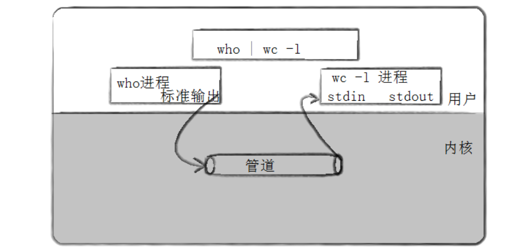
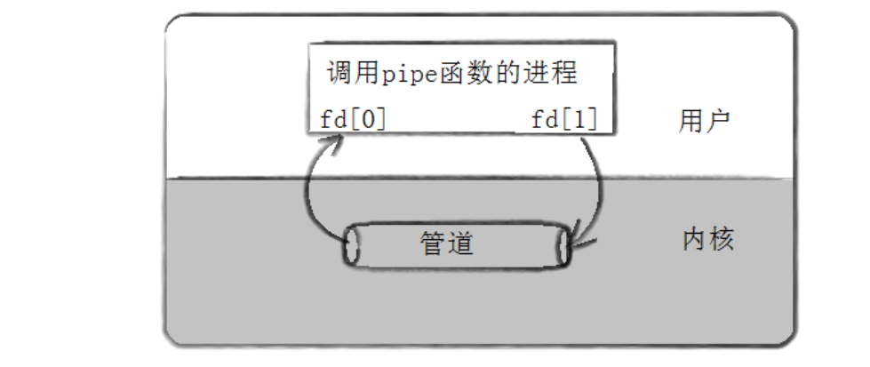
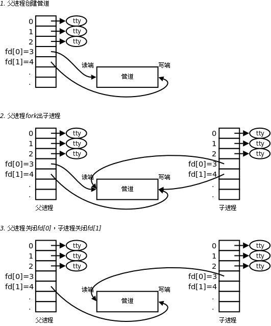
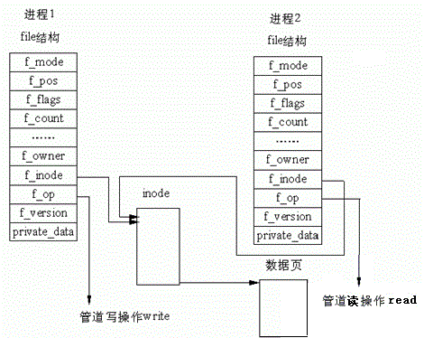

# 理解层面

## 为什么要有进程间通信（IPC）

- 数据传输：一个进程需要将它的数据发送给另一个进程

- 资源共享：多个进程之间共享同样的资源。 
- 通知事件：一个进程需要向另一个或一组进程发送消息，通知它（它们）发⽣了某种事件（如进程终止时要通知父进程）。
- 进程控制：有些进程希望完全控制另一个进程的执行（如Debug进程），此时控制进程希望能够拦截另一个进程的所有陷入和异常，并能够及时知道它的状态改变。

## 怎么通信

**进程间通信的本质：是让不同的进程，先看到同一份资源（某种形式的内存），然后才有通信的条件。**

那个资源不能是任意进程提供，**必须是OS提供系统调用。只要是系统调用，就必须是OS的接口，设计统一的通信接口**

***

# 管道

- 管道是 Unix 中最古老的进程间通信的形式。
- 我们把从一个进程连接到另一个进程的一个数据流称为一个“管道”

## 原理

匿名管道通常用于父子进程通信。

这个管道是被 OS 单独设计的，配上单独的系统调用。

`int pipe(int pipefd[2]);`用于创建管道，成功返回0，否则-1。**这种管道是内存级的，没有文件名，是匿名管道。**子进程继承了父进程的文件描述符表，进而保证父子进程打开的是同一份文件。

***

**管道特性：**

- 匿名管道只能用来进行具有血缘关系的进程进行通信（常用于父子）。
