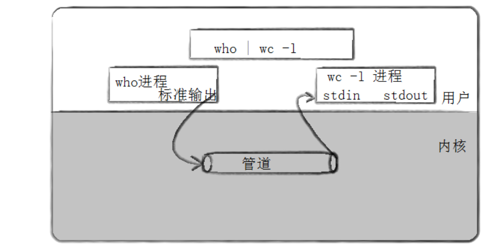
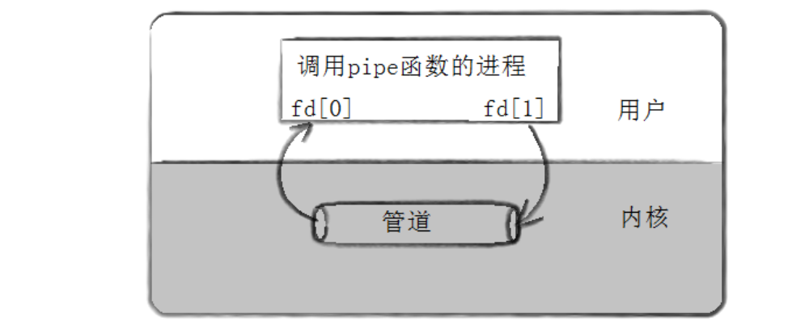
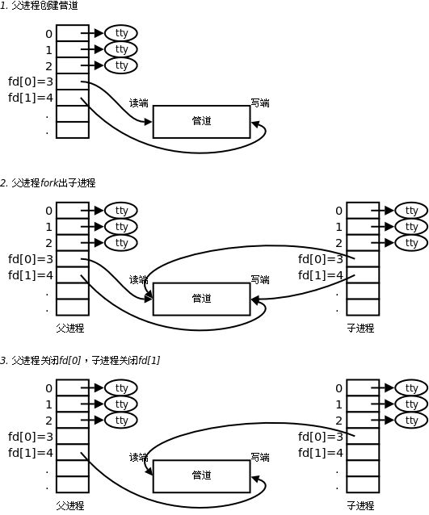
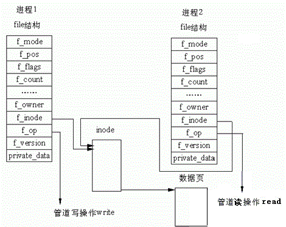
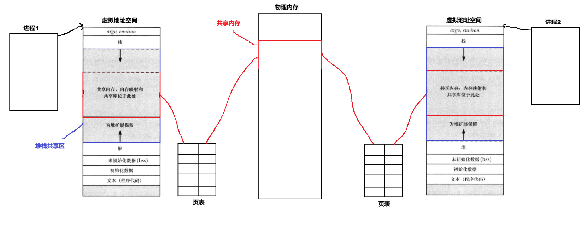
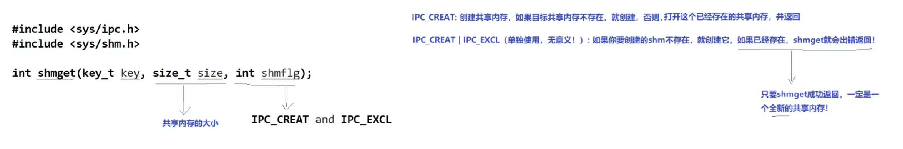

# 理解层面

## 为什么要有进程间通信（IPC）

- 数据传输：一个进程需要将它的数据发送给另一个进程

- 资源共享：多个进程之间共享同样的资源。 
- 通知事件：一个进程需要向另一个或一组进程发送消息，通知它（它们）发⽣了某种事件（如进程终止时要通知父进程）。
- 进程控制：有些进程希望完全控制另一个进程的执行（如Debug进程），此时控制进程希望能够拦截另一个进程的所有陷入和异常，并能够及时知道它的状态改变。

## 怎么通信

**进程间通信的本质：是让不同的进程，先看到同一份资源（某种形式的内存），然后才有通信的条件。**

那个资源不能是任意进程提供，**必须是OS提供系统调用。只要是系统调用，就必须是OS的接口，设计统一的通信接口**

***

# 管道

- 管道是 Unix 中最古老的进程间通信的形式。
- 我们把从一个进程连接到另一个进程的一个数据流称为一个“管道”






## 原理

匿名管道通常用于父子进程通信。



这个管道是被 OS 单独设计的，配上单独的系统调用。

`int pipe(int pipefd[2]);`用于创建管道，成功返回0，否则-1。**这种管道是内存级的，没有文件名，是匿名管道。**子进程继承了父进程的文件描述符表，进而保证父子进程打开的是同一份文件。




***

**管道特性：**

- 匿名管道只能用来进行具有血缘关系的进程进行通信（常用于父子）。
- 管道文件，自带同步机制。
- 管道是面向字节流的。
- 管道是单向通信的。
  - 任何时刻，一个发，一个收——半双工。
  - 任何时刻，同时发收——全双工。
  - 管道属于半双工。
- （管道）文件的生命周期，是随进程的。

***

**管道通信情况：**

1. 写慢，读快——读端阻塞，等待写端。
2. 写快，读慢——写满的时候，写就要阻塞等待读端。
3. 写关闭，继续读—— read 得到返回值就为 0 ，表示文件结尾。
4. 读关闭，继续写——写端再写入没有任何意义。 OS 不会做没有意义的事。—— OS 会杀掉写进程，发送异常信号（`SIGPIPE`）。

## 基于匿名管道——进程池

**管道容量：在 Ubuntu 中，管道容量是64KB。**

**管道写入的原子性：写入的大小如果小于`PIPE_BUF`，那么写入就是原子性的，就是一段字符串，没有存在正在写入的情况，在 Linux 中，`PIPE_BUF`为4096 byte。**

**代码参考：**

ProcessPool.hpp:

```cpp
#pragma once
#include <iostream>
#include <vector>
#include <unistd.h>
#include <string>
#include <cstdlib>
#include <sys/wait.h>
#include "Tasks.hpp"

class Channel
{
public:
    Channel(int wfd, pid_t subid)
        : _wfd(wfd), _subid(subid)
    {
        _name = "Channel-" + std::to_string(subid) + "-" + std::to_string(wfd);
    }
    ~Channel()
    {
    }

    void Send(int code)
    {
        ssize_t n = write(_wfd, &code, sizeof(code));
        (void)n;
    }

    int wfd() { return _wfd; }
    pid_t subid() { return _subid; }
    std::string name() { return _name; }

    // 关闭管道的写端
    void OnceCloseW() { close(_wfd); }
    // 关闭管道的子进程
    void OnceWait() { waitpid(_subid, nullptr, 0); }

private:
    int _wfd;
    pid_t _subid;
    std::string _name;
};

class ChannelManager
{
public:
    ChannelManager()
        : _next(0)
    {
    }
    ~ChannelManager()
    {
    }

    void Insert(int wfd, pid_t subid)
    {
        _channels.emplace_back(wfd, subid);
    }

    void PrintChannel()
    {
        for (auto &channel : _channels)
        {
            std::cout << channel.name() << std::endl;
        }
    }

    Channel &Select()
    {
        Channel &c = _channels[_next];
        _next++;
        _next %= _channels.size();
        return c;
    }

    // 关闭写端
    void CloseW()
    {
        for (auto &c : _channels)
            c.OnceCloseW();
    }

    // 回收子进程
    void Wait()
    {
        for (auto &c : _channels)
            c.OnceWait();
    }

private:
    std::vector<Channel> _channels;
    int _next;
};

// 默认管道数
const int gdefaultnum = 5;

class ProcessPool
{
public:
    ProcessPool(int num)
        : _process_num(num)
    {
        _tm.Register(PrintLog);
        _tm.Register(DownLoad);
        _tm.Register(UpLoad);
    }
    ~ProcessPool()
    {
    }

    void Work(int rfd)
    {
        int code = 0;
        while (1)
        {
            ssize_t n = read(rfd, &code, sizeof(code));
            if (n > 0)
            {
                if (n != sizeof(code))
                    continue;
                std::cout << "子进程[" << getpid() << "]得到一个任务码：" << code << std::endl;
                _tm.Execute(code);
            }
            else if (n == 0)
            {
                std::cout << "子进程退出" << std::endl;
                break;
            }
            else
            {
                std::cout << "读取错误" << std::endl;
                break;
            }
        }
    }

    bool Create()
    {
        for (int i = 0; i < _process_num; i++)
        {
            int pipefd[2] = {0};
            int n = pipe(pipefd);
            if (n == -1)
                return false;
            pid_t subid = fork();
            if (subid < 0)
                return false;
            else if (subid == 0)
            {
                // 子进程，读
                close(pipefd[1]);
                _cm.CloseW();
                Work(pipefd[0]);
                close(pipefd[0]);
                exit(0);
            }
            else
            {
                // 父进程，写
                close(pipefd[0]);
                _cm.Insert(pipefd[1], subid);
            }
        }
        return true;
    }

    void Debug()
    {
        _cm.PrintChannel();
    }

    void Run()
    {
        Channel &c = _cm.Select();
        std::cout << "选取子进程：" << c.name() << std::endl;
        int code = _tm.Code();
        std::cout << "发送任务码：" << code << std::endl;
        c.Send(code);
    }

    void Stop()
    {
        _cm.CloseW();
        std::cout << "已关闭所有写入端" << std::endl;
        _cm.Wait();
        std::cout << "已回收所有子进程" << std::endl;
    }

private:
    ChannelManager _cm;
    int _process_num = 5;
    TaskManager _tm;
};

```

Tasks.hpp:

```cpp
#pragma once
#include <iostream>
#include <ctime>
#include <functional>

void PrintLog() { std::cout << "打印日志..." << std::endl; }
void DownLoad() { std::cout << "下载内容..." << std::endl; }
void UpLoad() { std::cout << "上传内容..." << std::endl; }

typedef std::function<void(void)> task_t;

class TaskManager
{
public:
    TaskManager() { srand(time(nullptr)); }
    int Code() { return rand() % _tm.size(); }
    void Execute(int code) { _tm[code](); }
    void Register(task_t f) { _tm.push_back(f); }

private:
    std::vector<task_t> _tm;
};

```

main.cc:

```cpp
#include "ProcessPool.hpp"
int main()
{
    ProcessPool pp(5);
    pp.Create();
    int cnt = 10;
    while (cnt)
    {
        pp.Run();
        sleep(1);
        cnt--;
    }
    pp.Stop();
    return 0;
}
```

## 命名管道

上面的匿名管道只能用于具有血缘关系的进程进行通信。那两个毫不相干的进程该如何通信呢？

让两个进程通过打开同一路径下的同一文件，从而使它们看到同一份资源，文件有路径有名字，因此实现命名管道。

Linux 支持一种管道文件`p`，这种文件爱你只会被打开，不需要刷新，是内存级的文件。

使用`mkfifo [OPTION]... NAME...`创建命名管道。`unlink NAME`删除管道。

打开文件，如果`write`方没有`open`文件，那么`read`方就会在`open`内部阻塞，直到有人把管道文件打开了。

命名管道特性与匿名管道一致，只是命名管道可以用于毫不相干的进程的通信。

# system V

`system V`是一种标准，Linux 内核只吃了这种内核，专门设计了一个 IPC 通信模块。

## 共享内存



这些工作都是 OS 自己完成的，我们用系统调用完成上面的工作。

释放共享内存：取消关联关系，OS 再释放内存。

可能存在多足内存，都在使用不同的内存进行通信—— OS 内可能存在多组内存，同时通信。共享内存一定会有对应描述共享内存的结构体对象。进程与共享内存的关系一定是内核数据结构之间的关系。



可以用 key 来区分不同的共享内存，它不是内核直接形成的，而是在用户层，构建并传入 OS 的。

可以使用`key_t ftok(const char *pathname, int proj_id);`构建`key`。

