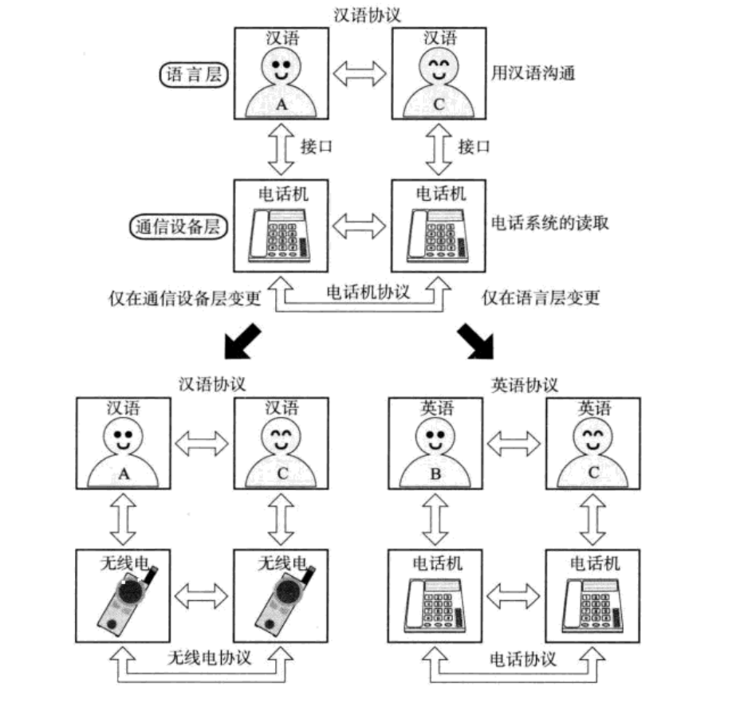
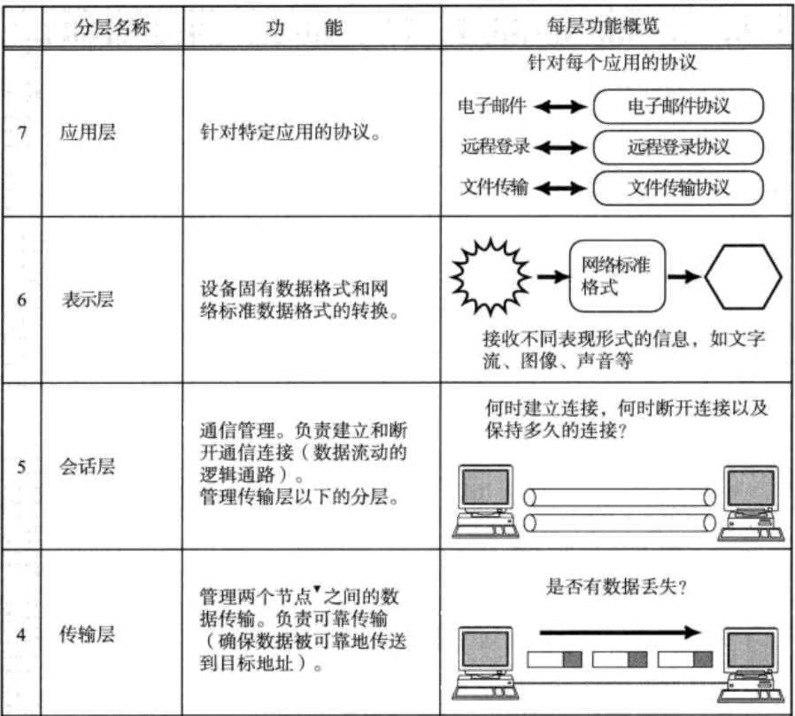
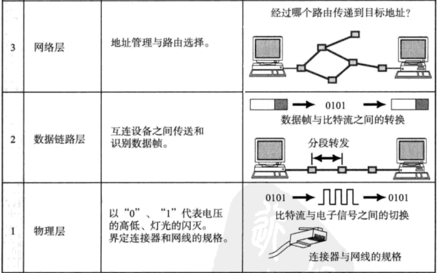
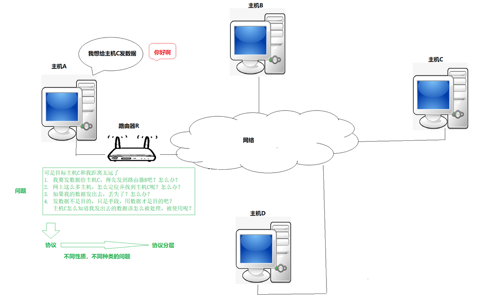
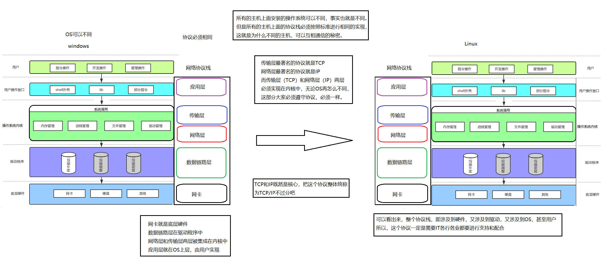
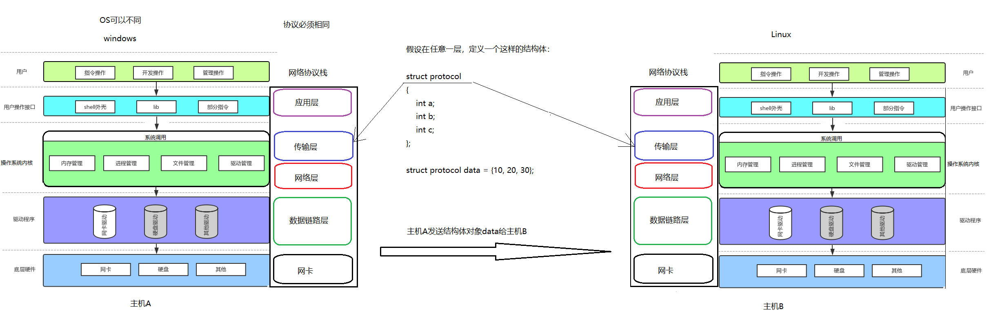

# 初识协议

协议本质是一种约定，可以减少通信成本，用于快速形成共识。

## 协议分层

协议本质也是软件，在设计上为了更好地进行模块化、解耦合，要设计成层状结构。

所有软件都是层状结构的。

- **两种视角**：普通用户视角（只关心上层应用）与工程师视角（关注底层实现）。
- **同层通信**：在逻辑上，同层之间是在直接进行通信。
- **分层解耦**：分层之后，可以无障碍替换任意一层，极大地降低了系统维护与演进的成本。

## 了解OSI七层协议

OSI（Open System Interconnection，开放系统互连）七层网络模型称为开放式系统互联参考模型，是一个逻辑上的定义和规范。

把网络从逻辑上分为了7层. 每一层都有相关、相对应的物理设备，比如路由器，交换机；

OSI 七层模型是一种框架性的设计方法，其最主要的功能使就是帮助不同类型的主机实现数据传输；

它的最大优点是将服务、接口和协议这三个概念明确地区分开来，概念清楚，理论也比较完整。通过七个层次化的结构模型使不同的系统不同的网络之间实现可靠的通讯；

但是，它既复杂又不实用；==**所以我们按照TCP/IP四层模型来讲。**==

## TCP/IP五层（或四层）模型

 TCP/IP是一组协议的代名词，它还包括许多协议，组成了TCP/IP协议簇。
  TCP/IP通讯协议采用了5层的层级结构，每一层都呼叫它的下一层所提供的网络来完成自己的需求。

- ==**物理层**==：负责光/电信号的传递方式。集线器(Hub)工作在物理层。
- ==**数据链路层**==：负责设备之间的数据帧的传送和识别。交换机(Switch)工作在数据链路层。
- ==**网络层**==：负责地址管理和路由选择。
- ==**传输层**==：负责两台主机之间的数据传输。
- ==**应用层**==：负责应用程序间沟通。我们的网络编程主要就是针对应用层。

# 再识协议

本地通信：所有设备都是通过“线”连接起来。所以计算机内部，冯诺依曼体系本身就是一个网络结构。

网络通信：多台主机，通过网络通信，本职业是设备到设备，与本地通信唯一的区别：距离变长。

==**TCP/IP协议本质是一种网络长距离通信问题的解决方案。**==

## TCP/IP协议与操作系统的关系

协议本质：就是约定好的结构体。

问题： 主机B能识别data，并且准确提取a=10, b=20, c=30吗？

回答： 答案是肯定的！ 因为双方都有同样的结构体类型struct protocol。 也就是说，用同样的代码实现协议，用同样的自定义数据类型，天然就具有” 共识 “，能够识别对方发来的数据，这不就是约定吗？

**关于协议的朴素理解： 所谓协议，就是通信双方都认识的结构化的数据类型**

**因为协议栈是分层的，所以，每层都有双方都有协议，同层之间，互相可以认识对方的协议。**