# 初识协议

协议本质是一种约定，可以减少通信成本，用于快速形成共识。

## 协议分层

协议本质也是软件，在设计上为了更好地进行模块化、解耦合，要设计成层状结构。

所有软件都是层状结构的。

- **两种视角**：普通用户视角（只关心上层应用）与工程师视角（关注底层实现）。
- **同层通信**：在逻辑上，同层之间是在直接进行通信。
- **分层解耦**：分层之后，可以无障碍替换任意一层，极大地降低了系统维护与演进的成本。

## 了解OSI七层协议

OSI（Open System Interconnection，开放系统互连）七层网络模型称为开放式系统互联参考模型，是一个逻辑上的定义和规范。

把网络从逻辑上分为了7层. 每一层都有相关、相对应的物理设备，比如路由器，交换机；

OSI 七层模型是一种框架性的设计方法，其最主要的功能使就是帮助不同类型的主机实现数据传输；

它的最大优点是将服务、接口和协议这三个概念明确地区分开来，概念清楚，理论也比较完整。通过七个层次化的结构模型使不同的系统不同的网络之间实现可靠的通讯；

但是，它既复杂又不实用；==**所以我们按照TCP/IP四层模型来讲。**==

## TCP/IP五层（或四层）模型

 TCP/IP是一组协议的代名词，它还包括许多协议，组成了TCP/IP协议簇。
  TCP/IP通讯协议采用了5层的层级结构，每一层都呼叫它的下一层所提供的网络来完成自己的需求。

- ==**物理层**==：负责光/电信号的传递方式。集线器(Hub)工作在物理层。
- ==**数据链路层**==：负责设备之间的数据帧的传送和识别。交换机(Switch)工作在数据链路层。
- ==**网络层**==：负责地址管理和路由选择。
- ==**传输层**==：负责两台主机之间的数据传输。
- ==**应用层**==：负责应用程序间沟通。我们的网络编程主要就是针对应用层。

# 再识协议

本地通信：所有设备都是通过“线”连接起来。所以计算机内部，冯诺依曼体系本身就是一个网络结构。

网络通信：多台主机，通过网络通信，本职业是设备到设备，与本地通信唯一的区别：距离变长。

==**TCP/IP协议本质是一种网络长距离通信问题的解决方案。**==

## TCP/IP协议与操作系统的关系

协议本质：就是约定好的结构体。

问题： 主机B能识别data，并且准确提取a=10, b=20, c=30吗？

回答： 答案是肯定的！ 因为双方都有同样的结构体类型struct protocol。 也就是说，用同样的代码实现协议，用同样的自定义数据类型，天然就具有” 共识 “，能够识别对方发来的数据，这不就是约定吗？

**关于协议的朴素理解： 所谓协议，就是通信双方都认识的结构化的数据类型**

**因为协议栈是分层的，所以，每层都有双方都有协议，同层之间，互相可以认识对方的协议。**

# 网络传输基本流程

## 局域网（以太网为例）网络流程

### 认识MAC地址

在局域网中，每台主机必须拥有唯一的标识来保证其身份的唯一性，这个标识就是 **MAC 地址**（Media Access Control Address ）。

**MAC 地址 / 物理地址 / 硬件地址（MAC Address / Physical Address / Hardware Address）这是该网卡固化的全球唯一硬件识别码。**

**MAC地址长度为 6 个字节，通常用 16 进制数字加冒号分隔的形式表示（例如：`08:00:27:03:fb:19`）。**

**网卡里面有一段特定的区域，用来存放mac地址,未来我们的系统可以使用网卡驱动，来获取网卡中的这个mac地址**。

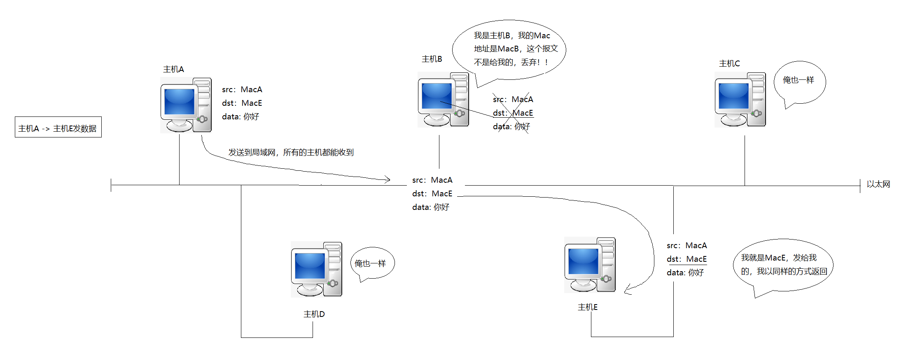

当主机 A 向主机 E 发送数据时：

**数据包构建**：主机 A 将数据封装为结构体（struct）形式，其中包含源 MAC 地址（src: MacA）、目标 MAC 地址（dst: MacE）以及具体数据内容。

**广播发送**：主机 A 将报文发送到共享的局域网物理介质上，此时局域网内的所有主机（主机 B、主机 C、主机 D、主机 E）都会收到该数据帧。

**这种，发出去的消息大家都可以听到，叫做“泛洪”**

**MAC 地址校验与过滤**：主机 B 接收到数据帧后，比对目标 MAC 地址，发现 dst: MacE 与自己的 MAC 地址（MacB）不匹配，直接丢弃该数据包。

主机 C、主机 D 采取相同方式直接丢弃。

主机 E 校验后发现 dst: MacE 正是自己的 MAC 地址，遂接收该报文，并可以采用相同的方式向主机 A 进行响应。

***

- 以太网中，任何时刻，只允许一台机器向网络中发送数据。
- 如果有多台机器，会发生数据干扰，我们称之为数据碰撞。
- 在没有交换机的情况下，一个以太网就是一个碰撞域。
- 所有发送数据的主机都要进行碰撞检测和碰撞避免。

因此，以太网本质就是共享的资源！它就是临界资源，所谓的碰撞检测、碰撞避免就是维护临界资源的互斥属性。

看看同一网段中两个主机的通信：

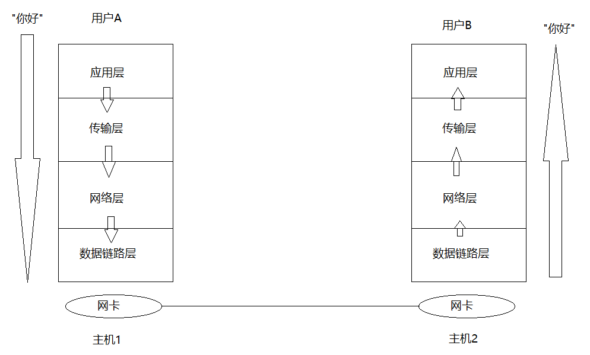

而其中每层都有协议，所以当我进行上述传输流程的时候，要进行封装和解包。

**主机之间的通信，本质是协议栈进行通信。**

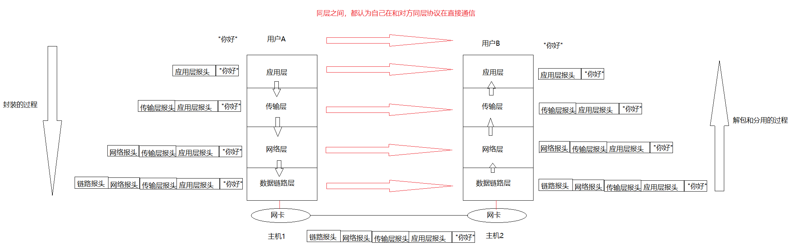

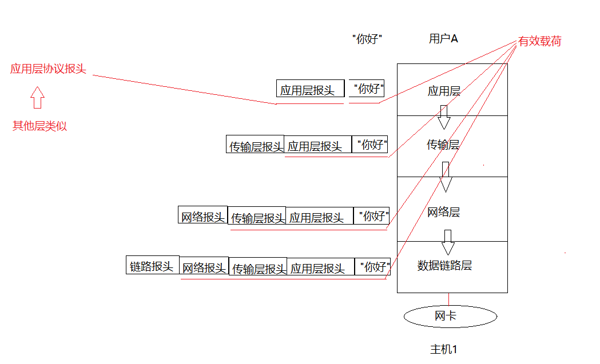

对端同层，要先解包：报头和有效载荷进行分离。

1. 不考虑应用层，任何协议：

- 报头必须能做到和有效载荷分离的能力。
- 报头中必须包含，如何将自己的有效载荷交付给上层的哪一个协议。这个交付的过程是分用的过程

2. 底层收到报文，但该报文不是发给我的，数据链路层会直接丢弃。

数据封装：

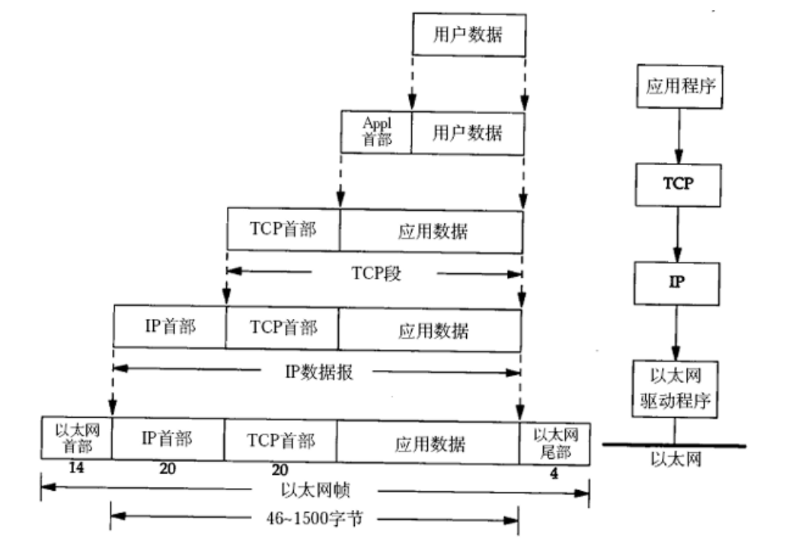

数据分用：

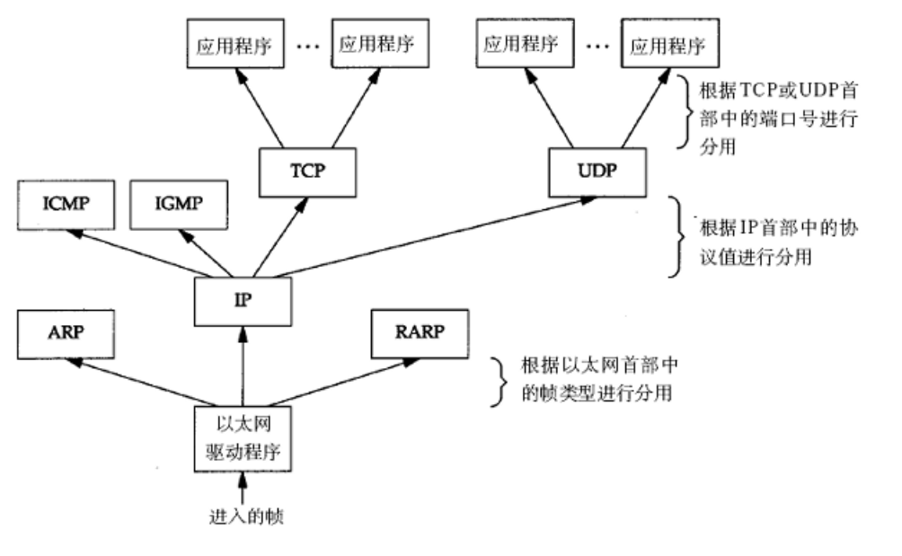

| **应用层**     | **请求与应答** |
| -------------- | -------------- |
| **传输层**     | **数据段**     |
| **网络层**     | **数据报**     |
| **数据链路层** | **数据帧**     |

- 报文除了报头剩下的都是有效载荷，报文=报头+有效载荷。

总结：

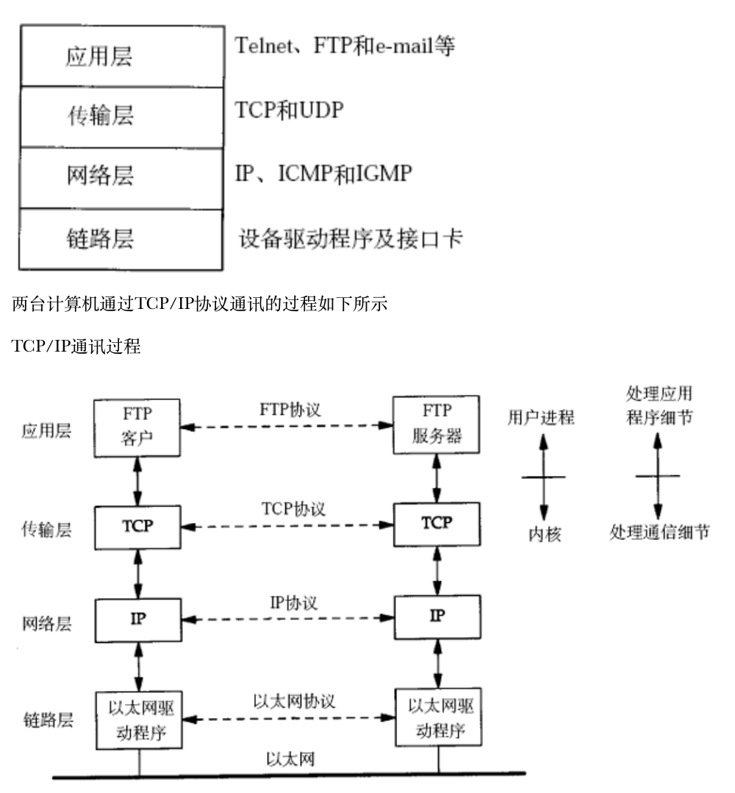

当网卡被设置为**混杂模式**时，网卡关闭物理层的过滤开关。此时，**无论数据帧的目标 MAC 地址是否指向自己，只要是在该局域网物理介质上传播的数据帧，网卡都会接收并向上层递交。**

## 跨网络传输流程

### 认识IP地址

**IP协议**（网际协议）目前主要有两个版本：**IPv4** 与 **IPv6**。在未经特殊说明的情况下，通常默认指代的是 **IPv4** 协议。

IP地址用来表示全球范围内主机的唯一性。

对于 IPv4 而言，IP地址是一个4字节，32位的整数。

我们通常用点分十进制的字符串表示IP地址，例如：`192.168.0.1`。用点分割的每一个数字表示一个字节，范围是0-255。

***

跨网段主机传输：

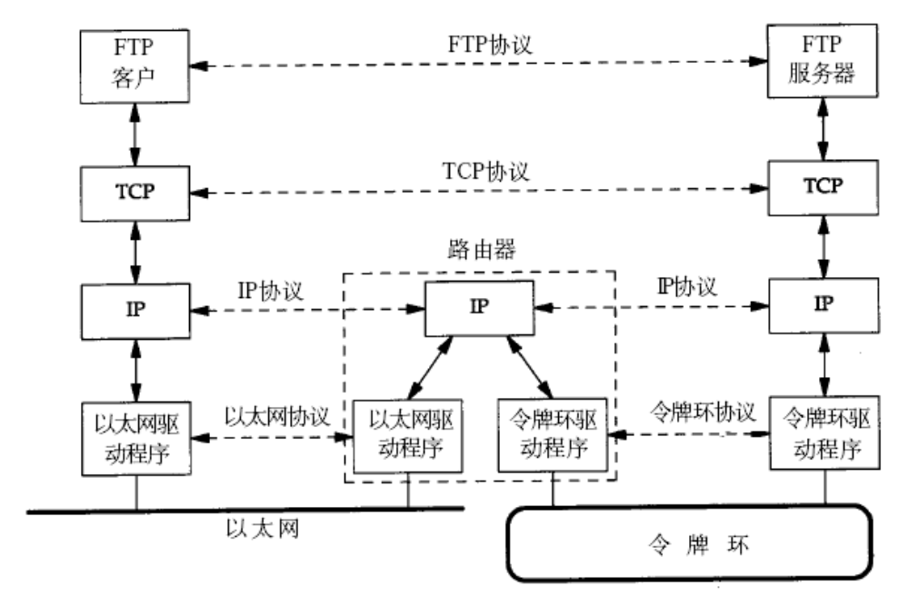

目的IP的意义：

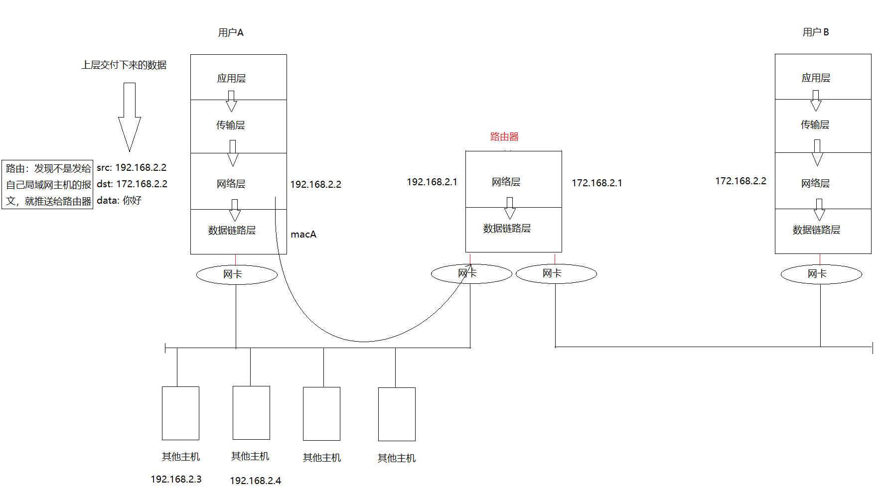

主机A不知道172主机在哪，但是它一定知道不是本地的，因此就发给路由器。

路由过程中，IP地址不变，MAC地址一直在变，MAC地址只会在本局域网内生效。

**网络层+IP的本质：给网络通过了一层虚拟化层，让世界上所有的网络都叫做IP地址屏蔽最底层网络的差异。**

结合一下：

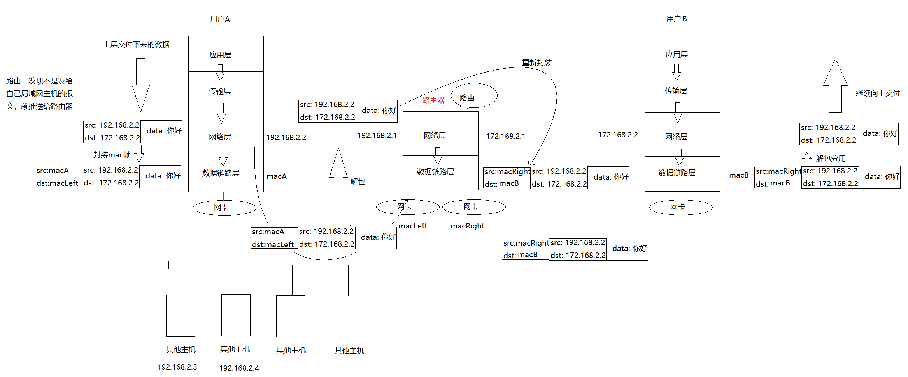

宏观流程：

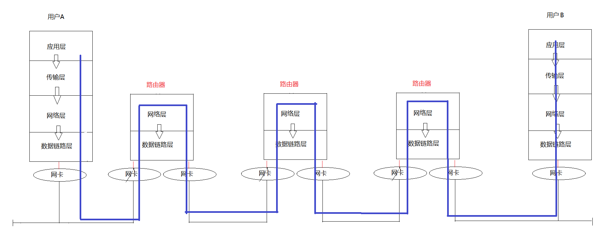